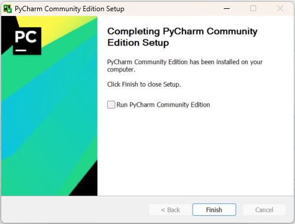
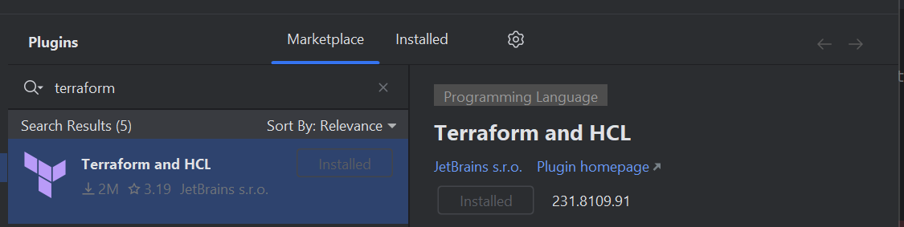
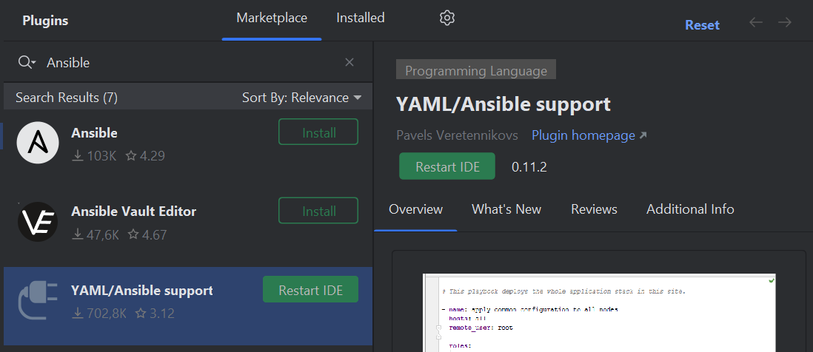
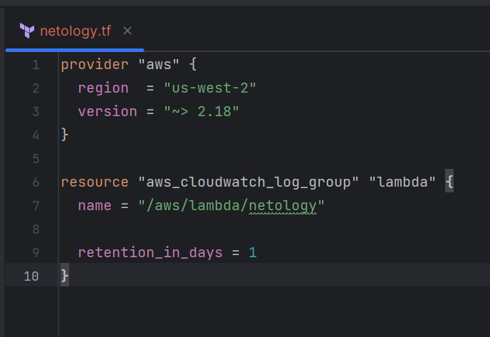
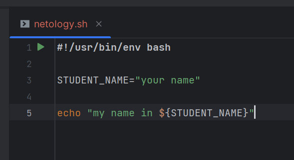
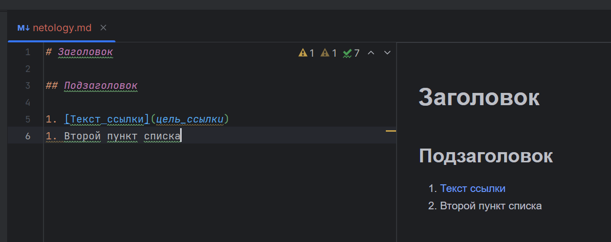
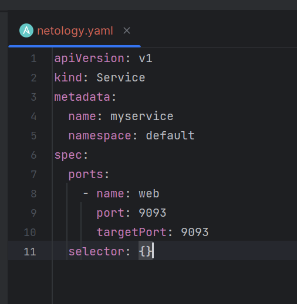
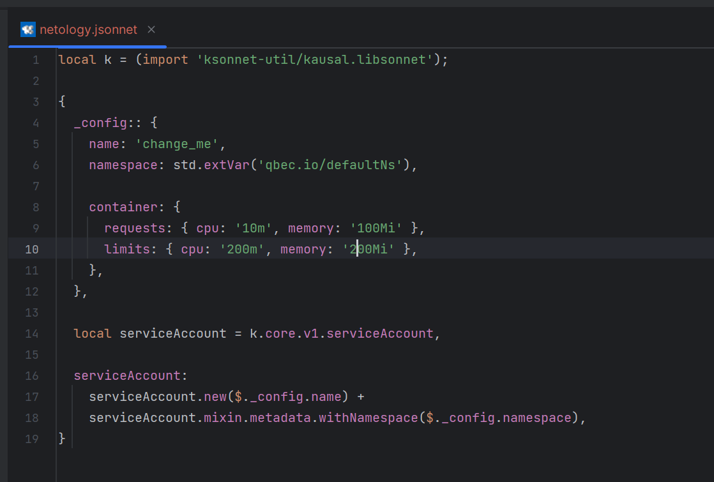

## Задание 1. Подготовка рабочей среды
* 1_install_pycharm: 
* 2_install_plugin_terraform: 
* 3_install_plugin_yaml_ansible: 
* 4_syntax_tf_file: 
* 5_syntax_sh_file: 
* 6_syntax_md_file: 
* 7_syntax_yaml_file: 
* 8_syntax_jsonnet_file: 
* 9_install_plugin_terraform_(vscode): .png)
* 10_install_plugin_jsonnet_(vscode): .png)
* 11_syntax_tf_file_(vscode): .png)
* 12_syntax_sh_file_(vscode): .png)
* 13_syntax_md_file_(vscode): .png)
* 14_syntx_yaml_file_(vscode): .png)
* 15_syntax_jsonnet_file_(vscode): .png)

---

## Задание 2. Описание жизненного цикла задачи (разработки нового функционала)

### Описание истории

Представьте, что вы работаете в стартапе, который запустил интернет-магазин. Он достаточно успешно развивался, и пришло время налаживать процессы: у вас стало больше конечных клиентов, менеджеров и разработчиков.

Сейчас от клиентов вам приходят задачи, связанные с разработкой нового функционала. Задач много, и все они требуют выкладки на тестовые среды, одобрения тестировщика, проверки менеджером перед показом клиенту. В некоторых случаях вам будет необходим откат изменений.
 
### Решение задачи

[Описание жизненного цикла (разработка нового функционала)](describe_live_cycle_task.docx)