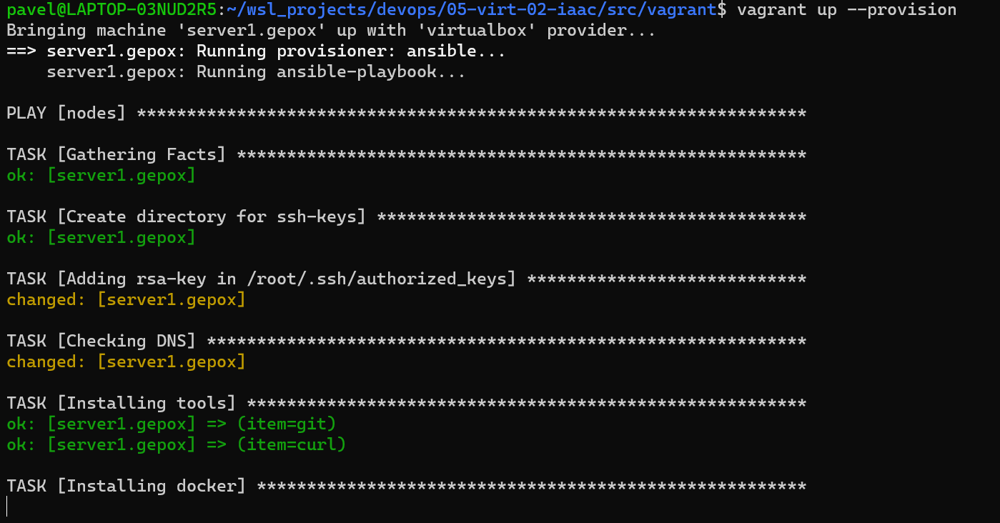
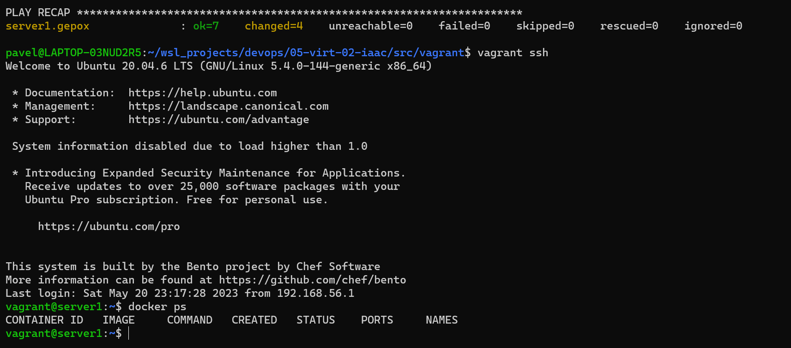

## Задача 1

- Опишите основные преимущества применения на практике IaaC-паттернов.
- Какой из принципов IaaC является основополагающим?

## Решение

Основные плюсы IaaC:

- **Скорость и уменьшение затрат.** IaC позволяет быстрее конфигурировать инфраструктуру и направлен на обеспечение прозрачности, чтобы помочь другим командам работать быстрее и эффективнее.
- **Масштабируемость и стандартизация.** IaC предоставляет стабильные среды быстро и на должном уровне. Командам разработчиков не нужно прибегать к ручной настройке - они обеспечивают корректность, описывая с помощью кода требуемое состояние сред. Развертывания инфраструктуры с помощью IaC повторяемы и предотвращают проблемы во время выполнения, вызванных дрейфом конфигурации или отсутствием зависимостей.
- **Безопасность и документация.** Поскольку код инфраструктуры можно версионировать, IaC позволяет документировать, регистрировать и отслеживать каждое изменение конфигурации серверов.

Основополагающим принципом, в рамках IaaC, является обеспечение идемпотентности.

## Задача 2

- Чем Ansible выгодно отличается от других систем управление конфигурациями?
- Какой, на ваш взгляд, метод работы систем конфигурации более надёжный — push или pull?

## Решение

Ansible простой и мощный инструмент написанный на языке Python (1й ЯП по полулярности). Он использует для своей работы SSH и методо доставки конфигураций push, что позволяет применить его не добавляя никаких дополнительных инструментов на стороне хоста.

У каждого из подходов pull/push есть свои плюсы и минусы. Если говорить о безопасности, то сначала может показаться, что что pull-подход гораздо защищеннее, поскольку учетные данные сервера/кластера недоступны за его пределами. Но это не всегда так. И если действительно говорить о компонентах, которые требуют максимальной защиты, то это хранилища секретов и CI/CD-системы, Git-репозитории. Если кто-то проникнет в репозиторий Git и сможет push'ить туда код, то он сможет развернуть все, что пожелает (независимо от выбранного подхода, будет это pull или push), и внедриться в системы сервера/кластера.

## Задача 3

Установите на личный компьютер:

- [VirtualBox](https://www.virtualbox.org/),
- [Vagrant](https://github.com/netology-code/devops-materials),
- [Terraform](https://github.com/netology-code/devops-materials/blob/master/README.md),
- Ansible.

_Приложите вывод команд установленных версий каждой из программ, оформленный в Markdown._

## Решение

Личный ПК под ОС Windows + WSL.

1. Для работы с VirtualBox для начала необходимо сделать симлинк на VBoxManage

```shell
sudo ln -s "/mnt/c/Program Files/Oracle/VirtualBox/VBoxManage.exe" /usr/bin/VBoxManage
```


2. Для работы с Vagrant + WSL Windows необходимо установить переменную окружения

```shell
export VAGRANT_WSL_ENABLE_WINDOWS_ACCESS=1
export VAGRANT_DEFAULT_PROVIDER=virtualbox
export VAGRANT_WSL_WINDOWS_ACCESS_USER_HOME_PATH="/mnt/c/Users/pavel/"
```

https://developer.hashicorp.com/vagrant/docs/other/wsl


3. Terraform


4. Ansible


## Задача 4

Воспроизведите практическую часть лекции самостоятельно.

- Создайте виртуальную машину.
- Зайдите внутрь ВМ, убедитесь, что Docker установлен с помощью команды

```
docker ps,
```

Vagrantfile из лекции и код ansible находятся в [папке](https://github.com/netology-code/virt-homeworks/tree/virt-11/05-virt-02-iaac/src).

Примечание. Если Vagrant выдаёт ошибку:

```
URL: ["https://vagrantcloud.com/bento/ubuntu-20.04"]
Error: The requested URL returned error: 404:
```

выполните следующие действия:

1. Скачайте с [сайта](https://app.vagrantup.com/bento/boxes/ubuntu-20.04) файл-образ "bento/ubuntu-20.04".
2. Добавьте его в список образов Vagrant: "vagrant box add bento/ubuntu-20.04 <путь к файлу>".

## Решение

Для работы сети в virtualbox через wsl необходимо утановить плагин

```shell
vagrant plugin install virtualbox_WSL2 --plugin-clean-sources --plugin-source https://rubygems.org
```

И для работы с Ansible версии 2 и выше необходимо было в Vagrant добавить

```shell
setup.compatibility_mode = "2.0"
```

внутри блока
node.vm.provision "ansible" do |setup|



