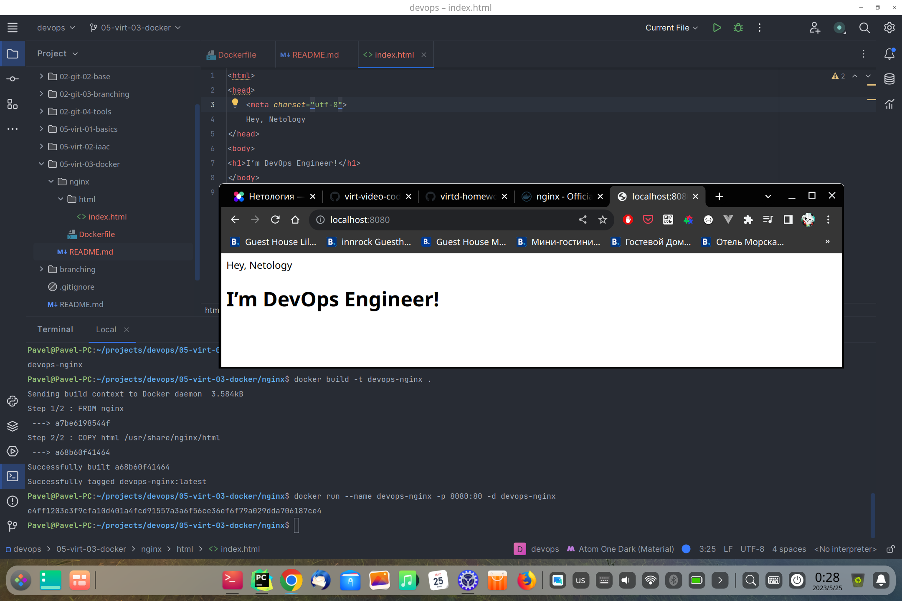
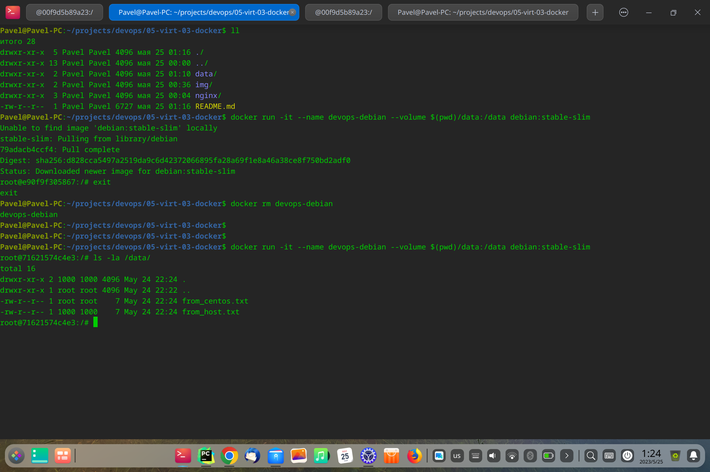

## Задача 1

Сценарий выполнения задачи:

- создайте свой репозиторий на https://hub.docker.com;
- выберите любой образ, который содержит веб-сервер Nginx;
- создайте свой fork образа;
- реализуйте функциональность:
запуск веб-сервера в фоне с индекс-страницей, содержащей HTML-код ниже:
```html
<html>
<head>
Hey, Netology
</head>
<body>
<h1>I’m DevOps Engineer!</h1>
</body>
</html>
```

Опубликуйте созданный fork в своём репозитории и предоставьте ответ в виде ссылки на https://hub.docker.com/username_repo.

## Решение

Сcылка на образ:
https://hub.docker.com/repository/docker/gepox/devops-nginx/general



## Задача 2

Посмотрите на сценарий ниже и ответьте на вопрос:
«Подходит ли в этом сценарии использование Docker-контейнеров или лучше подойдёт виртуальная машина, физическая машина? Может быть, возможны разные варианты?»

Детально опишите и обоснуйте свой выбор.

--

## Сценарии + решения

- высоконагруженное монолитное Java веб-приложение;

Для такого сценария возможны все варианты размещения (docker, виртуальная машина, физический сервер).
При размещении в docker удобство развертывания будет заключаться в том,что все настройки JVM и зависимости приложения будут уже упакованы в образ.
Дополнительно можно настроить CI/CD c прохождением тестов и оптимизированной сборкой приложения, а так же с непрерывной доставкой.
Виртуальная машина и физический сервер подойдут для выигрыша в производительности и т.к. это монолитное приложение (контейнеризация больше подходит для микросервисной архитектуры).

- Nodejs веб-приложение;

Docker (удобство хранения всех зависимостей)

- мобильное приложение c версиями для Android и iOS;

В этом сценарии лучше подойдет виртуализация (работа с UI)

- шина данных на базе Apache Kafka;

Шины данных чаще всего кластерные приложения чувствительные к сети. Лучше подойдет виртуальные машины или физические сервера.

- Elasticsearch-кластер для реализации логирования продуктивного веб-приложения — три ноды elasticsearch, два logstash и две ноды kibana;

Elasticsearch-кластер лучше вынести в виртуальные машины или физические сервера (производительность при работе с сетью и хранилищем данных).
А kibana и logstash можно на виртуальной машине или в docker.

- мониторинг-стек на базе Prometheus и Grafana;

При небольшом кол-ве узлов/приложений, которые необходимо мониторить подойдет решение в docker/docker-swarm.
При больших масштабах мониторинг стэк собирается на виртуальных машинах или даже физических серверах (возможен кластерный отказоустойчивый режим работы).

- MongoDB как основное хранилище данных для Java-приложения;

Зависит от нагрузки и режима работы. При малой нагрузке и не кластерном режим подойдет docker.
При большом объеме данных и операций записи/чтения - ВМ или физические сервера.

- Gitlab-сервер для реализации CI/CD-процессов и приватный (закрытый) Docker Registry.

Для хранения - физический сервер или виртуальные машины. Для веб сервисов подойдет doсker.
Для воркеров - виртуальные мишины.

## Задача 3 + решение

- Запустите первый контейнер из образа ***centos*** c любым тегом в фоновом режиме, подключив папку ```/data``` из текущей рабочей директории на хостовой машине в ```/data``` контейнера.
```shell
docker run -it --name devops-centos --volume $(pwd)/data:/data centos:7
```
- Запустите второй контейнер из образа ***debian*** в фоновом режиме, подключив папку ```/data``` из текущей рабочей директории на хостовой машине в ```/data``` контейнера.
```shell
docker run -it --name devops-centos --volume $(pwd)/data:/data debian:stable-slim
```
- Подключитесь к первому контейнеру с помощью ```docker exec``` и создайте текстовый файл любого содержания в ```/data```.
```shell
docker exec -it devops-centos bash
echo 'devops' > /data/from_centos.txt
```
- Добавьте ещё один файл в папку ```/data``` на хостовой машине.
```shell
echo 'devops' > ./data/from_host.txt
```
- Подключитесь во второй контейнер и отобразите листинг и содержание файлов в ```/data``` контейнера.

```shell
root@71621574c4e3:/# ls -la /data/  
total 16  
drwxr-xr-x 2 1000 1000 4096 May 24 22:24 .  
drwxr-xr-x 1 root root 4096 May 24 22:22 ..  
-rw-r--r-- 1 root root    7 May 24 22:24 from_centos.txt  
-rw-r--r-- 1 1000 1000    7 May 24 22:24 from_host.txt
```  

