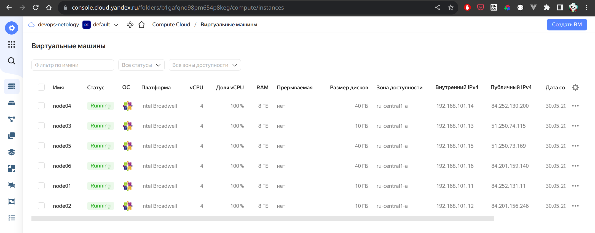
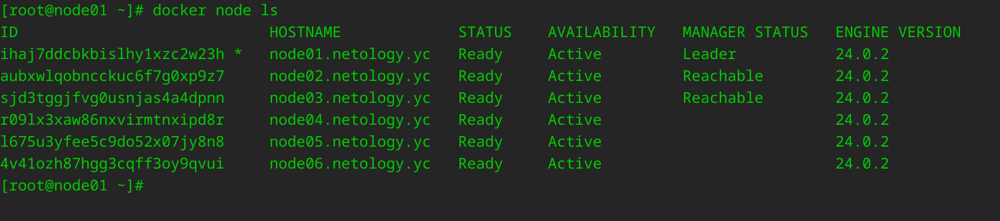
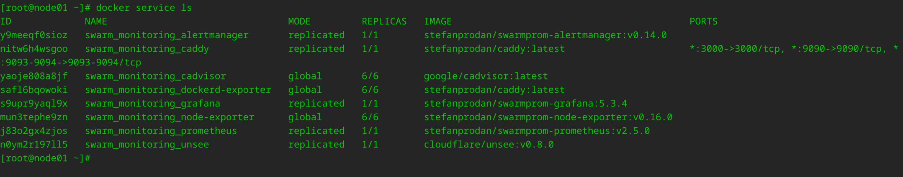
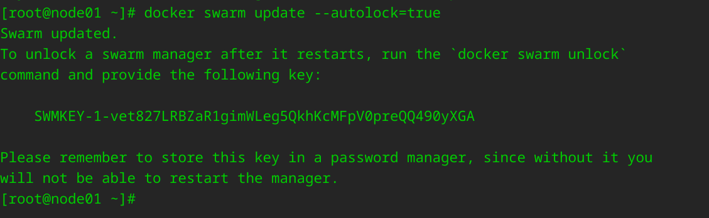
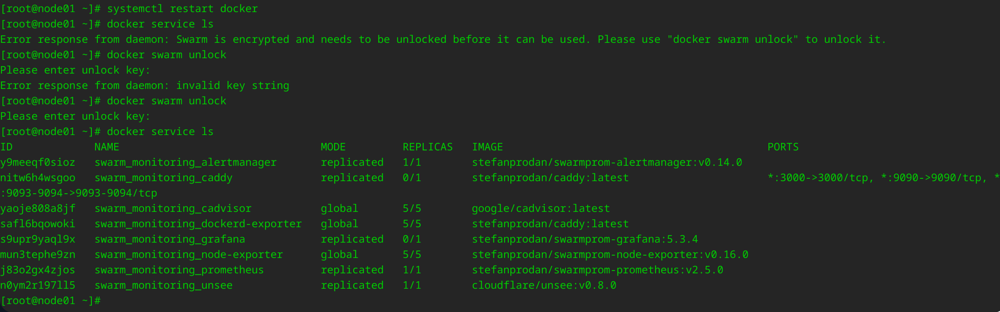

## Задача 1

Дайте письменые ответы на вопросы:

- В чём отличие режимов работы сервисов в Docker Swarm-кластере: replication и global?
- Какой алгоритм выбора лидера используется в Docker Swarm-кластере?
- Что такое Overlay Network?

## Решение

1. В чём отличие режимов работы сервисов в Docker Swarm-кластере: replication и global?
- deploy mode global означает, что данный сервис будет запущен ровно в одном экземпляре на всех возможных нодах кластера  
- deploy mode replicated (replicas: n) означает, что n-ое кол-во контейнеров для данного сервиса будет запущено на доступных нодах
2. Какой алгоритм выбора лидера используется в Docker Swarm-кластере?
- Используется алгоритм поддержания распределенного консенсуса — Raft.  
[Raft в работе](http://thesecretlivesofdata.com/raft/)
3. Что такое Overlay Network? 
- Тип docker-сети, которая позволяет связать контейнеры, запущенные на разных нодах.
Контейнеры на разных физических хостах могут обмениваться данными по overlay-сети (если все они прикреплены к одной сети).

## Задача 2

Создайте ваш первый Docker Swarm-кластер в Яндекс Облаке.

Чтобы получить зачёт, предоставьте скриншот из терминала (консоли) с выводом команды:
```
docker node ls
```

## Решение

<p>
    
    
</p>

## Задача 3

Создайте ваш первый, готовый к боевой эксплуатации кластер мониторинга, состоящий из стека микросервисов.

Чтобы получить зачёт, предоставьте скриншот из терминала (консоли), с выводом команды:
```
docker service ls
```

## Решение

<p>
    
</p>

## Задача 4 (*)

Выполните на лидере Docker Swarm-кластера команду, указанную ниже, и дайте письменное описание её функционала — что она делает и зачем нужна:
```
# см.документацию: https://docs.docker.com/engine/swarm/swarm_manager_locking/
docker swarm update --autolock=true
```

## Решение

<p>
    
</p>

Журналы Raft, используемые менеджерами swarm, по умолчанию зашифрованы на диске.
Это шифрование защищает конфигурацию и данные сервиса от злоумышленников, которые получают доступ к зашифрованным журналам Raft.
Одна из причин, по которой эта функция была введена, заключалась в поддержке функции секретов Docker.
При перезапуске Docker в память каждого управляющего узла загружается как ключ TLS, используемый для шифрования связи между узлами swarm, так и ключ, используемый для шифрования и расшифровки журналов Raft на диске.
Docker может защитить общий ключ шифрования TLS и ключ, используемый для шифрования и расшифровки журналов Raft, позволяя стать владельцем этих ключей и требовать ручной разблокировки менеджеров.
Эта функция называется автоблокировкой.

Когда Docker перезапустится, необходимо сначала разблокировать swarm, используя ключ шифрования, сгенерированный Docker, когда swarm был заблокирован.
Можно изменить этот ключ шифрования в любое время.

<p>
    
</p>