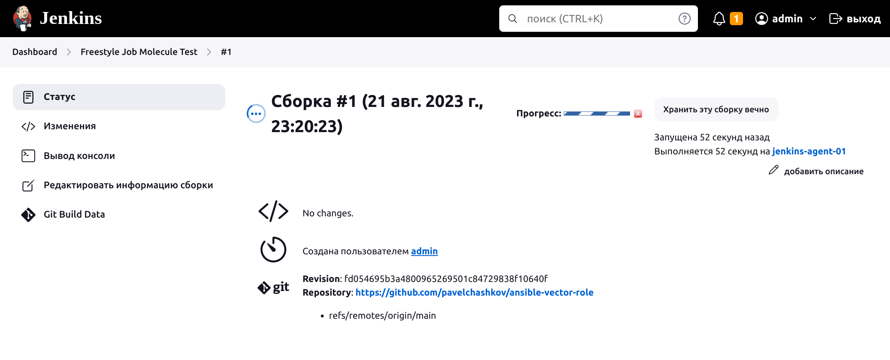

# Домашнее задание к занятию 10 «Jenkins»

## Подготовка к выполнению

1. Создать два VM: для jenkins-master и jenkins-agent.
2. Установить Jenkins при помощи playbook.
3. Запустить и проверить работоспособность.
4. Сделать первоначальную настройку.

## Решение


## Основная часть

1. Сделать Freestyle Job, который будет запускать `molecule test` из любого вашего репозитория с ролью.
2. Сделать Declarative Pipeline Job, который будет запускать `molecule test` из любого вашего репозитория с ролью.
3. Перенести Declarative Pipeline в репозиторий в файл `Jenkinsfile`.
4. Создать Multibranch Pipeline на запуск `Jenkinsfile` из репозитория.
5. Создать Scripted Pipeline, наполнить его скриптом из [pipeline](./pipeline).
6. Внести необходимые изменения, чтобы Pipeline запускал `ansible-playbook` без флагов `--check --diff`, если не установлен параметр при запуске джобы (prod_run = True). По умолчанию параметр имеет значение False и запускает прогон с флагами `--check --diff`.
7. Проверить работоспособность, исправить ошибки, исправленный Pipeline вложить в репозиторий в файл `ScriptedJenkinsfile`.
8. Отправить ссылку на репозиторий с ролью и Declarative Pipeline и Scripted Pipeline.

## Решение

Ссылка на репозиторий [ansible-vector-role](https://github.com/pavelchashkov/ansible-vector-role)

### Freestyle Job





### Declarative Pipeline Job

```shell
pipeline {
    agent any

    stages {
        stage('checkout') {
            steps {
                echo 'Hello Netology'
                git credentialsId: '73033305-42d9-4b05-920e-83325ca4de16', 
                url: 'git@github.com:pavelchashkov/ansible-vector-role.git',
                branch: 'main'
            }
        }
        stage('test') {
            steps {
                echo 'Run molecule test'
                sh 'molecule test'
            }
        }
    }
}
```


### Multibranch Pipeline

Ссылка на [Jsonfile](https://github.com/pavelchashkov/ansible-vector-role/blob/main/Jenkinsfile)


### Scripted Pipeline

```shell
def base_command = 'ansible-playbook site.yml -i inventory/prod.yml'

node("linux"){
    parameters {
        string(name: 'prod_run', defaultValue: 'False', description: 'Run without --check and --diff')
    }
    stage("Git checkout"){
        git credentialsId: '5ac0095d-0185-431b-94da-09a0ad9b0e2c', url: 'git@github.com:aragastmatb/example-playbook.git'
    }
    stage("Sample define secret_check"){
        secret_check=true
    }
    stage("Run playbook"){
        if (secret_check){
            if (params.prod_run == 'True') {
                sh(base_command)
            } else {
                sh("$base_command --check --diff")
            }
        }
        else{
            echo 'need more action'
        }

    }
}
```


Ссылка на [ScriptedJenkinsfile](./pipeline/ScriptedJenkinsfile) 

## Необязательная часть

1. Создать скрипт на groovy, который будет собирать все Job, завершившиеся хотя бы раз неуспешно. Добавить скрипт в репозиторий с решением и названием `AllJobFailure.groovy`.
2. Создать Scripted Pipeline так, чтобы он мог сначала запустить через Yandex Cloud CLI необходимое количество инстансов, прописать их в инвентори плейбука и после этого запускать плейбук. Мы должны при нажатии кнопки получить готовую к использованию систему.

---

### Как оформить решение задания

Выполненное домашнее задание пришлите в виде ссылки на .md-файл в вашем репозитории.

---
