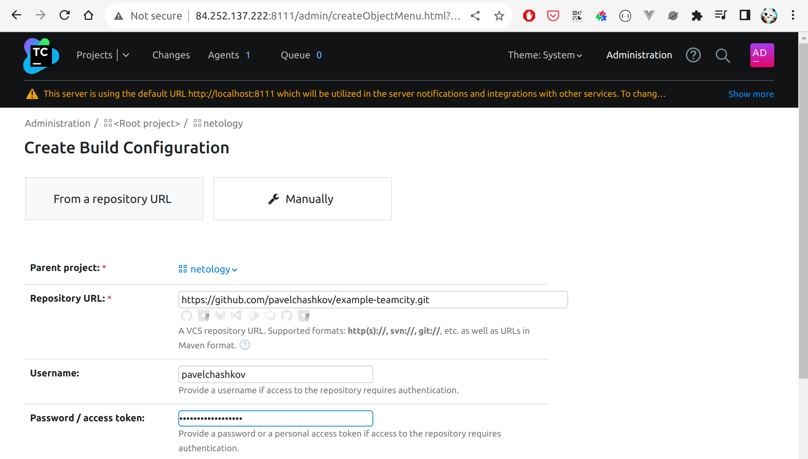
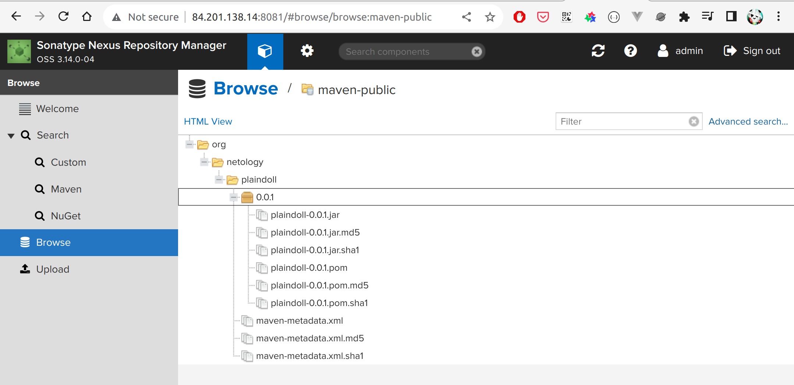
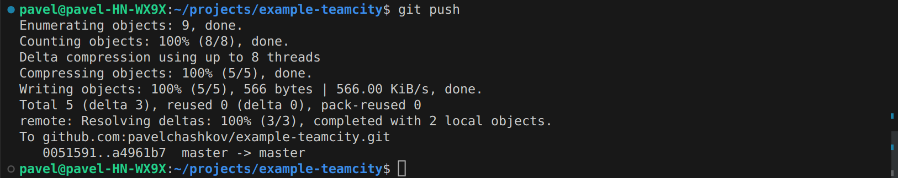

# Домашнее задание к занятию 11 «Teamcity»

## Подготовка к выполнению

1. В Yandex Cloud создайте новый инстанс (4CPU4RAM) на основе образа `jetbrains/teamcity-server`.
2. Дождитесь запуска teamcity, выполните первоначальную настройку.


3. Создайте ещё один инстанс (2CPU4RAM) на основе образа `jetbrains/teamcity-agent`. Пропишите к нему переменную окружения `SERVER_URL: "http://<teamcity_url>:8111"`.

Инстансы ВМ


4. Авторизуйте агент.
5. Сделайте fork [репозитория](https://github.com/aragastmatb/example-teamcity).


Ссылка на [репозиторий](https://github.com/pavelchashkov/example-teamcity)

6. Создайте VM (2CPU4RAM) и запустите [playbook](./infrastructure).

```shell
ansible-playbook -i inventory/cicd/hosts.yml site.yml
```


## Основная часть

1. Создайте новый проект в teamcity на основе fork.




2. Сделайте autodetect конфигурации.


3. Сохраните необходимые шаги, запустите первую сборку master.


4. Поменяйте условия сборки: если сборка по ветке `master`, то должен происходит `mvn clean deploy`, иначе `mvn clean test`.


5. Для deploy будет необходимо загрузить [settings.xml](./teamcity/settings.xml) в набор конфигураций maven у teamcity, предварительно записав туда креды для подключения к nexus.


6. В pom.xml необходимо поменять ссылки на репозиторий и nexus.
7. Запустите сборку по master, убедитесь, что всё прошло успешно и артефакт появился в nexus.




8. Мигрируйте `build configuration` в репозиторий.


9. Создайте отдельную ветку `feature/add_reply` в репозитории.


10. Напишите новый метод для класса Welcomer: метод должен возвращать произвольную реплику, содержащую слово `hunter`.
11. Дополните тест для нового метода на поиск слова `hunter` в новой реплике.


12. Сделайте push всех изменений в новую ветку репозитория.


13. Убедитесь, что сборка самостоятельно запустилась, тесты прошли успешно.


14. Внесите изменения из произвольной ветки `feature/add_reply` в `master` через `Merge`.
15. Убедитесь, что нет собранного артефакта в сборке по ветке `master`.

Артефакта нет, потому что nexus по умолчанию не позволяет обновлять код в предалах одной версии


Для создания артефакта обновляем версию приложения в pom.xml


16. Настройте конфигурацию так, чтобы она собирала `.jar` в артефакты сборки.
17. Проведите повторную сборку мастера, убедитесь, что сбора прошла успешно и артефакты собраны.





18. Проверьте, что конфигурация в репозитории содержит все настройки конфигурации из teamcity.
19. В ответе пришлите ссылку на репозиторий.

Ссылка на [репозиторий](https://github.com/pavelchashkov/example-teamcity)

---

### Как оформить решение задания

Выполненное домашнее задание пришлите в виде ссылки на .md-файл в вашем репозитории.

---
