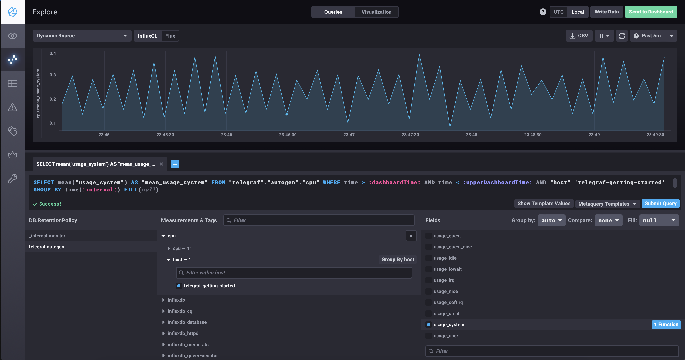

# Домашнее задание к занятию "13.Системы мониторинга"

## Обязательные задания

1. Вас пригласили настроить мониторинг на проект. На онбординге вам рассказали, что проект представляет из себя 
платформу для вычислений с выдачей текстовых отчетов, которые сохраняются на диск. Взаимодействие с платформой 
осуществляется по протоколу http. Также вам отметили, что вычисления загружают ЦПУ. Какой минимальный набор метрик вы
выведите в мониторинг и почему?

### Решение

Минимальный набор метрик можно разбить на несколько групп:
* Системные метрики
* Метрики приложения

По системным метрикам можно выделить основные

| Метрика | Описание |
| --- | --- |
| CPU | Метрики по использованию CPU |
| RAM | Метрики по использованию RAM |
| HDD/Inodes | Метрики по использованию HDD и Inodes |
| LAN | Метрики по использованию LAN |
| Services | Метрики по доступности основных служб |

По метрикам приложения существует несколько методологий:
* USE
* RED
* LTES

В методологии USE для каждого ресурса (CPU, дисковая подсистема, память и т.д.) рекомендуется снимать следующие метрики:
* Utilization — время или процент использования ресурса, занятого «полезной работой»;
* Saturation — насыщенность, то есть количество отложенной или поставленной в очередь «работы»;
* Errors — количество ошибок в работе компонента.

RED предлагает мониторить:
* Rate — количество запросов в единицу времени (например, rps на микросервис или сервер);
* Errors — количество ошибок;
* Duration (оно же latency) — время обработки одного запроса.

В LTES по аналогии с двумя предыдущими методологиями отслеживают:
* Latency — время на обработку одного запроса (с разделением на успешные и ошибочные запросы);
* Traffic — количество запросов к компоненту (для веб-сервера это могут http-запросы, для базы данных — транзакции и т.п.);
* Errors — количество ошибок;
* Saturation — здесь это количественная метрика, отражающая, насколько компонент использует свои ресурсы и сколько у него «работы в очереди».

#
2. Менеджер продукта посмотрев на ваши метрики сказал, что ему непонятно что такое RAM/inodes/CPUla. Также он сказал, 
что хочет понимать, насколько мы выполняем свои обязанности перед клиентами и какое качество обслуживания. Что вы 
можете ему предложить?

### Решение

| Аббревиатура | Определение |
| --- | --- |
| RAM | Random Access Memory, оперативная память |
| inodes | Структура данных в традиционных для ОС UNIX файловых системах. В этой структуре хранится метаинформация о стандартных файлах, каталогах или других объектах файловой системы, кроме непосредственно данных и имени |
| CPUla | Средняя загрузка процессора |

Для понимания, насколько мы выполняем свои обязанности перед клиентами и какое качество обслуживания, необходимо определить SLA и SLO.

Например, можно определить следующие SLO (цели уровня обслуживания) с обсуждаемыми в дальнейшем значениями:

* 99.99% запросов обрабатываются успешно
* 95% запросов обрабатываются в течение 5 секунд

И возможно определение следующих SLA (соглашений об уровне обслуживания):

* доступность системы - 99.99%

Так же можно определить методолгию по реагированию на инциденты и сбои.

#
3. Вашей DevOps команде в этом году не выделили финансирование на построение системы сбора логов. Разработчики в свою 
очередь хотят видеть все ошибки, которые выдают их приложения. Какое решение вы можете предпринять в этой ситуации, 
чтобы разработчики получали ошибки приложения?

### Решение

2 варианта:
1. Искать opensource решения (например стэк от Grafana Labs)
2. Разработать собственное custom решение (скрипты + cron)

#
4. Вы, как опытный SRE, сделали мониторинг, куда вывели отображения выполнения SLA=99% по http кодам ответов. 
Вычисляете этот параметр по следующей формуле: summ_2xx_requests/summ_all_requests. Данный параметр не поднимается выше 
70%, но при этом в вашей системе нет кодов ответа 5xx и 4xx. Где у вас ошибка?
#

### Решение

В формуле учитываются только 2XX ответы, которые деляться на  общее количество запросов. Не учитываются коды ответов 1XX и 3XX.
Правильная формула:
```
summ_1xx_requests+summ_2xx_requests+summ_3xx_requests)/sum_all_requests
```

5. Опишите основные плюсы и минусы pull и push систем мониторинга.
#

### Решение

#### PULL модель

Плюсы:
* Легче контролировать подлинность данных
* Можно настроить единый proxy server до всех агентов с TLS
* Упрощённая отладка получения данных с агентов

Минусы:
* Задержка в получении данных: так как данные собираются только при запросе, может возникать некоторая задержка в получении актуальной информации
* Нагрузка на сеть: при активном использовании pull системы может возникать большая нагрузка на сеть при каждом запросе на получение данных
* Ограниченная возможность мониторинга в режиме реального времени: pull система может не обеспечивать возможность мониторинга в режиме реального времени из-за задержки в получении данных

#### PUSH модель

Плюсы:
* Упрощение репликации данных в разные системы мониторинга или их резервные копии 
* Более гибкая настройка отправки пакетов данных с метриками  UDP — это менее затратный способ передачи данных, из-за чего может возрасти производительность сбора метрик

Минусы:
* Высокая нагрузка на ресурсы: push системы активно передают данные в режиме реального времени, что может приводить к высокой нагрузке на ресурсы и сеть
* Сложность настройки и интеграции: push системы требуют более сложной настройки и интеграции с приложениями и устройствами
* Потенциальные проблемы безопасности: так как push системы активно передают данные, может возникать потенциальная угроза безопасности при передаче конфиденциальной информации

6. Какие из ниже перечисленных систем относятся к push модели, а какие к pull? А может есть гибридные?

    - Prometheus 
    - TICK
    - Zabbix
    - VictoriaMetrics
    - Nagios
#

### Решение

| Система | Тип |
| --- | --- |
| Prometheus | PULL (PUSH через реализацию push-gateway) |
| TICK | PUSH |
| Zabbix | PULL & PUSH|
| VictoriaMetrics | PULL & PUSH |
| Nagios | PULL |

7. Склонируйте себе [репозиторий](https://github.com/influxdata/sandbox/tree/master) и запустите TICK-стэк, 
используя технологии docker и docker-compose.

В виде решения на это упражнение приведите скриншот веб-интерфейса ПО chronograf (`http://localhost:8888`). 

P.S.: если при запуске некоторые контейнеры будут падать с ошибкой - проставьте им режим `Z`, например
`./data:/var/lib:Z`
#

### Решение

Команда запуска
```shell
./sandbox up
```


8. Перейдите в веб-интерфейс Chronograf (http://localhost:8888) и откройте вкладку Data explorer.
        
    - Нажмите на кнопку Add a query
    - Изучите вывод интерфейса и выберите БД telegraf.autogen
    - В `measurments` выберите cpu->host->telegraf-getting-started, а в `fields` выберите usage_system. Внизу появится график утилизации cpu.
    - Вверху вы можете увидеть запрос, аналогичный SQL-синтаксису. Поэкспериментируйте с запросом, попробуйте изменить группировку и интервал наблюдений.

Для выполнения задания приведите скриншот с отображением метрик утилизации cpu из веб-интерфейса.
#

### Решение



9. Изучите список [telegraf inputs](https://github.com/influxdata/telegraf/tree/master/plugins/inputs). 
Добавьте в конфигурацию telegraf следующий плагин - [docker](https://github.com/influxdata/telegraf/tree/master/plugins/inputs/docker):
```
[[inputs.docker]]
  endpoint = "unix:///var/run/docker.sock"
```

Дополнительно вам может потребоваться донастройка контейнера telegraf в `docker-compose.yml` дополнительного volume и 
режима privileged:
```
  telegraf:
    image: telegraf:1.4.0
    privileged: true
    volumes:
      - ./etc/telegraf.conf:/etc/telegraf/telegraf.conf:Z
      - /var/run/docker.sock:/var/run/docker.sock:Z
    links:
      - influxdb
    ports:
      - "8092:8092/udp"
      - "8094:8094"
      - "8125:8125/udp"
```

После настройке перезапустите telegraf, обновите веб интерфейс и приведите скриншотом список `measurments` в 
веб-интерфейсе базы telegraf.autogen . Там должны появиться метрики, связанные с docker.

Факультативно можете изучить какие метрики собирает telegraf после выполнения данного задания.

### Решение

```
[[inputs.cpu]]
[[inputs.system]]
[[inputs.influxdb]]
  urls = ["http://influxdb:8086/debug/vars"]
[[inputs.syslog]]
  server = "tcp://localhost:6514"
[[inputs.docker]]
  endpoint = "unix:///var/run/docker.sock"
```

```shell
./sandbox restart
```


## Дополнительное задание (со звездочкой*) - необязательно к выполнению

1. Вы устроились на работу в стартап. На данный момент у вас нет возможности развернуть полноценную систему 
мониторинга, и вы решили самостоятельно написать простой python3-скрипт для сбора основных метрик сервера. Вы, как 
опытный системный-администратор, знаете, что системная информация сервера лежит в директории `/proc`. 
Также, вы знаете, что в системе Linux есть  планировщик задач cron, который может запускать задачи по расписанию.

Суммировав все, вы спроектировали приложение, которое:
- является python3 скриптом
- собирает метрики из папки `/proc`
- складывает метрики в файл 'YY-MM-DD-awesome-monitoring.log' в директорию /var/log 
(YY - год, MM - месяц, DD - день)
- каждый сбор метрик складывается в виде json-строки, в виде:
  + timestamp (временная метка, int, unixtimestamp)
  + metric_1 (метрика 1)
  + metric_2 (метрика 2)
  
     ...
     
  + metric_N (метрика N)
  
- сбор метрик происходит каждую 1 минуту по cron-расписанию

Для успешного выполнения задания нужно привести:

а) работающий код python3-скрипта,

б) конфигурацию cron-расписания,

в) пример верно сформированного 'YY-MM-DD-awesome-monitoring.log', имеющий не менее 5 записей,

P.S.: количество собираемых метрик должно быть не менее 4-х.
P.P.S.: по желанию можно себя не ограничивать только сбором метрик из `/proc`.

2. В веб-интерфейсе откройте вкладку `Dashboards`. Попробуйте создать свой dashboard с отображением:

    - утилизации ЦПУ
    - количества использованного RAM
    - утилизации пространства на дисках
    - количество поднятых контейнеров
    - аптайм
    - ...
    - фантазируйте)
    
    ---

### Как оформить ДЗ?

Выполненное домашнее задание пришлите ссылкой на .md-файл в вашем репозитории.

---

