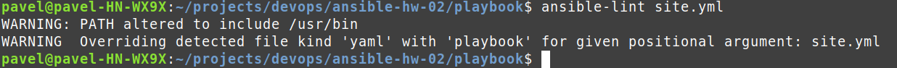
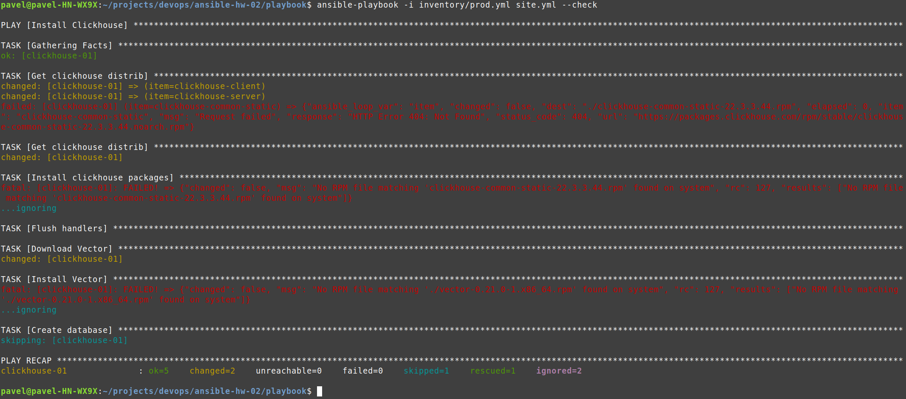
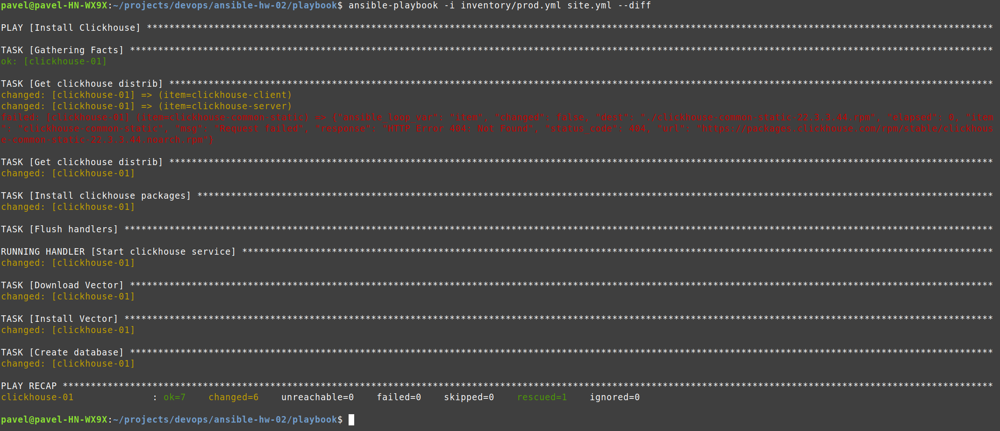
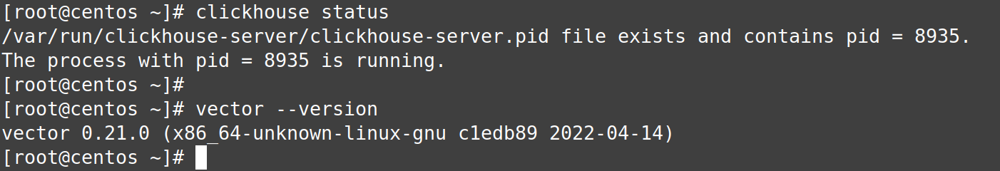
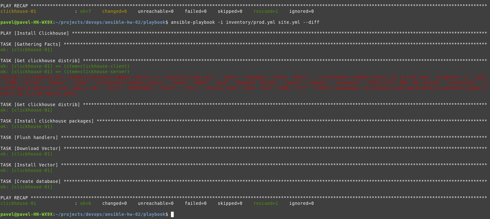

# Домашнее задание к занятию 2 «Работа с Playbook»

## Подготовка к выполнению

1. * Необязательно. Изучите, что такое [ClickHouse](https://www.youtube.com/watch?v=fjTNS2zkeBs) и [Vector](https://www.youtube.com/watch?v=CgEhyffisLY).
2. Создайте свой публичный репозиторий на GitHub с произвольным именем или используйте старый.
3. Скачайте [Playbook](./playbook/) из репозитория с домашним заданием и перенесите его в свой репозиторий.
4. Подготовьте хосты в соответствии с группами из предподготовленного playbook.

## Основная часть

1. Подготовьте свой inventory-файл `prod.yml`.
2. Допишите playbook: нужно сделать ещё один play, который устанавливает и настраивает [vector](https://vector.dev).
3. При создании tasks рекомендую использовать модули: `get_url`, `template`, `unarchive`, `file`.
4. Tasks должны: скачать дистрибутив нужной версии, выполнить распаковку в выбранную директорию, установить vector.

```yaml
    - name: Download Vector
      ansible.builtin.get_url:
        url: "https://packages.timber.io/vector/{{ vector_version }}/vector-{{ vector_version }}-1.x86_64.rpm"
        dest: "./vector-{{ vector_version }}-1.x86_64.rpm"
        mode: 0664
        timeout: 200
      ignore_errors: "{{ ansible_check_mode }}"

    - name: Install Vector
      become: true
      become_method: sudo
      ansible.builtin.yum:
        disable_gpg_check: true
        name: "./vector-{{ vector_version }}-1.x86_64.rpm"
      ignore_errors: "{{ ansible_check_mode }}"
```

6. Запустите `ansible-lint site.yml` и исправьте ошибки, если они есть.


Ошибок нет

6. Попробуйте запустить playbook на этом окружении с флагом `--check`.

Добавил в таски
* Install clickhouse packages
* Install Vector

атрибут ignore_errors

```yaml
ignore_errors: "{{ ansible_check_mode }}"
```

```shell
ansible-playbook -i inventory/prod.yml site.yml --check
```



7. Запустите playbook на `prod.yml` окружении с флагом `--diff`. Убедитесь, что изменения на системе произведены.

```shell
ansible-playbook -i inventory/prod.yml site.yml --diff
```





8. Повторно запустите playbook с флагом `--diff` и убедитесь, что playbook идемпотентен.

```shell
ansible-playbook -i inventory/prod.yml site.yml --diff
```



9. Подготовьте README.md-файл по своему playbook. В нём должно быть описано: что делает playbook, какие у него есть параметры и теги.

Playbook выполнет
* установку clickhouse версии 22.3.3.44 (версия указана в vars)
* * clickhouse-client
* * clickhouse-server
* * clickhouse-common-static
* настройку и запуск clickhouse
* установку vector версии 0.21.0 (версия указана в vars)

10. Готовый playbook выложите в свой репозиторий, поставьте тег `08-ansible-02-playbook` на фиксирующий коммит, в ответ предоставьте ссылку на него.

---

### Как оформить решение задания

Выполненное домашнее задание пришлите в виде ссылки на .md-файл в вашем репозитории.

---
