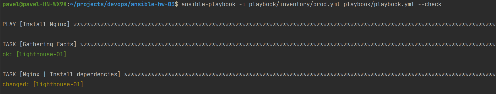
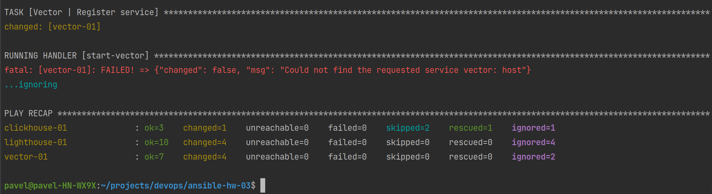
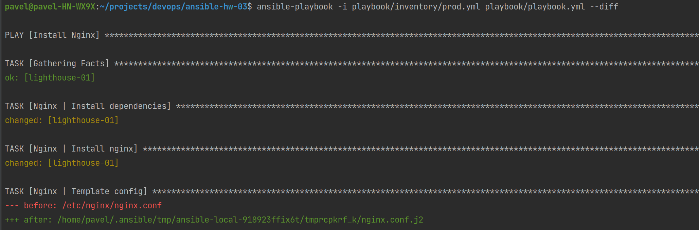
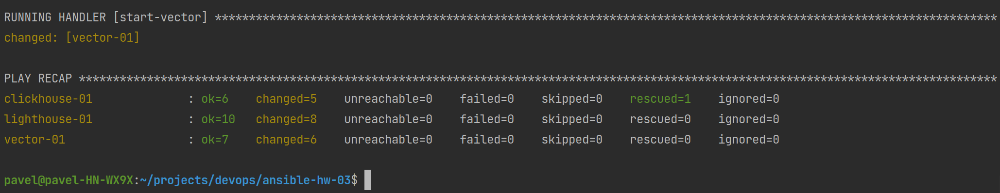
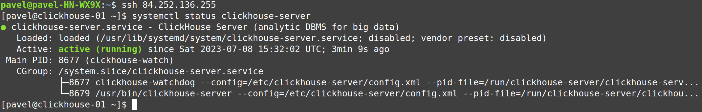
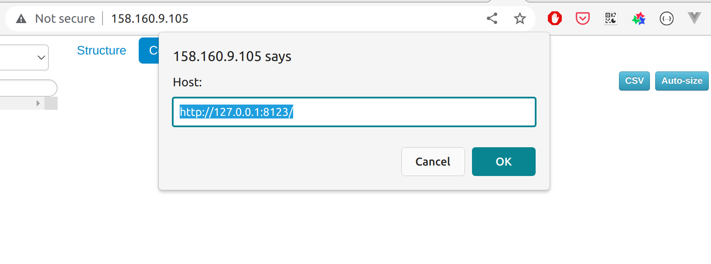
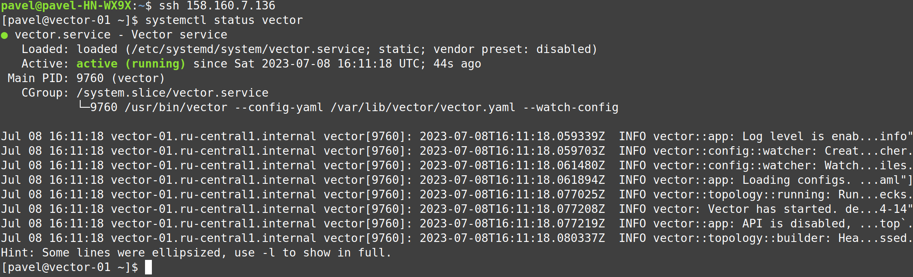
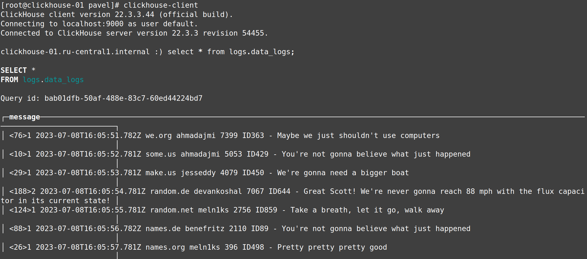

# Домашнее задание к занятию 3 «Использование Ansible»

## Подготовка к выполнению

1. Подготовьте в Yandex Cloud три хоста: для `clickhouse`, для `vector` и для `lighthouse`.
2. Репозиторий LightHouse находится [по ссылке](https://github.com/VKCOM/lighthouse).

## Основная часть

1. Допишите playbook: нужно сделать ещё один play, который устанавливает и настраивает LightHouse.
2. При создании tasks рекомендую использовать модули: `get_url`, `template`, `yum`, `apt`.
3. Tasks должны: скачать статику LightHouse, установить Nginx или любой другой веб-сервер, настроить его конфиг для открытия LightHouse, запустить веб-сервер.
4. Подготовьте свой inventory-файл `prod.yml`.
5. Запустите `ansible-lint site.yml` и исправьте ошибки, если они есть.
6. Попробуйте запустить playbook на этом окружении с флагом `--check`.
7. Запустите playbook на `prod.yml` окружении с флагом `--diff`. Убедитесь, что изменения на системе произведены.
8. Повторно запустите playbook с флагом `--diff` и убедитесь, что playbook идемпотентен.
9. Подготовьте README.md-файл по своему playbook. В нём должно быть описано: что делает playbook, какие у него есть параметры и теги.
10. Готовый playbook выложите в свой репозиторий, поставьте тег `08-ansible-03-yandex` на фиксирующий коммит, в ответ предоставьте ссылку на него.

---

### Как оформить решение задания

Выполненное домашнее задание пришлите в виде ссылки на .md-файл в вашем репозитории.

---

## Решение

<details>
  <summary>Листинг выполненения playbook</summary>

```shell
pavel@pavel-HN-WX9X:~/projects/devops/ansible-hw-03$ ansible-playbook -i playbook/inventory/prod.yml playbook/playbook.yml --diff

PLAY [Install Nginx] *****************************************************************************************************************************

TASK [Gathering Facts] ***************************************************************************************************************************
ok: [lighthouse-01]

TASK [Nginx | Install dependencies] **************************************************************************************************************
changed: [lighthouse-01]

TASK [Nginx | Install nginx] *********************************************************************************************************************
changed: [lighthouse-01]

TASK [Nginx | Template config] *******************************************************************************************************************
--- before: /etc/nginx/nginx.conf
+++ after: /home/pavel/.ansible/tmp/ansible-local-918923ffix6t/tmprcpkrf_k/nginx.conf.j2
@@ -1,13 +1,8 @@
-# For more information on configuration, see:
-#   * Official English Documentation: http://nginx.org/en/docs/
-#   * Official Russian Documentation: http://nginx.org/ru/docs/
-
 user nginx;
 worker_processes auto;
 error_log /var/log/nginx/error.log;
 pid /run/nginx.pid;
 
-# Load dynamic modules. See /usr/share/doc/nginx/README.dynamic.
 include /usr/share/nginx/modules/*.conf;
 
 events {
@@ -30,55 +25,5 @@
     include             /etc/nginx/mime.types;
     default_type        application/octet-stream;
 
-    # Load modular configuration files from the /etc/nginx/conf.d directory.
-    # See http://nginx.org/en/docs/ngx_core_module.html#include
-    # for more information.
     include /etc/nginx/conf.d/*.conf;
-
-    server {
-        listen       80;
-        listen       [::]:80;
-        server_name  _;
-        root         /usr/share/nginx/html;
-
-        # Load configuration files for the default server block.
-        include /etc/nginx/default.d/*.conf;
-
-        error_page 404 /404.html;
-        location = /404.html {
-        }
-
-        error_page 500 502 503 504 /50x.html;
-        location = /50x.html {
-        }
-    }
-
-# Settings for a TLS enabled server.
-#
-#    server {
-#        listen       443 ssl http2;
-#        listen       [::]:443 ssl http2;
-#        server_name  _;
-#        root         /usr/share/nginx/html;
-#
-#        ssl_certificate "/etc/pki/nginx/server.crt";
-#        ssl_certificate_key "/etc/pki/nginx/private/server.key";
-#        ssl_session_cache shared:SSL:1m;
-#        ssl_session_timeout  10m;
-#        ssl_ciphers HIGH:!aNULL:!MD5;
-#        ssl_prefer_server_ciphers on;
-#
-#        # Load configuration files for the default server block.
-#        include /etc/nginx/default.d/*.conf;
-#
-#        error_page 404 /404.html;
-#            location = /40x.html {
-#        }
-#
-#        error_page 500 502 503 504 /50x.html;
-#            location = /50x.html {
-#        }
-#    }
-
 }
-

changed: [lighthouse-01]

RUNNING HANDLER [start-nginx] ********************************************************************************************************************
changed: [lighthouse-01]

PLAY [Install LightHouse] ************************************************************************************************************************

TASK [Gathering Facts] ***************************************************************************************************************************
ok: [lighthouse-01]

TASK [LightHouse | Install dependencies] *********************************************************************************************************
changed: [lighthouse-01]

TASK [LightHouse | Copy from git] ****************************************************************************************************************
>> Newly checked out d701335c25cd1bb9b5155711190bad8ab852c2ce
changed: [lighthouse-01]

TASK [LightHouse | Create config] ****************************************************************************************************************
--- before
+++ after: /home/pavel/.ansible/tmp/ansible-local-918923ffix6t/tmp_dkaved2/lighthouse.conf.j2
@@ -0,0 +1,10 @@
+server {
+    listen 80;
+
+    access_log /var/log/nginx/lighthouse_access.log;
+
+    location / {
+        root /usr/share/nginx/lighthouse;
+        index index.html;
+    }
+}

changed: [lighthouse-01]

RUNNING HANDLER [reload-nginx] *******************************************************************************************************************
changed: [lighthouse-01]

PLAY [Install ClickHouse] ************************************************************************************************************************

TASK [Gathering Facts] ***************************************************************************************************************************
ok: [clickhouse-01]

TASK [ClickHouse | Get clickhouse distrib] *******************************************************************************************************
changed: [clickhouse-01] => (item=clickhouse-client)
changed: [clickhouse-01] => (item=clickhouse-server)
failed: [clickhouse-01] (item=clickhouse-common-static) => {"ansible_loop_var": "item", "changed": false, "dest": "./clickhouse-common-static-22.3.3.44.rpm", "elapsed": 0, "item": "clickhouse-common-static", "msg": "Request failed", "response": "HTTP Error 404: Not Found", "status_code": 404, "url": "https://packages.clickhouse.com/rpm/stable/clickhouse-common-static-22.3.3.44.noarch.rpm"}

TASK [ClickHouse | Get clickhouse distrib] *******************************************************************************************************
changed: [clickhouse-01]

TASK [ClickHouse | Install packages] *************************************************************************************************************
changed: [clickhouse-01]

TASK [ClickHouse | Flush handlers] ***************************************************************************************************************

RUNNING HANDLER [start-clickhouse] ***************************************************************************************************************
changed: [clickhouse-01]

TASK [ClickHouse | Create database] **************************************************************************************************************
changed: [clickhouse-01]

TASK [Clickhouse | Create table] *****************************************************************************************************************
changed: [clickhouse-01]

PLAY [Install Vector] ****************************************************************************************************************************

TASK [Gathering Facts] ***************************************************************************************************************************
ok: [vector-01]

TASK [Vector | Download rpm] *********************************************************************************************************************
changed: [vector-01]

TASK [Vector | Install package] ******************************************************************************************************************
changed: [vector-01]

TASK [Vector | Create data dir] ******************************************************************************************************************
--- before
+++ after
@@ -1,5 +1,5 @@
 {
-    "group": 0,
-    "owner": 997,
+    "group": 1000,
+    "owner": 1000,
     "path": "/var/lib/vector"
 }

changed: [vector-01]

TASK [Vector | Template config] ******************************************************************************************************************
--- before
+++ after: /home/pavel/.ansible/tmp/ansible-local-918923ffix6t/tmpaqtbfsqp/vector.config.j2
@@ -0,0 +1,16 @@
+data_dir: /var/lib/vector
+sinks:
+    to_clickhouse:
+        compression: gzip
+        database: logs
+        endpoint: http://84.252.136.255:8123
+        healthcheck: true
+        inputs:
+        - demo_logs
+        skip_unknown_fields: true
+        table: data_logs
+        type: clickhouse
+sources:
+    demo_logs:
+        format: syslog
+        type: demo_logs

changed: [vector-01]

TASK [Vector | Register service] *****************************************************************************************************************
--- before
+++ after: /home/pavel/.ansible/tmp/ansible-local-918923ffix6t/tmph1dqqg82/vector.service.j2
@@ -0,0 +1,7 @@
+[Unit]
+Description=Vector service
+[Service]
+User=pavel
+Group=1000
+ExecStart=/usr/bin/vector --config-yaml /var/lib/vector/vector.yaml --watch-config
+Restart=always

changed: [vector-01]

RUNNING HANDLER [start-vector] *******************************************************************************************************************
changed: [vector-01]

PLAY RECAP ***************************************************************************************************************************************
clickhouse-01              : ok=6    changed=5    unreachable=0    failed=0    skipped=0    rescued=1    ignored=0   
lighthouse-01              : ok=10   changed=8    unreachable=0    failed=0    skipped=0    rescued=0    ignored=0   
vector-01                  : ok=7    changed=6    unreachable=0    failed=0    skipped=0    rescued=0    ignored=0   
```

</details>

## Пример выполнения playbook с параметром --check


...



## Пример выполнения playbook с параметром --diff


...



## Проверка сервиса clickhouse


## Проверка nginx и lighthouse


## Проверка сервиса vector


## Проверка содержимого таблицы в clickhouse с логами от vector


## Tags

### Clickhouse

- `clickhouse` - установка и запуск только `clickhouse`

### Vector

- `vector` - установка только `vector`

### Nginx и Lighthouse

- `nginx` - установка только `nginx`
- `lighthouse` - установка только `lighthouse`