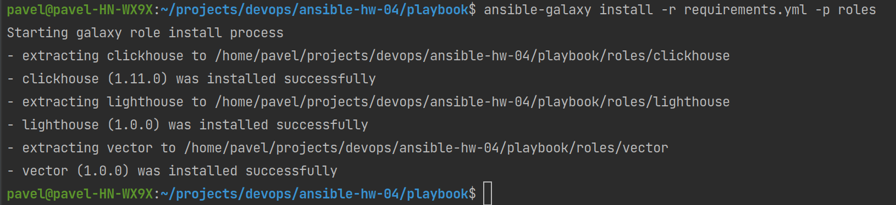
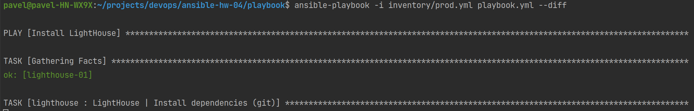
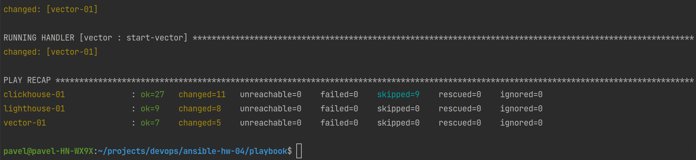
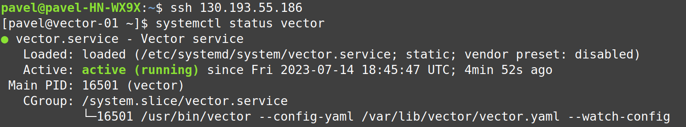
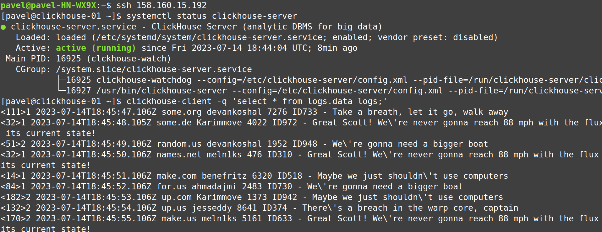
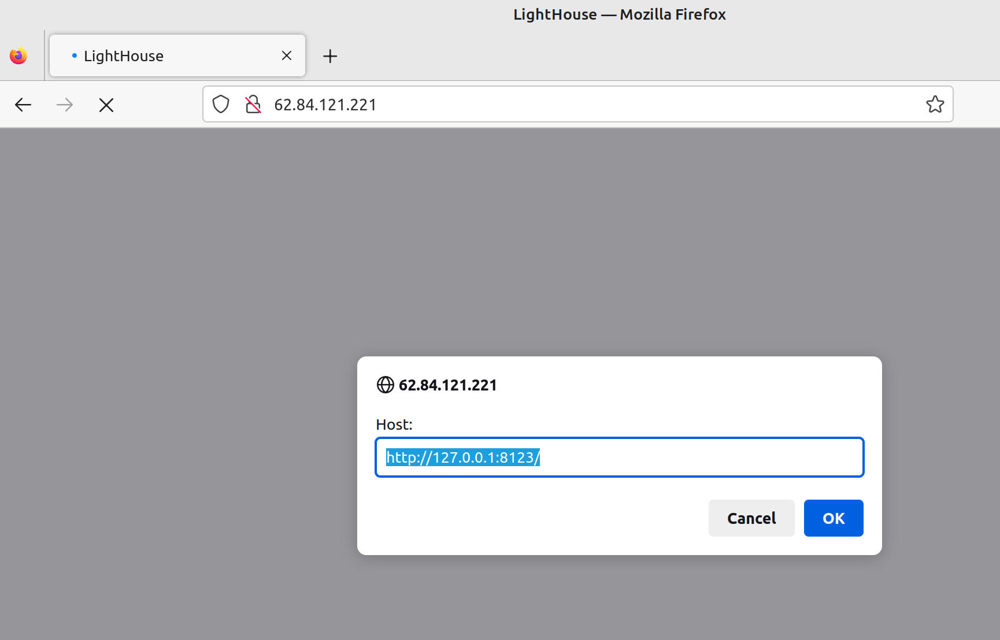

# Домашнее задание к занятию 4 «Работа с roles»

## Подготовка к выполнению

1.
    * Необязательно. Познакомьтесь с [LightHouse](https://youtu.be/ymlrNlaHzIY?t=929).
2. Создайте два пустых публичных репозитория в любом своём проекте: vector-role и lighthouse-role.
3. Добавьте публичную часть своего ключа к своему профилю на GitHub.

## Основная часть

Ваша цель — разбить ваш playbook на отдельные roles.

Задача — сделать roles для ClickHouse, Vector и LightHouse и написать playbook для использования этих ролей.

Ожидаемый результат — существуют три ваших репозитория: два с roles и один с playbook.

**Что нужно сделать**

1. Создайте в старой версии playbook файл `requirements.yml` и заполните его содержимым:

   ```yaml
   ---
     - src: git@github.com:AlexeySetevoi/ansible-clickhouse.git
       scm: git
       version: "1.11.0"
       name: clickhouse 
   ```

2. При помощи `ansible-galaxy` скачайте себе эту роль.
3. Создайте новый каталог с ролью при помощи `ansible-galaxy role init vector-role`.
4. На основе tasks из старого playbook заполните новую role. Разнесите переменные между `vars` и `default`.
5. Перенести нужные шаблоны конфигов в `templates`.
6. Опишите в `README.md` обе роли и их параметры.
7. Повторите шаги 3–6 для LightHouse. Помните, что одна роль должна настраивать один продукт.
8. Выложите все roles в репозитории. Проставьте теги, используя семантическую нумерацию. Добавьте roles
   в `requirements.yml` в playbook.
9. Переработайте playbook на использование roles. Не забудьте про зависимости LightHouse и возможности
   совмещения `roles` с `tasks`.
10. Выложите playbook в репозиторий.
11. В ответе дайте ссылки на оба репозитория с roles и одну ссылку на репозиторий с playbook.

---

### Как оформить решение задания

Выполненное домашнее задание пришлите в виде ссылки на .md-файл в вашем репозитории.

---

# Решение

### Зависимости

Файл requirements.yml

```yaml
---
  - src: git@github.com:AlexeySetevoi/ansible-clickhouse.git
    scm: git
    version: "1.11.0"
    name: clickhouse

  - src: git@github.com:pavelchashkov/ansible-lighthouse.git
    scm: git
    version: "1.0.0"
    name: lighthouse

  - src: git@github.com:pavelchashkov/ansible-vector.git
    scm: git
    version: "1.0.0"
    name: vector
```

### Ссылки на репозитории ролей:

* [clickhouse](https://github.com/AlexeySetevoi/ansible-clickhouse)
* [lighthouse](https://github.com/pavelchashkov/ansible-lighthouse)
* [vector](https://github.com/pavelchashkov/ansible-vector)

### Установка ролей

Устанавливаем роли из файла зависимостей

```shell
ansible-galaxy install -r requirements.yml -p roles
```



### Описание переменных

IP узлов перечислены в ./group_vars/all.yml

```yaml
clickhouse_host: 158.160.15.192
vector_host: 130.193.55.186
lighthouse_host: 62.84.121.221
```

Переменные роли vector объявлены в ./group_vars/vector/vars.yml
Переменные роли clickhouse объявлены в ./group_vars/clickhouse/vars.yml

### Playbook и его выполнение

Файл playbook.yml

```yaml
---
# Install/Configure LightHouse
- name: Install LightHouse
  hosts: lighthouse
  tags:
    - lighthouse
  roles:
    - lighthouse

# Install/Configure ClickHouse
- name: Install ClickHouse
  hosts: clickhouse
  tags:
    - clickhouse
  roles:
    - clickhouse
  post_tasks:
    - name: Clickhouse | Create table
      ansible.builtin.command: "clickhouse-client -q 'CREATE TABLE IF NOT EXISTS logs.data_logs (message String) ENGINE = MergeTree() ORDER BY tuple();'"
      register: create_table
      failed_when: create_table.rc != 0 and create_table.rc !=82
      changed_when: create_table.rc == 0
      ignore_errors: "{{ ansible_check_mode }}"

# Install/Configure Vector
- name: Install Vector
  hosts: vector
  tags:
    - vector
  roles:
    - vector
```

Выполнение playbook

```shell
ansible-playbook -i inventory/prod.yml playbook.yml --diff
```


...


<details>
  <summary>Листинг выполнения playbook</summary>

```text
pavel@pavel-HN-WX9X:~/projects/devops/ansible-hw-04/playbook$ ansible-playbook -i inventory/prod.yml playbook.yml --diff

PLAY [Install LightHouse] ************************************************************************************************************************

TASK [Gathering Facts] ***************************************************************************************************************************
ok: [lighthouse-01]

TASK [lighthouse : LightHouse | Install dependencies (git)] **************************************************************************************
changed: [lighthouse-01]

TASK [lighthouse : LightHouse | Install dependencies (epel-release)] *****************************************************************************
changed: [lighthouse-01]

TASK [lighthouse : LightHouse | Install dependencies (nginx)] ************************************************************************************
changed: [lighthouse-01]

TASK [lighthouse : LightHouse | Nginx template config] *******************************************************************************************
--- before: /etc/nginx/nginx.conf
+++ after: /home/pavel/.ansible/tmp/ansible-local-14828jevbmm_2/tmp_xzl4_rk/nginx.conf.j2
@@ -1,13 +1,8 @@
-# For more information on configuration, see:
-#   * Official English Documentation: http://nginx.org/en/docs/
-#   * Official Russian Documentation: http://nginx.org/ru/docs/
-
 user nginx;
 worker_processes auto;
 error_log /var/log/nginx/error.log;
 pid /run/nginx.pid;
 
-# Load dynamic modules. See /usr/share/doc/nginx/README.dynamic.
 include /usr/share/nginx/modules/*.conf;
 
 events {
@@ -30,55 +25,5 @@
     include             /etc/nginx/mime.types;
     default_type        application/octet-stream;
 
-    # Load modular configuration files from the /etc/nginx/conf.d directory.
-    # See http://nginx.org/en/docs/ngx_core_module.html#include
-    # for more information.
     include /etc/nginx/conf.d/*.conf;
-
-    server {
-        listen       80;
-        listen       [::]:80;
-        server_name  _;
-        root         /usr/share/nginx/html;
-
-        # Load configuration files for the default server block.
-        include /etc/nginx/default.d/*.conf;
-
-        error_page 404 /404.html;
-        location = /404.html {
-        }
-
-        error_page 500 502 503 504 /50x.html;
-        location = /50x.html {
-        }
-    }
-
-# Settings for a TLS enabled server.
-#
-#    server {
-#        listen       443 ssl http2;
-#        listen       [::]:443 ssl http2;
-#        server_name  _;
-#        root         /usr/share/nginx/html;
-#
-#        ssl_certificate "/etc/pki/nginx/server.crt";
-#        ssl_certificate_key "/etc/pki/nginx/private/server.key";
-#        ssl_session_cache shared:SSL:1m;
-#        ssl_session_timeout  10m;
-#        ssl_ciphers HIGH:!aNULL:!MD5;
-#        ssl_prefer_server_ciphers on;
-#
-#        # Load configuration files for the default server block.
-#        include /etc/nginx/default.d/*.conf;
-#
-#        error_page 404 /404.html;
-#            location = /40x.html {
-#        }
-#
-#        error_page 500 502 503 504 /50x.html;
-#            location = /50x.html {
-#        }
-#    }
-
 }
-

changed: [lighthouse-01]

TASK [lighthouse : LightHouse | Copy from git] ***************************************************************************************************
>> Newly checked out d701335c25cd1bb9b5155711190bad8ab852c2ce
changed: [lighthouse-01]

TASK [lighthouse : LightHouse | Create config] ***************************************************************************************************
--- before
+++ after: /home/pavel/.ansible/tmp/ansible-local-14828jevbmm_2/tmpz2ploe11/lighthouse.conf.j2
@@ -0,0 +1,10 @@
+server {
+    listen 80;
+
+    access_log /var/log/nginx/lighthouse_access.log;
+
+    location / {
+        root /usr/share/nginx/lighthouse;
+        index index.html;
+    }
+}

changed: [lighthouse-01]

RUNNING HANDLER [lighthouse : start-nginx] *******************************************************************************************************
changed: [lighthouse-01]

RUNNING HANDLER [lighthouse : reload-nginx] ******************************************************************************************************
changed: [lighthouse-01]

PLAY [Install ClickHouse] ************************************************************************************************************************

TASK [Gathering Facts] ***************************************************************************************************************************
ok: [clickhouse-01]

TASK [clickhouse : Include OS Family Specific Variables] *****************************************************************************************
ok: [clickhouse-01]

TASK [clickhouse : include_tasks] ****************************************************************************************************************
included: /home/pavel/projects/devops/ansible-hw-04/playbook/roles/clickhouse/tasks/precheck.yml for clickhouse-01

TASK [clickhouse : Requirements check | Checking sse4_2 support] *********************************************************************************
ok: [clickhouse-01]

TASK [clickhouse : Requirements check | Not supported distribution && release] *******************************************************************
skipping: [clickhouse-01]

TASK [clickhouse : include_tasks] ****************************************************************************************************************
included: /home/pavel/projects/devops/ansible-hw-04/playbook/roles/clickhouse/tasks/params.yml for clickhouse-01

TASK [clickhouse : Set clickhouse_service_enable] ************************************************************************************************
ok: [clickhouse-01]

TASK [clickhouse : Set clickhouse_service_ensure] ************************************************************************************************
ok: [clickhouse-01]

TASK [clickhouse : include_tasks] ****************************************************************************************************************
included: /home/pavel/projects/devops/ansible-hw-04/playbook/roles/clickhouse/tasks/install/yum.yml for clickhouse-01

TASK [clickhouse : Install by YUM | Ensure clickhouse repo GPG key imported] *********************************************************************
changed: [clickhouse-01]

TASK [clickhouse : Install by YUM | Ensure clickhouse repo installed] ****************************************************************************
--- before: /etc/yum.repos.d/clickhouse.repo
+++ after: /etc/yum.repos.d/clickhouse.repo
@@ -0,0 +1,7 @@
+[clickhouse]
+baseurl = https://repo.clickhouse.tech/rpm/stable/x86_64/
+enabled = 1
+gpgcheck = 1
+gpgkey = https://repo.clickhouse.tech//CLICKHOUSE-KEY.GPG
+name = Clickhouse repo
+

changed: [clickhouse-01]

TASK [clickhouse : Install by YUM | Ensure clickhouse package installed (latest)] ****************************************************************
changed: [clickhouse-01]

TASK [clickhouse : Install by YUM | Ensure clickhouse package installed (version latest)] ********************************************************
skipping: [clickhouse-01]

TASK [clickhouse : include_tasks] ****************************************************************************************************************
included: /home/pavel/projects/devops/ansible-hw-04/playbook/roles/clickhouse/tasks/configure/sys.yml for clickhouse-01

TASK [clickhouse : Check clickhouse config, data and logs] ***************************************************************************************
ok: [clickhouse-01] => (item=/var/log/clickhouse-server)
--- before
+++ after
@@ -1,4 +1,4 @@
 {
-    "mode": "0700",
+    "mode": "0770",
     "path": "/etc/clickhouse-server"
 }

changed: [clickhouse-01] => (item=/etc/clickhouse-server)
--- before
+++ after
@@ -1,7 +1,7 @@
 {
-    "group": 0,
-    "mode": "0755",
-    "owner": 0,
+    "group": 994,
+    "mode": "0770",
+    "owner": 997,
     "path": "/var/lib/clickhouse/tmp/",
-    "state": "absent"
+    "state": "directory"
 }

changed: [clickhouse-01] => (item=/var/lib/clickhouse/tmp/)
--- before
+++ after
@@ -1,4 +1,4 @@
 {
-    "mode": "0700",
+    "mode": "0770",
     "path": "/var/lib/clickhouse/"
 }

changed: [clickhouse-01] => (item=/var/lib/clickhouse/)

TASK [clickhouse : Config | Create config.d folder] **********************************************************************************************
--- before
+++ after
@@ -1,4 +1,4 @@
 {
-    "mode": "0500",
+    "mode": "0770",
     "path": "/etc/clickhouse-server/config.d"
 }

changed: [clickhouse-01]

TASK [clickhouse : Config | Create users.d folder] ***********************************************************************************************
--- before
+++ after
@@ -1,4 +1,4 @@
 {
-    "mode": "0500",
+    "mode": "0770",
     "path": "/etc/clickhouse-server/users.d"
 }

changed: [clickhouse-01]

TASK [clickhouse : Config | Generate system config] **********************************************************************************************
--- before
+++ after: /home/pavel/.ansible/tmp/ansible-local-14828jevbmm_2/tmpstwnp0v6/config.j2
@@ -0,0 +1,382 @@
+<?xml version="1.0"?>
+<!--
+ -
+ - Ansible managed
+ -
+--> 
+<clickhouse>
+    <logger>
+        <!-- Possible levels: https://github.com/pocoproject/poco/blob/develop/Foundation/include/Poco/Logger.h#L105 -->
+        <level>trace</level>
+        <log>/var/log/clickhouse-server/clickhouse-server.log</log>
+        <errorlog>/var/log/clickhouse-server/clickhouse-server.err.log</errorlog>
+        <size>1000M</size>
+        <count>10</count>
+    </logger>
+
+    <http_port>8123</http_port>
+
+    <tcp_port>9000</tcp_port>
+
+    <!-- Used with https_port and tcp_port_secure. Full ssl options list: https://github.com/ClickHouse-Extras/poco/blob/master/NetSSL_OpenSSL/include/Poco/Net/SSLManager.h#L71 -->
+    <openSSL>
+        <server> <!-- Used for https server AND secure tcp port -->
+            <!-- openssl req -subj "/CN=localhost" -new -newkey rsa:2048 -days 365 -nodes -x509 -keyout /etc/clickhouse-server/server.key -out /etc/clickhouse-server/server.crt -->
+            <certificateFile>/etc/clickhouse-server/server.crt</certificateFile>
+            <privateKeyFile>/etc/clickhouse-server/server.key</privateKeyFile>
+            <!-- openssl dhparam -out /etc/clickhouse-server/dhparam.pem 4096 -->
+            <dhParamsFile>/etc/clickhouse-server/dhparam.pem</dhParamsFile>
+            <verificationMode>none</verificationMode>
+            <loadDefaultCAFile>true</loadDefaultCAFile>
+            <cacheSessions>true</cacheSessions>
+            <disableProtocols>sslv2,sslv3</disableProtocols>
+            <preferServerCiphers>true</preferServerCiphers>
+        </server>
+
+        <client> <!-- Used for connecting to https dictionary source -->
+            <loadDefaultCAFile>true</loadDefaultCAFile>
+            <cacheSessions>true</cacheSessions>
+            <disableProtocols>sslv2,sslv3</disableProtocols>
+            <preferServerCiphers>true</preferServerCiphers>
+            <!-- Use for self-signed: <verificationMode>none</verificationMode> -->
+            <invalidCertificateHandler>
+                <!-- Use for self-signed: <name>AcceptCertificateHandler</name> -->
+                <name>RejectCertificateHandler</name>
+            </invalidCertificateHandler>
+        </client>
+    </openSSL>
+
+    <!-- Default root page on http[s] server. For example load UI from https://tabix.io/ when opening http://localhost:8123 -->
+    <!--
+    <http_server_default_response><![CDATA[<html ng-app="SMI2"><head><base href="http://ui.tabix.io/"></head><body><div ui-view="" class="content-ui"></div><script src="http://loader.tabix.io/master.js"></script></body></html>]]></http_server_default_response>
+    -->
+
+    <!-- Port for communication between replicas. Used for data exchange. -->
+    <interserver_http_port>9009</interserver_http_port>
+
+
+
+    <!-- Hostname that is used by other replicas to request this server.
+         If not specified, than it is determined analoguous to 'hostname -f' command.
+         This setting could be used to switch replication to another network interface.
+      -->
+    <!--
+    <interserver_http_host>example.clickhouse.com</interserver_http_host>
+    -->
+
+    <!-- Listen specified host. use :: (wildcard IPv6 address), if you want to accept connections both with IPv4 and IPv6 from everywhere. -->
+    <!-- <listen_host>::</listen_host> -->
+    <!-- Same for hosts with disabled ipv6: -->
+    <!-- <listen_host>0.0.0.0</listen_host> -->
+    <listen_host>::1</listen_host>
+    <listen_host>0.0.0.0</listen_host>
+
+    <max_connections>2048</max_connections>
+    <keep_alive_timeout>3</keep_alive_timeout>
+
+    <!-- Maximum number of concurrent queries. -->
+    <max_concurrent_queries>100</max_concurrent_queries>
+
+    <!-- Set limit on number of open files (default: maximum). This setting makes sense on Mac OS X because getrlimit() fails to retrieve
+         correct maximum value. -->
+    <!-- <max_open_files>262144</max_open_files> -->
+
+    <!-- Size of cache of uncompressed blocks of data, used in tables of MergeTree family.
+         In bytes. Cache is single for server. Memory is allocated only on demand.
+         Cache is used when 'use_uncompressed_cache' user setting turned on (off by default).
+         Uncompressed cache is advantageous only for very short queries and in rare cases.
+      -->
+    <uncompressed_cache_size>8589934592</uncompressed_cache_size>
+
+    <!-- Approximate size of mark cache, used in tables of MergeTree family.
+         In bytes. Cache is single for server. Memory is allocated only on demand.
+         You should not lower this value.
+      -->
+    <mark_cache_size>5368709120</mark_cache_size>
+
+
+    <!-- Path to data directory, with trailing slash. -->
+    <path>/var/lib/clickhouse/</path>
+
+    <!-- Path to temporary data for processing hard queries. -->
+    <tmp_path>/var/lib/clickhouse/tmp/</tmp_path>
+
+    <!-- Directory with user provided files that are accessible by 'file' table function. -->
+    <user_files_path>/var/lib/clickhouse/user_files/</user_files_path>
+
+    <!-- Path to configuration file with users, access rights, profiles of settings, quotas. -->
+    <users_config>users.xml</users_config>
+
+    <!-- Default profile of settings. -->
+    <default_profile>default</default_profile>
+
+    <!-- System profile of settings. This settings are used by internal processes (Buffer storage, Distibuted DDL worker and so on). -->
+    <!-- <system_profile>default</system_profile> -->
+
+    <!-- Default database. -->
+    <default_database>default</default_database>
+
+    <!-- Server time zone could be set here.
+
+         Time zone is used when converting between String and DateTime types,
+          when printing DateTime in text formats and parsing DateTime from text,
+          it is used in date and time related functions, if specific time zone was not passed as an argument.
+
+         Time zone is specified as identifier from IANA time zone database, like UTC or Africa/Abidjan.
+         If not specified, system time zone at server startup is used.
+
+         Please note, that server could display time zone alias instead of specified name.
+         Example: W-SU is an alias for Europe/Moscow and Zulu is an alias for UTC.
+    -->
+    <!-- <timezone>Europe/Moscow</timezone> -->
+
+    <!-- You can specify umask here (see "man umask"). Server will apply it on startup.
+         Number is always parsed as octal. Default umask is 027 (other users cannot read logs, data files, etc; group can only read).
+    -->
+    <!-- <umask>022</umask> -->
+
+    <!-- Perform mlockall after startup to lower first queries latency
+          and to prevent clickhouse executable from being paged out under high IO load.
+         Enabling this option is recommended but will lead to increased startup time for up to a few seconds.
+    -->
+    <mlock_executable>False</mlock_executable>
+
+    <!-- Configuration of clusters that could be used in Distributed tables.
+         https://clickhouse.com/docs/en/engines/table-engines/special/distributed/
+      -->
+    <remote_servers incl="clickhouse_remote_servers" />
+
+
+    <!-- If element has 'incl' attribute, then for it's value will be used corresponding substitution from another file.
+         By default, path to file with substitutions is /etc/metrika.xml. It could be changed in config in 'include_from' element.
+         Values for substitutions are specified in /clickhouse/name_of_substitution elements in that file.
+      -->
+
+    <!-- ZooKeeper is used to store metadata about replicas, when using Replicated tables.
+         Optional. If you don't use replicated tables, you could omit that.
+
+         See https://clickhouse.com/docs/en/engines/table-engines/mergetree-family/replication/
+      -->
+    <zookeeper incl="zookeeper-servers" optional="true" />
+
+    <!-- Substitutions for parameters of replicated tables.
+          Optional. If you don't use replicated tables, you could omit that.
+         See https://clickhouse.com/docs/en/engines/table-engines/mergetree-family/replication/#creating-replicated-tables
+      -->
+    <macros incl="macros" optional="true" />
+
+
+    <!-- Reloading interval for embedded dictionaries, in seconds. Default: 3600. -->
+    <builtin_dictionaries_reload_interval>3600</builtin_dictionaries_reload_interval>
+
+    <!-- If true, dictionaries are created lazily on first use. Otherwise they are initialised on server startup. Default: true -->
+    <!-- See also: https://clickhouse.com/docs/en/operations/server-configuration-parameters/settings/#server_configuration_parameters-dictionaries_lazy_load -->
+    <dictionaries_lazy_load>True</dictionaries_lazy_load>
+
+    <!-- Maximum session timeout, in seconds. Default: 3600. -->
+    <max_session_timeout>3600</max_session_timeout>
+
+    <!-- Default session timeout, in seconds. Default: 60. -->
+    <default_session_timeout>60</default_session_timeout>
+
+    <!-- Sending data to Graphite for monitoring. Several sections can be defined. -->
+    <!--
+        interval - send every X second
+        root_path - prefix for keys
+        hostname_in_path - append hostname to root_path (default = true)
+        metrics - send data from table system.metrics
+        events - send data from table system.events
+        asynchronous_metrics - send data from table system.asynchronous_metrics
+    -->
+    <!--
+    <graphite>
+        <host>localhost</host>
+        <port>42000</port>
+        <timeout>0.1</timeout>
+        <interval>60</interval>
+        <root_path>one_min</root_path>
+        <hostname_in_path>true</hostname_in_path>
+
+        <metrics>true</metrics>
+        <events>true</events>
+        <asynchronous_metrics>true</asynchronous_metrics>
+    </graphite>
+    <graphite>
+        <host>localhost</host>
+        <port>42000</port>
+        <timeout>0.1</timeout>
+        <interval>1</interval>
+        <root_path>one_sec</root_path>
+
+        <metrics>true</metrics>
+        <events>true</events>
+        <asynchronous_metrics>false</asynchronous_metrics>
+    </graphite>
+    -->
+
+
+    <!-- Query log. Used only for queries with setting log_queries = 1. -->
+    <query_log>
+        <!-- What table to insert data. If table is not exist, it will be created.
+             When query log structure is changed after system update,
+              then old table will be renamed and new table will be created automatically.
+        -->
+        <database>system</database>
+        <table>query_log</table>
+        <!--
+            PARTITION BY expr https://clickhouse.com/docs/en/table_engines/mergetree-family/custom_partitioning_key/
+            Example:
+                event_date
+                toMonday(event_date)
+                toYYYYMM(event_date)
+                toStartOfHour(event_time)
+        -->
+        <partition_by>toYYYYMM(event_date)</partition_by>
+        <!-- Interval of flushing data. -->
+        <flush_interval_milliseconds>7500</flush_interval_milliseconds>
+    </query_log>
+
+    <!-- Query thread log. Has information about all threads participated in query execution.
+         Used only for queries with setting log_query_threads = 1. -->
+    <query_thread_log>
+        <database>system</database>
+        <table>query_thread_log</table>
+        <partition_by>toYYYYMM(event_date)</partition_by>
+        <flush_interval_milliseconds>7500</flush_interval_milliseconds>
+    </query_thread_log>
+
+    <!-- Uncomment if use part log.
+         Part log contains information about all actions with parts in MergeTree tables (creation, deletion, merges, downloads).
+    <part_log>
+        <database>system</database>
+        <table>part_log</table>
+        <flush_interval_milliseconds>7500</flush_interval_milliseconds>
+    </part_log>
+    -->
+
+
+    <!-- Parameters for embedded dictionaries, used in Yandex.Metrica.
+         See https://clickhouse.com/docs/en/dicts/internal_dicts/
+    -->
+
+    <!-- Path to file with region hierarchy. -->
+    <!-- <path_to_regions_hierarchy_file>/opt/geo/regions_hierarchy.txt</path_to_regions_hierarchy_file> -->
+
+    <!-- Path to directory with files containing names of regions -->
+    <!-- <path_to_regions_names_files>/opt/geo/</path_to_regions_names_files> -->
+
+
+    <!-- Configuration of external dictionaries. See:
+         https://clickhouse.com/docs/en/sql-reference/dictionaries/external-dictionaries/external-dicts
+    -->
+    <dictionaries_config>*_dictionary.xml</dictionaries_config>
+
+    <!-- Uncomment if you want data to be compressed 30-100% better.
+         Don't do that if you just started using ClickHouse.
+      -->
+    <compression incl="clickhouse_compression">
+    <!--
+        <!- - Set of variants. Checked in order. Last matching case wins. If nothing matches, lz4 will be used. - ->
+        <case>
+
+            <!- - Conditions. All must be satisfied. Some conditions may be omitted. - ->
+            <min_part_size>10000000000</min_part_size>        <!- - Min part size in bytes. - ->
+            <min_part_size_ratio>0.01</min_part_size_ratio>   <!- - Min size of part relative to whole table size. - ->
+
+            <!- - What compression method to use. - ->
+            <method>zstd</method>
+        </case>
+    -->
+    </compression>
+
+    <!-- Allow to execute distributed DDL queries (CREATE, DROP, ALTER, RENAME) on cluster.
+         Works only if ZooKeeper is enabled. Comment it if such functionality isn't required. -->
+    <distributed_ddl>
+        <!-- Path in ZooKeeper to queue with DDL queries -->
+        <path>/clickhouse/task_queue/ddl</path>
+
+        <!-- Settings from this profile will be used to execute DDL queries -->
+        <!-- <profile>default</profile> -->
+    </distributed_ddl>
+
+    <!-- Settings to fine tune MergeTree tables. See documentation in source code, in MergeTreeSettings.h -->
+        <merge_tree>
+        </merge_tree>
+
+    <!-- Protection from accidental DROP.
+         If size of a MergeTree table is greater than max_table_size_to_drop (in bytes) than table could not be dropped with any DROP query.
+         If you want do delete one table and don't want to restart clickhouse-server, you could create special file <clickhouse-path>/flags/force_drop_table and make DROP once.
+         By default max_table_size_to_drop is 50GB; max_table_size_to_drop=0 allows to DROP any tables.
+         The same for max_partition_size_to_drop.
+         Uncomment to disable protection.
+    -->
+    <!-- <max_table_size_to_drop>0</max_table_size_to_drop> -->
+    <!-- <max_partition_size_to_drop>0</max_partition_size_to_drop> -->
+
+    <!-- Example of parameters for GraphiteMergeTree table engine -->
+    <graphite_rollup_example>
+        <pattern>
+            <regexp>click_cost</regexp>
+            <function>any</function>
+            <retention>
+                <age>0</age>
+                <precision>3600</precision>
+            </retention>
+            <retention>
+                <age>86400</age>
+                <precision>60</precision>
+            </retention>
+        </pattern>
+        <default>
+            <function>max</function>
+            <retention>
+                <age>0</age>
+                <precision>60</precision>
+            </retention>
+            <retention>
+                <age>3600</age>
+                <precision>300</precision>
+            </retention>
+            <retention>
+                <age>86400</age>
+                <precision>3600</precision>
+            </retention>
+        </default>
+    </graphite_rollup_example>
+
+
+    <!-- Exposing metrics data for scraping from Prometheus. -->
+    <!--
+        endpoint – HTTP endpoint for scraping metrics by prometheus server. Start from ‘/’.
+        port – Port for endpoint.
+        metrics – Flag that sets to expose metrics from the system.metrics table.
+        events – Flag that sets to expose metrics from the system.events table.
+        asynchronous_metrics – Flag that sets to expose current metrics values from the system.asynchronous_metrics table.
+    -->
+    <!--
+    <prometheus>
+        <endpoint>/metrics</endpoint>
+        <port>8001</port>
+        <metrics>true</metrics>
+        <events>true</events>
+        <asynchronous_metrics>true</asynchronous_metrics>
+    </prometheus>
+    -->
+
+
+    <!-- Directory in <clickhouse-path> containing schema files for various input formats.
+         The directory will be created if it doesn't exist.
+      -->
+    <format_schema_path>/var/lib/clickhouse//format_schemas/</format_schema_path>
+
+    <!-- Uncomment to disable ClickHouse internal DNS caching. -->
+    <!-- <disable_internal_dns_cache>1</disable_internal_dns_cache> -->
+
+    <kafka>
+    </kafka>
+
+
+
+
+
+</clickhouse>

changed: [clickhouse-01]

TASK [clickhouse : Config | Generate users config] ***********************************************************************************************
--- before
+++ after: /home/pavel/.ansible/tmp/ansible-local-14828jevbmm_2/tmp5wr9djk3/users.j2
@@ -0,0 +1,77 @@
+<?xml version="1.0"?>
+<!--
+ -
+ - Ansible managed
+ -
+--> 
+<clickhouse>
+   <profiles>
+    <!-- Profiles of settings. -->
+    <!-- Default profiles. -->
+        <default>
+            <max_memory_usage>10000000000</max_memory_usage>
+            <use_uncompressed_cache>0</use_uncompressed_cache>
+            <load_balancing>random</load_balancing>
+            <max_partitions_per_insert_block>100</max_partitions_per_insert_block>
+        </default>
+        <readonly>
+            <readonly>1</readonly>
+        </readonly>
+        <!-- Default profiles end. -->
+    <!-- Custom profiles. -->
+        <!-- Custom profiles end. -->
+    </profiles>
+
+    <!-- Users and ACL. -->
+    <users>
+    <!-- Default users. -->
+            <!-- Default user for login if user not defined -->
+        <default>
+                <password></password>
+                <networks incl="networks" replace="replace">
+                <ip>::1</ip>
+                <ip>127.0.0.1</ip>
+                </networks>
+        <profile>default</profile>
+        <quota>default</quota>
+            </default>
+            <!-- Example of user with readonly access -->
+        <readonly>
+                <password></password>
+                <networks incl="networks" replace="replace">
+                <ip>::1</ip>
+                <ip>127.0.0.1</ip>
+                </networks>
+        <profile>readonly</profile>
+        <quota>default</quota>
+            </readonly>
+        <!-- Custom users. -->
+            <!-- vector user -->
+        <vector>
+                <password>password</password>
+                <networks incl="networks" replace="replace">
+                <ip>130.193.55.186</ip>
+                </networks>
+        <profile>default</profile>
+        <quota>default</quota>
+                 <allow_databases>
+                    <database>logs</database>
+                </allow_databases>
+                            </vector>
+        </users>
+
+    <!-- Quotas. -->
+    <quotas>
+        <!-- Default quotas. -->
+        <default>
+        <interval>
+        <duration>3600</duration>
+        <queries>0</queries>
+        <errors>0</errors>
+        <result_rows>0</result_rows>
+        <read_rows>0</read_rows>
+        <execution_time>0</execution_time>
+    </interval>
+        </default>
+            </quotas>
+</clickhouse>

changed: [clickhouse-01]

TASK [clickhouse : Config | Generate remote_servers config] **************************************************************************************
skipping: [clickhouse-01]

TASK [clickhouse : Config | Generate macros config] **********************************************************************************************
skipping: [clickhouse-01]

TASK [clickhouse : Config | Generate zookeeper servers config] ***********************************************************************************
skipping: [clickhouse-01]

TASK [clickhouse : Config | Fix interserver_http_port and intersever_https_port collision] *******************************************************
skipping: [clickhouse-01]

TASK [clickhouse : Notify Handlers Now] **********************************************************************************************************

RUNNING HANDLER [clickhouse : Restart Clickhouse Service] ****************************************************************************************
ok: [clickhouse-01]

TASK [clickhouse : include_tasks] ****************************************************************************************************************
included: /home/pavel/projects/devops/ansible-hw-04/playbook/roles/clickhouse/tasks/service.yml for clickhouse-01

TASK [clickhouse : Ensure clickhouse-server.service is enabled: True and state: restarted] *******************************************************
changed: [clickhouse-01]

TASK [clickhouse : Wait for Clickhouse Server to Become Ready] ***********************************************************************************
ok: [clickhouse-01]

TASK [clickhouse : include_tasks] ****************************************************************************************************************
included: /home/pavel/projects/devops/ansible-hw-04/playbook/roles/clickhouse/tasks/configure/db.yml for clickhouse-01

TASK [clickhouse : Set ClickHose Connection String] **********************************************************************************************
ok: [clickhouse-01]

TASK [clickhouse : Gather list of existing databases] ********************************************************************************************
ok: [clickhouse-01]

TASK [clickhouse : Config | Delete database config] **********************************************************************************************
skipping: [clickhouse-01] => (item={'name': 'logs'}) 
skipping: [clickhouse-01]

TASK [clickhouse : Config | Create database config] **********************************************************************************************
changed: [clickhouse-01] => (item={'name': 'logs'})

TASK [clickhouse : include_tasks] ****************************************************************************************************************
included: /home/pavel/projects/devops/ansible-hw-04/playbook/roles/clickhouse/tasks/configure/dict.yml for clickhouse-01

TASK [clickhouse : Config | Generate dictionary config] ******************************************************************************************
skipping: [clickhouse-01]

TASK [clickhouse : include_tasks] ****************************************************************************************************************
skipping: [clickhouse-01]

TASK [Clickhouse | Create table] *****************************************************************************************************************
changed: [clickhouse-01]

PLAY [Install Vector] ****************************************************************************************************************************

TASK [Gathering Facts] ***************************************************************************************************************************
ok: [vector-01]

TASK [vector : Vector | Download rpm] ************************************************************************************************************
changed: [vector-01]

TASK [vector : Vector | Install package] *********************************************************************************************************
changed: [vector-01]

TASK [vector : Vector | Create data dir] *********************************************************************************************************
ok: [vector-01]

TASK [vector : Vector | Template config] *********************************************************************************************************
--- before
+++ after: /home/pavel/.ansible/tmp/ansible-local-14828jevbmm_2/tmp99azfoja/vector.config.j2
@@ -0,0 +1,20 @@
+data_dir: /var/lib/vector
+sinks:
+    to_clickhouse:
+        auth:
+            password: password
+            strategy: basic
+            user: vector
+        compression: gzip
+        database: logs
+        endpoint: http://158.160.15.192:8123
+        healthcheck: true
+        inputs:
+        - demo_logs
+        skip_unknown_fields: true
+        table: data_logs
+        type: clickhouse
+sources:
+    demo_logs:
+        format: syslog
+        type: demo_logs

changed: [vector-01]

TASK [vector : Vector | Register service] ********************************************************************************************************
--- before
+++ after: /home/pavel/.ansible/tmp/ansible-local-14828jevbmm_2/tmpufhyw8hl/vector.service.j2
@@ -0,0 +1,5 @@
+[Unit]
+Description=Vector service
+[Service]
+ExecStart=/usr/bin/vector --config-yaml /var/lib/vector/vector.yaml --watch-config
+Restart=always

changed: [vector-01]

RUNNING HANDLER [vector : start-vector] **********************************************************************************************************
changed: [vector-01]

PLAY RECAP ***************************************************************************************************************************************
clickhouse-01              : ok=27   changed=11   unreachable=0    failed=0    skipped=9    rescued=0    ignored=0   
lighthouse-01              : ok=9    changed=8    unreachable=0    failed=0    skipped=0    rescued=0    ignored=0   
vector-01                  : ok=7    changed=5    unreachable=0    failed=0    skipped=0    rescued=0    ignored=0   

pavel@pavel-HN-WX9X:~/projects/devops/ansible-hw-04/playbook$
```

</details>

### Проверка сервисов на узлах

Vector



Clickhouse



Lighhouse

