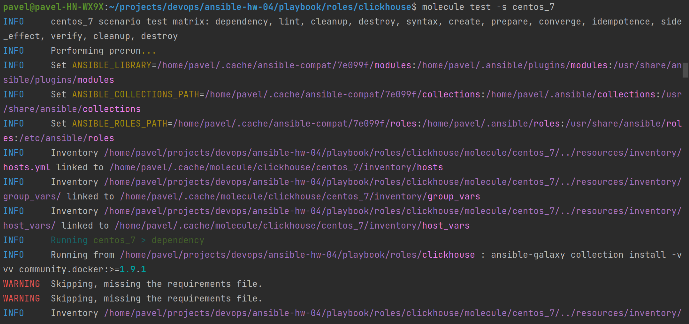
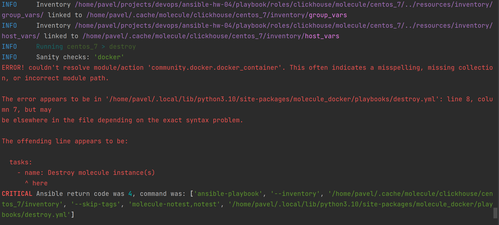
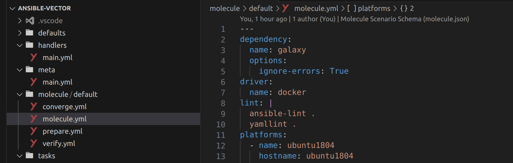
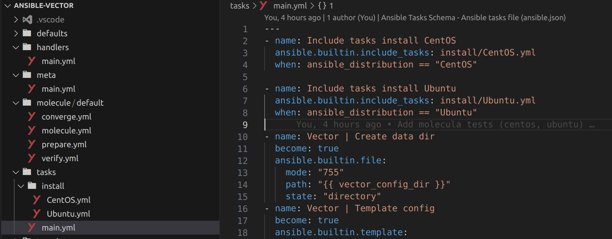
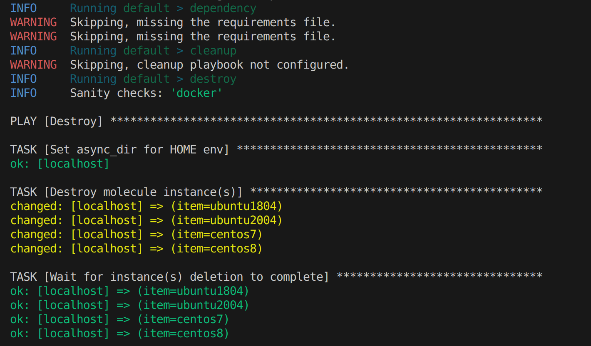
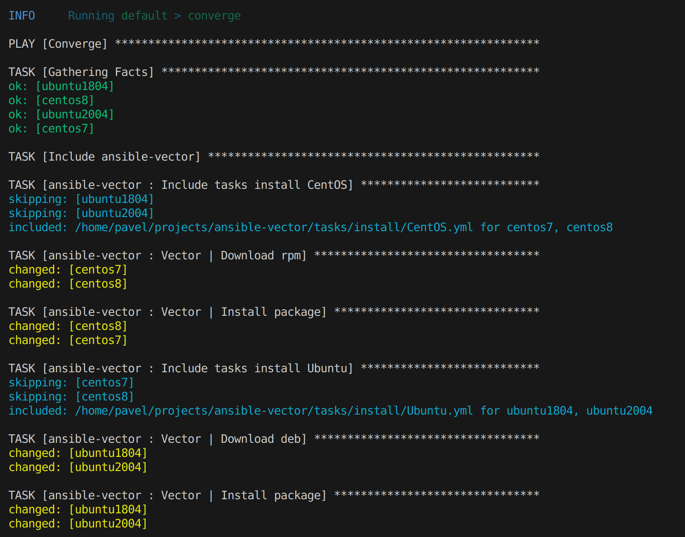
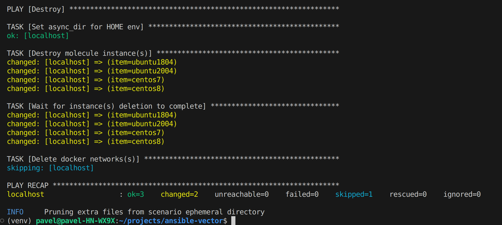

# Домашнее задание к занятию 5 «Тестирование roles»

## Подготовка к выполнению

1. Установите molecule: `pip3 install "molecule==3.5.2"` и драйвера `pip3 install molecule_docker molecule_podman`.
2. Выполните `docker pull aragast/netology:latest` —  это образ с podman, tox и несколькими пайтонами (3.7 и 3.9) внутри.

## Основная часть

Ваша цель — настроить тестирование ваших ролей. 

Задача — сделать сценарии тестирования для vector. 

Ожидаемый результат — все сценарии успешно проходят тестирование ролей.

### Molecule

1. Запустите  `molecule test -s centos_7` внутри корневой директории clickhouse-role, посмотрите на вывод команды. Данная команда может отработать с ошибками, это нормально. Наша цель - посмотреть как другие в реальном мире используют молекулу.
2. Перейдите в каталог с ролью vector-role и создайте сценарий тестирования по умолчанию при помощи `molecule init scenario --driver-name docker`.
3. Добавьте несколько разных дистрибутивов (centos:8, ubuntu:latest) для инстансов и протестируйте роль, исправьте найденные ошибки, если они есть.
4. Добавьте несколько assert в verify.yml-файл для  проверки работоспособности vector-role (проверка, что конфиг валидный, проверка успешности запуска и др.). 
5. Запустите тестирование роли повторно и проверьте, что оно прошло успешно.
5. Добавьте новый тег на коммит с рабочим сценарием в соответствии с семантическим версионированием.

### Tox

1. Добавьте в директорию с vector-role файлы из [директории](./example).
2. Запустите `docker run --privileged=True -v <path_to_repo>:/opt/vector-role -w /opt/vector-role -it aragast/netology:latest /bin/bash`, где path_to_repo — путь до корня репозитория с vector-role на вашей файловой системе.
3. Внутри контейнера выполните команду `tox`, посмотрите на вывод.
5. Создайте облегчённый сценарий для `molecule` с драйвером `molecule_podman`. Проверьте его на исполнимость.
6. Пропишите правильную команду в `tox.ini`, чтобы запускался облегчённый сценарий.
8. Запустите команду `tox`. Убедитесь, что всё отработало успешно.
9. Добавьте новый тег на коммит с рабочим сценарием в соответствии с семантическим версионированием.

После выполнения у вас должно получится два сценария molecule и один tox.ini файл в репозитории. Не забудьте указать в ответе теги решений Tox и Molecule заданий. В качестве решения пришлите ссылку на  ваш репозиторий и скриншоты этапов выполнения задания. 

## Необязательная часть

1. Проделайте схожие манипуляции для создания роли LightHouse.
2. Создайте сценарий внутри любой из своих ролей, который умеет поднимать весь стек при помощи всех ролей.
3. Убедитесь в работоспособности своего стека. Создайте отдельный verify.yml, который будет проверять работоспособность интеграции всех инструментов между ними.
4. Выложите свои roles в репозитории.

В качестве решения пришлите ссылки и скриншоты этапов выполнения задания.

---

### Как оформить решение задания

Выполненное домашнее задание пришлите в виде ссылки на .md-файл в вашем репозитории.

# Решение

## Запуск molecule в clickhouse

2.1.
```shell
molecule test -s centos_7
```


...


## Molecule

2.2. Создан сценарий default



2.3. Добавлены platforms для 
* ubuntu 18.04 / ubuntu 20.04
* centos 7 / centos 8

Добавлены вложенные таски для определения платформы

```yaml
- name: Include tasks install CentOS
  ansible.builtin.include_tasks: install/CentOS.yml
  when: ansible_distribution == "CentOS"

- name: Include tasks install Ubuntu
  ansible.builtin.include_tasks: install/Ubuntu.yml
  when: ansible_distribution == "Ubuntu"
```



2.4. Добавлен assert для проверки службы vector

```yaml
- name: Verify
  hosts: all
  gather_facts: false
  tasks:
    - name: Ensure vector service started
      ansible.builtin.service:
        name: vector
        state: started
```

2.5. Запуск тестирования

```shell
molecule test
```


...

...


2.6. Добавлен новый тэг 1.1.0 (т.к. расширение функционала без потери обратной совместимости)

## Tox

2.1. Добавлены файлы 
* tox-requirements.ini
* tox.ini

2.2. Запуск контейнера

```shell
docker run --privileged=True -v /home/pavel/projects/ansible-vector:/opt/vector-role -w /opt/vector-role -it aragast/netology:latest /bin/bash
```

2.3. Запуск tox в контейнере

<details>
  <summary>Листинг выполнения</summary>

```shell
[root@0b2acb72dfe3 vector-role]# tox
py37-ansible210 create: /opt/vector-role/.tox/py37-ansible210
py37-ansible210 installdeps: -rtox-requirements.txt, ansible<3.0
py37-ansible210 installed: ansible==2.10.7,ansible-base==2.10.17,ansible-compat==1.0.0,ansible-lint==5.1.3,arrow==1.2.3,bcrypt==4.0.1,binaryornot==0.4.4,bracex==2.3.post1,cached-property==1.5.2,Cerberus==1.3.2,certifi==2023.5.7,cffi==1.15.1,chardet==5.1.0,charset-normalizer==3.2.0,click==8.1.6,click-help-colors==0.9.1,cookiecutter==2.2.3,cryptography==41.0.2,distro==1.8.0,enrich==1.2.7,idna==3.4,importlib-metadata==6.7.0,Jinja2==3.1.2,jmespath==1.0.1,lxml==4.9.3,markdown-it-py==2.2.0,MarkupSafe==2.1.3,mdurl==0.1.2,molecule==3.5.2,molecule-podman==1.1.0,packaging==23.1,paramiko==2.12.0,pathspec==0.11.1,pluggy==1.2.0,pycparser==2.21,Pygments==2.15.1,PyNaCl==1.5.0,python-dateutil==2.8.2,python-slugify==8.0.1,PyYAML==5.4.1,requests==2.31.0,rich==13.4.2,ruamel.yaml==0.17.32,ruamel.yaml.clib==0.2.7,selinux==0.2.1,six==1.16.0,subprocess-tee==0.3.5,tenacity==8.2.2,text-unidecode==1.3,typing_extensions==4.7.1,urllib3==2.0.3,wcmatch==8.4.1,yamllint==1.26.3,zipp==3.15.0
py37-ansible210 run-test-pre: PYTHONHASHSEED='4010838038'
py37-ansible210 run-test: commands[0] | molecule test -s compatibility --destroy always
CRITICAL 'molecule/compatibility/molecule.yml' glob failed.  Exiting.
ERROR: InvocationError for command /opt/vector-role/.tox/py37-ansible210/bin/molecule test -s compatibility --destroy always (exited with code 1)
py37-ansible30 create: /opt/vector-role/.tox/py37-ansible30
py37-ansible30 installdeps: -rtox-requirements.txt, ansible<3.1
py37-ansible30 installed: ansible==3.0.0,ansible-base==2.10.17,ansible-compat==1.0.0,ansible-lint==5.1.3,arrow==1.2.3,bcrypt==4.0.1,binaryornot==0.4.4,bracex==2.3.post1,cached-property==1.5.2,Cerberus==1.3.2,certifi==2023.5.7,cffi==1.15.1,chardet==5.1.0,charset-normalizer==3.2.0,click==8.1.6,click-help-colors==0.9.1,cookiecutter==2.2.3,cryptography==41.0.2,distro==1.8.0,enrich==1.2.7,idna==3.4,importlib-metadata==6.7.0,Jinja2==3.1.2,jmespath==1.0.1,lxml==4.9.3,markdown-it-py==2.2.0,MarkupSafe==2.1.3,mdurl==0.1.2,molecule==3.5.2,molecule-podman==1.1.0,packaging==23.1,paramiko==2.12.0,pathspec==0.11.1,pluggy==1.2.0,pycparser==2.21,Pygments==2.15.1,PyNaCl==1.5.0,python-dateutil==2.8.2,python-slugify==8.0.1,PyYAML==5.4.1,requests==2.31.0,rich==13.4.2,ruamel.yaml==0.17.32,ruamel.yaml.clib==0.2.7,selinux==0.2.1,six==1.16.0,subprocess-tee==0.3.5,tenacity==8.2.2,text-unidecode==1.3,typing_extensions==4.7.1,urllib3==2.0.3,wcmatch==8.4.1,yamllint==1.26.3,zipp==3.15.0
py37-ansible30 run-test-pre: PYTHONHASHSEED='4010838038'
py37-ansible30 run-test: commands[0] | molecule test -s compatibility --destroy always
CRITICAL 'molecule/compatibility/molecule.yml' glob failed.  Exiting.
ERROR: InvocationError for command /opt/vector-role/.tox/py37-ansible30/bin/molecule test -s compatibility --destroy always (exited with code 1)
py39-ansible210 create: /opt/vector-role/.tox/py39-ansible210
py39-ansible210 installdeps: -rtox-requirements.txt, ansible<3.0
py39-ansible210 installed: ansible==2.10.7,ansible-base==2.10.17,ansible-compat==4.1.2,ansible-core==2.15.2,ansible-lint==5.1.3,arrow==1.2.3,attrs==23.1.0,bcrypt==4.0.1,binaryornot==0.4.4,bracex==2.3.post1,Cerberus==1.3.2,certifi==2023.5.7,cffi==1.15.1,chardet==5.1.0,charset-normalizer==3.2.0,click==8.1.6,click-help-colors==0.9.1,cookiecutter==2.2.3,cryptography==41.0.2,distro==1.8.0,enrich==1.2.7,idna==3.4,importlib-resources==5.0.7,Jinja2==3.1.2,jmespath==1.0.1,jsonschema==4.18.4,jsonschema-specifications==2023.7.1,lxml==4.9.3,markdown-it-py==3.0.0,MarkupSafe==2.1.3,mdurl==0.1.2,molecule==3.5.2,molecule-podman==2.0.0,packaging==23.1,paramiko==2.12.0,pathspec==0.11.1,pluggy==1.2.0,pycparser==2.21,Pygments==2.15.1,PyNaCl==1.5.0,python-dateutil==2.8.2,python-slugify==8.0.1,PyYAML==5.4.1,referencing==0.30.0,requests==2.31.0,resolvelib==1.0.1,rich==13.4.2,rpds-py==0.9.2,ruamel.yaml==0.17.32,ruamel.yaml.clib==0.2.7,selinux==0.3.0,six==1.16.0,subprocess-tee==0.4.1,tenacity==8.2.2,text-unidecode==1.3,typing_extensions==4.7.1,urllib3==2.0.3,wcmatch==8.4.1,yamllint==1.26.3
py39-ansible210 run-test-pre: PYTHONHASHSEED='4010838038'
py39-ansible210 run-test: commands[0] | molecule test -s compatibility --destroy always
CRITICAL 'molecule/compatibility/molecule.yml' glob failed.  Exiting.
ERROR: InvocationError for command /opt/vector-role/.tox/py39-ansible210/bin/molecule test -s compatibility --destroy always (exited with code 1)
py39-ansible30 create: /opt/vector-role/.tox/py39-ansible30
py39-ansible30 installdeps: -rtox-requirements.txt, ansible<3.1
py39-ansible30 installed: ansible==3.0.0,ansible-base==2.10.17,ansible-compat==4.1.2,ansible-core==2.15.2,ansible-lint==5.1.3,arrow==1.2.3,attrs==23.1.0,bcrypt==4.0.1,binaryornot==0.4.4,bracex==2.3.post1,Cerberus==1.3.2,certifi==2023.5.7,cffi==1.15.1,chardet==5.1.0,charset-normalizer==3.2.0,click==8.1.6,click-help-colors==0.9.1,cookiecutter==2.2.3,cryptography==41.0.2,distro==1.8.0,enrich==1.2.7,idna==3.4,importlib-resources==5.0.7,Jinja2==3.1.2,jmespath==1.0.1,jsonschema==4.18.4,jsonschema-specifications==2023.7.1,lxml==4.9.3,markdown-it-py==3.0.0,MarkupSafe==2.1.3,mdurl==0.1.2,molecule==3.5.2,molecule-podman==2.0.0,packaging==23.1,paramiko==2.12.0,pathspec==0.11.1,pluggy==1.2.0,pycparser==2.21,Pygments==2.15.1,PyNaCl==1.5.0,python-dateutil==2.8.2,python-slugify==8.0.1,PyYAML==5.4.1,referencing==0.30.0,requests==2.31.0,resolvelib==1.0.1,rich==13.4.2,rpds-py==0.9.2,ruamel.yaml==0.17.32,ruamel.yaml.clib==0.2.7,selinux==0.3.0,six==1.16.0,subprocess-tee==0.4.1,tenacity==8.2.2,text-unidecode==1.3,typing_extensions==4.7.1,urllib3==2.0.3,wcmatch==8.4.1,yamllint==1.26.3
py39-ansible30 run-test-pre: PYTHONHASHSEED='4010838038'
py39-ansible30 run-test: commands[0] | molecule test -s compatibility --destroy always
CRITICAL 'molecule/compatibility/molecule.yml' glob failed.  Exiting.
ERROR: InvocationError for command /opt/vector-role/.tox/py39-ansible30/bin/molecule test -s compatibility --destroy always (exited with code 1)
__________________________________________________________ summary __________________________________________________________
ERROR:   py37-ansible210: commands failed
ERROR:   py37-ansible30: commands failed
ERROR:   py39-ansible210: commands failed
ERROR:   py39-ansible30: commands failed
```

</details>

2.4. Создание сценария podman

```shell
molecule init scenario --driver-name=podman podman
```

2.5. Конфигурация tox на запуск c podman

```yaml
commands =
    {posargs:molecule test -s podman}
```

<details>
  <summary>Листинг выполнения</summary>

```shell
[root@52d9c703ac1a vector-role]# tox
py37-ansible210 installed: ansible==2.10.7,ansible-base==2.10.17,ansible-compat==1.0.0,ansible-lint==5.1.3,arrow==1.2.3,bcrypt==4.0.1,binaryornot==0.4.4,bracex==2.3.post1,cached-property==1.5.2,Cerberus==1.3.2,certifi==2023.5.7,cffi==1.15.1,chardet==5.1.0,charset-normalizer==3.2.0,click==8.1.6,click-help-colors==0.9.1,cookiecutter==2.2.3,cryptography==41.0.2,distro==1.8.0,enrich==1.2.7,idna==3.4,importlib-metadata==6.7.0,Jinja2==3.1.2,jmespath==1.0.1,lxml==4.9.3,markdown-it-py==2.2.0,MarkupSafe==2.1.3,mdurl==0.1.2,molecule==3.5.2,molecule-podman==1.1.0,packaging==23.1,paramiko==2.12.0,pathspec==0.11.1,pluggy==1.2.0,pycparser==2.21,Pygments==2.15.1,PyNaCl==1.5.0,python-dateutil==2.8.2,python-slugify==8.0.1,PyYAML==5.4.1,requests==2.31.0,rich==13.4.2,ruamel.yaml==0.17.32,ruamel.yaml.clib==0.2.7,selinux==0.2.1,six==1.16.0,subprocess-tee==0.3.5,tenacity==8.2.2,text-unidecode==1.3,typing_extensions==4.7.1,urllib3==2.0.3,wcmatch==8.4.1,yamllint==1.26.3,zipp==3.15.0
py37-ansible210 run-test-pre: PYTHONHASHSEED='3895210520'
py37-ansible210 run-test: commands[0] | molecule test -s podman
INFO     podman scenario test matrix: dependency, lint, cleanup, destroy, syntax, create, prepare, converge, idempotence, side_effect, verify, cleanup, destroy
INFO     Performing prerun...
INFO     Set ANSIBLE_LIBRARY=/root/.cache/ansible-compat/b984a4/modules:/root/.ansible/plugins/modules:/usr/share/ansible/plugins/modules
INFO     Set ANSIBLE_COLLECTIONS_PATH=/root/.cache/ansible-compat/b984a4/collections:/root/.ansible/collections:/usr/share/ansible/collections
INFO     Set ANSIBLE_ROLES_PATH=/root/.cache/ansible-compat/b984a4/roles:/root/.ansible/roles:/usr/share/ansible/roles:/etc/ansible/roles
INFO     Running podman > dependency
WARNING  Skipping, missing the requirements file.
WARNING  Skipping, missing the requirements file.
INFO     Running podman > lint
INFO     Lint is disabled.
INFO     Running podman > cleanup
WARNING  Skipping, cleanup playbook not configured.
INFO     Running podman > destroy
INFO     Sanity checks: 'podman'

PLAY [Destroy] *****************************************************************

TASK [Destroy molecule instance(s)] ********************************************
changed: [localhost] => (item={'command': '/lib/systemd/systemd', 'hostname': 'centos7', 'image': 'docker.io/library/centos:7', 'name': 'centos7', 'override_command': False, 'pre_build_image': True, 'privileged': True, 'volumes': ['/sys/fs/cgroup:/sys/fs/cgroup:rw']})

TASK [Wait for instance(s) deletion to complete] *******************************
changed: [localhost] => (item={'started': 1, 'finished': 0, 'ansible_job_id': '109913317530.1154', 'results_file': '/root/.ansible_async/109913317530.1154', 'changed': True, 'failed': False, 'item': {'command': '/lib/systemd/systemd', 'hostname': 'centos7', 'image': 'docker.io/library/centos:7', 'name': 'centos7', 'override_command': False, 'pre_build_image': True, 'privileged': True, 'volumes': ['/sys/fs/cgroup:/sys/fs/cgroup:rw']}, 'ansible_loop_var': 'item'})

PLAY RECAP *********************************************************************
localhost                  : ok=2    changed=2    unreachable=0    failed=0    skipped=0    rescued=0    ignored=0

INFO     Running podman > syntax

playbook: /opt/vector-role/molecule/podman/converge.yml
INFO     Running podman > create

PLAY [Create] ******************************************************************

TASK [get podman executable path] **********************************************
ok: [localhost]

TASK [save path to executable as fact] *****************************************
ok: [localhost]

TASK [Log into a container registry] *******************************************
skipping: [localhost] => (item="centos7 registry username: None specified") 

TASK [Check presence of custom Dockerfiles] ************************************
ok: [localhost] => (item=Dockerfile: None specified)

TASK [Create Dockerfiles from image names] *************************************
skipping: [localhost] => (item="Dockerfile: None specified; Image: docker.io/library/centos:7") 

TASK [Discover local Podman images] ********************************************
ok: [localhost] => (item=centos7)

TASK [Build an Ansible compatible image] ***************************************
skipping: [localhost] => (item=docker.io/library/centos:7) 

TASK [Determine the CMD directives] ********************************************
skipping: [localhost] => (item="centos7 command: /lib/systemd/systemd") 

TASK [Remove possible pre-existing containers] *********************************
changed: [localhost]

TASK [Discover local podman networks] ******************************************
skipping: [localhost] => (item=centos7: None specified) 

TASK [Create podman network dedicated to this scenario] ************************
skipping: [localhost]

TASK [Create molecule instance(s)] *********************************************
changed: [localhost] => (item=centos7)

TASK [Wait for instance(s) creation to complete] *******************************
changed: [localhost] => (item=centos7)

PLAY RECAP *********************************************************************
localhost                  : ok=7    changed=3    unreachable=0    failed=0    skipped=6    rescued=0    ignored=0

INFO     Running podman > prepare
WARNING  Skipping, prepare playbook not configured.
INFO     Running podman > converge

PLAY [Converge] ****************************************************************

TASK [Gathering Facts] *********************************************************
fatal: [centos7]: UNREACHABLE! => {"changed": false, "msg": "Failed to create temporary directory.In some cases, you may have been able to authenticate and did not have permissions on the target directory. Consider changing the remote tmp path in ansible.cfg to a path rooted in \"/tmp\", for more error information use -vvv. Failed command was: ( umask 77 && mkdir -p \"` echo ~/.ansible/tmp `\"&& mkdir \"` echo ~/.ansible/tmp/ansible-tmp-1689716063.6153362-1410-201314603595924 `\" && echo ansible-tmp-1689716063.6153362-1410-201314603595924=\"` echo ~/.ansible/tmp/ansible-tmp-1689716063.6153362-1410-201314603595924 `\" ), exited with result 255", "unreachable": true}

PLAY RECAP *********************************************************************
centos7                    : ok=0    changed=0    unreachable=1    failed=0    skipped=0    rescued=0    ignored=0

CRITICAL Ansible return code was 4, command was: ['ansible-playbook', '--inventory', '/root/.cache/molecule/vector-role/podman/inventory', '--skip-tags', 'molecule-notest,notest', '/opt/vector-role/molecule/podman/converge.yml']
WARNING  An error occurred during the test sequence action: 'converge'. Cleaning up.
INFO     Running podman > cleanup
WARNING  Skipping, cleanup playbook not configured.
INFO     Running podman > destroy

PLAY [Destroy] *****************************************************************

TASK [Destroy molecule instance(s)] ********************************************
changed: [localhost] => (item={'command': '/lib/systemd/systemd', 'hostname': 'centos7', 'image': 'docker.io/library/centos:7', 'name': 'centos7', 'override_command': False, 'pre_build_image': True, 'privileged': True, 'volumes': ['/sys/fs/cgroup:/sys/fs/cgroup:rw']})

TASK [Wait for instance(s) deletion to complete] *******************************
FAILED - RETRYING: Wait for instance(s) deletion to complete (300 retries left).
changed: [localhost] => (item={'started': 1, 'finished': 0, 'ansible_job_id': '592057707075.1486', 'results_file': '/root/.ansible_async/592057707075.1486', 'changed': True, 'failed': False, 'item': {'command': '/lib/systemd/systemd', 'hostname': 'centos7', 'image': 'docker.io/library/centos:7', 'name': 'centos7', 'override_command': False, 'pre_build_image': True, 'privileged': True, 'volumes': ['/sys/fs/cgroup:/sys/fs/cgroup:rw']}, 'ansible_loop_var': 'item'})

PLAY RECAP *********************************************************************
localhost                  : ok=2    changed=2    unreachable=0    failed=0    skipped=0    rescued=0    ignored=0

INFO     Pruning extra files from scenario ephemeral directory
ERROR: InvocationError for command /opt/vector-role/.tox/py37-ansible210/bin/molecule test -s podman (exited with code 1)
py37-ansible30 installed: ansible==3.0.0,ansible-base==2.10.17,ansible-compat==1.0.0,ansible-lint==5.1.3,arrow==1.2.3,bcrypt==4.0.1,binaryornot==0.4.4,bracex==2.3.post1,cached-property==1.5.2,Cerberus==1.3.2,certifi==2023.5.7,cffi==1.15.1,chardet==5.1.0,charset-normalizer==3.2.0,click==8.1.6,click-help-colors==0.9.1,cookiecutter==2.2.3,cryptography==41.0.2,distro==1.8.0,enrich==1.2.7,idna==3.4,importlib-metadata==6.7.0,Jinja2==3.1.2,jmespath==1.0.1,lxml==4.9.3,markdown-it-py==2.2.0,MarkupSafe==2.1.3,mdurl==0.1.2,molecule==3.5.2,molecule-podman==1.1.0,packaging==23.1,paramiko==2.12.0,pathspec==0.11.1,pluggy==1.2.0,pycparser==2.21,Pygments==2.15.1,PyNaCl==1.5.0,python-dateutil==2.8.2,python-slugify==8.0.1,PyYAML==5.4.1,requests==2.31.0,rich==13.4.2,ruamel.yaml==0.17.32,ruamel.yaml.clib==0.2.7,selinux==0.2.1,six==1.16.0,subprocess-tee==0.3.5,tenacity==8.2.2,text-unidecode==1.3,typing_extensions==4.7.1,urllib3==2.0.3,wcmatch==8.4.1,yamllint==1.26.3,zipp==3.15.0
py37-ansible30 run-test-pre: PYTHONHASHSEED='3895210520'
py37-ansible30 run-test: commands[0] | molecule test -s podman
INFO     podman scenario test matrix: dependency, lint, cleanup, destroy, syntax, create, prepare, converge, idempotence, side_effect, verify, cleanup, destroy
INFO     Performing prerun...
INFO     Set ANSIBLE_LIBRARY=/root/.cache/ansible-compat/b984a4/modules:/root/.ansible/plugins/modules:/usr/share/ansible/plugins/modules
INFO     Set ANSIBLE_COLLECTIONS_PATH=/root/.cache/ansible-compat/b984a4/collections:/root/.ansible/collections:/usr/share/ansible/collections
INFO     Set ANSIBLE_ROLES_PATH=/root/.cache/ansible-compat/b984a4/roles:/root/.ansible/roles:/usr/share/ansible/roles:/etc/ansible/roles
INFO     Running podman > dependency
WARNING  Skipping, missing the requirements file.
WARNING  Skipping, missing the requirements file.
INFO     Running podman > lint
INFO     Lint is disabled.
INFO     Running podman > cleanup
WARNING  Skipping, cleanup playbook not configured.
INFO     Running podman > destroy
INFO     Sanity checks: 'podman'

PLAY [Destroy] *****************************************************************

TASK [Destroy molecule instance(s)] ********************************************
changed: [localhost] => (item={'command': '/lib/systemd/systemd', 'hostname': 'centos7', 'image': 'docker.io/library/centos:7', 'name': 'centos7', 'override_command': False, 'pre_build_image': True, 'privileged': True, 'volumes': ['/sys/fs/cgroup:/sys/fs/cgroup:rw']})

TASK [Wait for instance(s) deletion to complete] *******************************
changed: [localhost] => (item={'started': 1, 'finished': 0, 'ansible_job_id': '529898013829.1603', 'results_file': '/root/.ansible_async/529898013829.1603', 'changed': True, 'failed': False, 'item': {'command': '/lib/systemd/systemd', 'hostname': 'centos7', 'image': 'docker.io/library/centos:7', 'name': 'centos7', 'override_command': False, 'pre_build_image': True, 'privileged': True, 'volumes': ['/sys/fs/cgroup:/sys/fs/cgroup:rw']}, 'ansible_loop_var': 'item'})

PLAY RECAP *********************************************************************
localhost                  : ok=2    changed=2    unreachable=0    failed=0    skipped=0    rescued=0    ignored=0

INFO     Running podman > syntax

playbook: /opt/vector-role/molecule/podman/converge.yml
INFO     Running podman > create

PLAY [Create] ******************************************************************

TASK [get podman executable path] **********************************************
ok: [localhost]

TASK [save path to executable as fact] *****************************************
ok: [localhost]

TASK [Log into a container registry] *******************************************
skipping: [localhost] => (item="centos7 registry username: None specified") 

TASK [Check presence of custom Dockerfiles] ************************************
ok: [localhost] => (item=Dockerfile: None specified)

TASK [Create Dockerfiles from image names] *************************************
skipping: [localhost] => (item="Dockerfile: None specified; Image: docker.io/library/centos:7") 

TASK [Discover local Podman images] ********************************************
ok: [localhost] => (item=centos7)

TASK [Build an Ansible compatible image] ***************************************
skipping: [localhost] => (item=docker.io/library/centos:7) 

TASK [Determine the CMD directives] ********************************************
skipping: [localhost] => (item="centos7 command: /lib/systemd/systemd") 

TASK [Remove possible pre-existing containers] *********************************
changed: [localhost]

TASK [Discover local podman networks] ******************************************
skipping: [localhost] => (item=centos7: None specified) 

TASK [Create podman network dedicated to this scenario] ************************
skipping: [localhost]

TASK [Create molecule instance(s)] *********************************************
changed: [localhost] => (item=centos7)

TASK [Wait for instance(s) creation to complete] *******************************
changed: [localhost] => (item=centos7)

PLAY RECAP *********************************************************************
localhost                  : ok=7    changed=3    unreachable=0    failed=0    skipped=6    rescued=0    ignored=0

INFO     Running podman > prepare
WARNING  Skipping, prepare playbook not configured.
INFO     Running podman > converge

PLAY [Converge] ****************************************************************

TASK [Gathering Facts] *********************************************************
fatal: [centos7]: UNREACHABLE! => {"changed": false, "msg": "Failed to create temporary directory.In some cases, you may have been able to authenticate and did not have permissions on the target directory. Consider changing the remote tmp path in ansible.cfg to a path rooted in \"/tmp\", for more error information use -vvv. Failed command was: ( umask 77 && mkdir -p \"` echo ~/.ansible/tmp `\"&& mkdir \"` echo ~/.ansible/tmp/ansible-tmp-1689716084.6089826-1860-170187865332112 `\" && echo ansible-tmp-1689716084.6089826-1860-170187865332112=\"` echo ~/.ansible/tmp/ansible-tmp-1689716084.6089826-1860-170187865332112 `\" ), exited with result 255", "unreachable": true}

PLAY RECAP *********************************************************************
centos7                    : ok=0    changed=0    unreachable=1    failed=0    skipped=0    rescued=0    ignored=0

CRITICAL Ansible return code was 4, command was: ['ansible-playbook', '--inventory', '/root/.cache/molecule/vector-role/podman/inventory', '--skip-tags', 'molecule-notest,notest', '/opt/vector-role/molecule/podman/converge.yml']
WARNING  An error occurred during the test sequence action: 'converge'. Cleaning up.
INFO     Running podman > cleanup
WARNING  Skipping, cleanup playbook not configured.
INFO     Running podman > destroy

PLAY [Destroy] *****************************************************************

TASK [Destroy molecule instance(s)] ********************************************
changed: [localhost] => (item={'command': '/lib/systemd/systemd', 'hostname': 'centos7', 'image': 'docker.io/library/centos:7', 'name': 'centos7', 'override_command': False, 'pre_build_image': True, 'privileged': True, 'volumes': ['/sys/fs/cgroup:/sys/fs/cgroup:rw']})

TASK [Wait for instance(s) deletion to complete] *******************************
FAILED - RETRYING: Wait for instance(s) deletion to complete (300 retries left).
changed: [localhost] => (item={'started': 1, 'finished': 0, 'ansible_job_id': '874757238800.1938', 'results_file': '/root/.ansible_async/874757238800.1938', 'changed': True, 'failed': False, 'item': {'command': '/lib/systemd/systemd', 'hostname': 'centos7', 'image': 'docker.io/library/centos:7', 'name': 'centos7', 'override_command': False, 'pre_build_image': True, 'privileged': True, 'volumes': ['/sys/fs/cgroup:/sys/fs/cgroup:rw']}, 'ansible_loop_var': 'item'})

PLAY RECAP *********************************************************************
localhost                  : ok=2    changed=2    unreachable=0    failed=0    skipped=0    rescued=0    ignored=0

INFO     Pruning extra files from scenario ephemeral directory
ERROR: InvocationError for command /opt/vector-role/.tox/py37-ansible30/bin/molecule test -s podman (exited with code 1)
py39-ansible210 installed: ansible==2.10.7,ansible-base==2.10.17,ansible-compat==4.1.2,ansible-core==2.15.2,ansible-lint==5.1.3,arrow==1.2.3,attrs==23.1.0,bcrypt==4.0.1,binaryornot==0.4.4,bracex==2.3.post1,Cerberus==1.3.2,certifi==2023.5.7,cffi==1.15.1,chardet==5.1.0,charset-normalizer==3.2.0,click==8.1.6,click-help-colors==0.9.1,cookiecutter==2.2.3,cryptography==41.0.2,distro==1.8.0,enrich==1.2.7,idna==3.4,importlib-resources==5.0.7,Jinja2==3.1.2,jmespath==1.0.1,jsonschema==4.18.4,jsonschema-specifications==2023.7.1,lxml==4.9.3,markdown-it-py==3.0.0,MarkupSafe==2.1.3,mdurl==0.1.2,molecule==3.5.2,molecule-podman==2.0.0,packaging==23.1,paramiko==2.12.0,pathspec==0.11.1,pluggy==1.2.0,pycparser==2.21,Pygments==2.15.1,PyNaCl==1.5.0,python-dateutil==2.8.2,python-slugify==8.0.1,PyYAML==5.4.1,referencing==0.30.0,requests==2.31.0,resolvelib==1.0.1,rich==13.4.2,rpds-py==0.9.2,ruamel.yaml==0.17.32,ruamel.yaml.clib==0.2.7,selinux==0.3.0,six==1.16.0,subprocess-tee==0.4.1,tenacity==8.2.2,text-unidecode==1.3,typing_extensions==4.7.1,urllib3==2.0.3,wcmatch==8.4.1,yamllint==1.26.3
py39-ansible210 run-test-pre: PYTHONHASHSEED='3895210520'
py39-ansible210 run-test: commands[0] | molecule test -s podman
INFO     podman scenario test matrix: dependency, lint, cleanup, destroy, syntax, create, prepare, converge, idempotence, side_effect, verify, cleanup, destroy
INFO     Performing prerun...
INFO     Set ANSIBLE_LIBRARY=/root/.cache/ansible-compat/f5bcd7/modules:/root/.ansible/plugins/modules:/usr/share/ansible/plugins/modules
INFO     Set ANSIBLE_COLLECTIONS_PATH=/root/.cache/ansible-compat/f5bcd7/collections:/root/.ansible/collections:/usr/share/ansible/collections
INFO     Set ANSIBLE_ROLES_PATH=/root/.cache/ansible-compat/f5bcd7/roles:/root/.ansible/roles:/usr/share/ansible/roles:/etc/ansible/roles
INFO     Running podman > dependency
INFO     Running from /opt/vector-role : ansible-galaxy collection install -vvv containers.podman:>=1.7.0
WARNING  Retrying execution failure 250 of: ansible-galaxy collection install -vvv containers.podman:>=1.7.0
ERROR    Command returned 250 code:
the full traceback was:

Traceback (most recent call last):
  File "/opt/vector-role/.tox/py39-ansible210/bin/ansible-galaxy", line 92, in <module>
    mycli = getattr(__import__("ansible.cli.%s" % sub, fromlist=), myclass)
  File "/opt/vector-role/.tox/py39-ansible210/lib/python3.9/site-packages/ansible/cli/galaxy.py", line 24, in <module>
    from ansible.galaxy.collection import (
  File "/opt/vector-role/.tox/py39-ansible210/lib/python3.9/site-packages/ansible/galaxy/collection/__init__.py", line 90, in <module>
    from ansible.galaxy.collection.concrete_artifact_manager import (
  File "/opt/vector-role/.tox/py39-ansible210/lib/python3.9/site-packages/ansible/galaxy/collection/concrete_artifact_manager.py", line 30, in <module>
    from ansible.galaxy.api import should_retry_error
ImportError: cannot import name 'should_retry_error' from 'ansible.galaxy.api' (/opt/vector-role/.tox/py39-ansible210/lib/python3.9/site-packages/ansible/galaxy/api.py)

[0;31mERROR! Unexpected Exception, this is probably a bug: cannot import name 'should_retry_error' from 'ansible.galaxy.api' (/opt/vector-role/.tox/py39-ansible210/lib/python3.9/site-packages/ansible/galaxy/api.py)[0m

Traceback (most recent call last):
  File "/opt/vector-role/.tox/py39-ansible210/bin/molecule", line 8, in <module>
    sys.exit(main())
  File "/opt/vector-role/.tox/py39-ansible210/lib/python3.9/site-packages/click/core.py", line 1157, in __call__
    return self.main(*args, **kwargs)
  File "/opt/vector-role/.tox/py39-ansible210/lib/python3.9/site-packages/click/core.py", line 1078, in main
    rv = self.invoke(ctx)
  File "/opt/vector-role/.tox/py39-ansible210/lib/python3.9/site-packages/click/core.py", line 1688, in invoke
    return _process_result(sub_ctx.command.invoke(sub_ctx))
  File "/opt/vector-role/.tox/py39-ansible210/lib/python3.9/site-packages/click/core.py", line 1434, in invoke
    return ctx.invoke(self.callback, **ctx.params)
  File "/opt/vector-role/.tox/py39-ansible210/lib/python3.9/site-packages/click/core.py", line 783, in invoke
    return __callback(*args, **kwargs)
  File "/opt/vector-role/.tox/py39-ansible210/lib/python3.9/site-packages/click/decorators.py", line 33, in new_func
    return f(get_current_context(), *args, **kwargs)
  File "/opt/vector-role/.tox/py39-ansible210/lib/python3.9/site-packages/molecule/command/test.py", line 159, in test
    base.execute_cmdline_scenarios(scenario_name, args, command_args, ansible_args)
  File "/opt/vector-role/.tox/py39-ansible210/lib/python3.9/site-packages/molecule/command/base.py", line 118, in execute_cmdline_scenarios
    execute_scenario(scenario)
  File "/opt/vector-role/.tox/py39-ansible210/lib/python3.9/site-packages/molecule/command/base.py", line 160, in execute_scenario
    execute_subcommand(scenario.config, action)
  File "/opt/vector-role/.tox/py39-ansible210/lib/python3.9/site-packages/molecule/command/base.py", line 149, in execute_subcommand
    return command(config).execute()
  File "/opt/vector-role/.tox/py39-ansible210/lib/python3.9/site-packages/molecule/logger.py", line 188, in wrapper
    rt = func(*args, **kwargs)
  File "/opt/vector-role/.tox/py39-ansible210/lib/python3.9/site-packages/molecule/command/dependency.py", line 74, in execute
    self._config.dependency.execute()
  File "/opt/vector-role/.tox/py39-ansible210/lib/python3.9/site-packages/molecule/dependency/ansible_galaxy/__init__.py", line 76, in execute
    invoker.execute()
  File "/opt/vector-role/.tox/py39-ansible210/lib/python3.9/site-packages/molecule/dependency/ansible_galaxy/base.py", line 120, in execute
    super().execute()
  File "/opt/vector-role/.tox/py39-ansible210/lib/python3.9/site-packages/molecule/dependency/base.py", line 92, in execute
    self._config.runtime.require_collection(name, version)
  File "/opt/vector-role/.tox/py39-ansible210/lib/python3.9/site-packages/ansible_compat/runtime.py", line 697, in require_collection
    self.install_collection(f"{name}:>={version}" if version else name)
  File "/opt/vector-role/.tox/py39-ansible210/lib/python3.9/site-packages/ansible_compat/runtime.py", line 437, in install_collection
    raise InvalidPrerequisiteError(msg)
ansible_compat.errors.InvalidPrerequisiteError: Command returned 250 code:
the full traceback was:

Traceback (most recent call last):
  File "/opt/vector-role/.tox/py39-ansible210/bin/ansible-galaxy", line 92, in <module>
    mycli = getattr(__import__("ansible.cli.%s" % sub, fromlist=[myclass]), myclass)
  File "/opt/vector-role/.tox/py39-ansible210/lib/python3.9/site-packages/ansible/cli/galaxy.py", line 24, in <module>
    from ansible.galaxy.collection import (
  File "/opt/vector-role/.tox/py39-ansible210/lib/python3.9/site-packages/ansible/galaxy/collection/__init__.py", line 90, in <module>
    from ansible.galaxy.collection.concrete_artifact_manager import (
  File "/opt/vector-role/.tox/py39-ansible210/lib/python3.9/site-packages/ansible/galaxy/collection/concrete_artifact_manager.py", line 30, in <module>
    from ansible.galaxy.api import should_retry_error
ImportError: cannot import name 'should_retry_error' from 'ansible.galaxy.api' (/opt/vector-role/.tox/py39-ansible210/lib/python3.9/site-packages/ansible/galaxy/api.py)

ERROR! Unexpected Exception, this is probably a bug: cannot import name 'should_retry_error' from 'ansible.galaxy.api' (/opt/vector-role/.tox/py39-ansible210/lib/python3.9/site-packages/ansible/galaxy/api.py)

ERROR: InvocationError for command /opt/vector-role/.tox/py39-ansible210/bin/molecule test -s podman (exited with code 1)
py39-ansible30 installed: ansible==3.0.0,ansible-base==2.10.17,ansible-compat==4.1.2,ansible-core==2.15.2,ansible-lint==5.1.3,arrow==1.2.3,attrs==23.1.0,bcrypt==4.0.1,binaryornot==0.4.4,bracex==2.3.post1,Cerberus==1.3.2,certifi==2023.5.7,cffi==1.15.1,chardet==5.1.0,charset-normalizer==3.2.0,click==8.1.6,click-help-colors==0.9.1,cookiecutter==2.2.3,cryptography==41.0.2,distro==1.8.0,enrich==1.2.7,idna==3.4,importlib-resources==5.0.7,Jinja2==3.1.2,jmespath==1.0.1,jsonschema==4.18.4,jsonschema-specifications==2023.7.1,lxml==4.9.3,markdown-it-py==3.0.0,MarkupSafe==2.1.3,mdurl==0.1.2,molecule==3.5.2,molecule-podman==2.0.0,packaging==23.1,paramiko==2.12.0,pathspec==0.11.1,pluggy==1.2.0,pycparser==2.21,Pygments==2.15.1,PyNaCl==1.5.0,python-dateutil==2.8.2,python-slugify==8.0.1,PyYAML==5.4.1,referencing==0.30.0,requests==2.31.0,resolvelib==1.0.1,rich==13.4.2,rpds-py==0.9.2,ruamel.yaml==0.17.32,ruamel.yaml.clib==0.2.7,selinux==0.3.0,six==1.16.0,subprocess-tee==0.4.1,tenacity==8.2.2,text-unidecode==1.3,typing_extensions==4.7.1,urllib3==2.0.3,wcmatch==8.4.1,yamllint==1.26.3
py39-ansible30 run-test-pre: PYTHONHASHSEED='3895210520'
py39-ansible30 run-test: commands[0] | molecule test -s podman
INFO     podman scenario test matrix: dependency, lint, cleanup, destroy, syntax, create, prepare, converge, idempotence, side_effect, verify, cleanup, destroy
INFO     Performing prerun...
INFO     Set ANSIBLE_LIBRARY=/root/.cache/ansible-compat/f5bcd7/modules:/root/.ansible/plugins/modules:/usr/share/ansible/plugins/modules
INFO     Set ANSIBLE_COLLECTIONS_PATH=/root/.cache/ansible-compat/f5bcd7/collections:/root/.ansible/collections:/usr/share/ansible/collections
INFO     Set ANSIBLE_ROLES_PATH=/root/.cache/ansible-compat/f5bcd7/roles:/root/.ansible/roles:/usr/share/ansible/roles:/etc/ansible/roles
INFO     Running podman > dependency
INFO     Running from /opt/vector-role : ansible-galaxy collection install -vvv containers.podman:>=1.7.0
WARNING  Retrying execution failure 250 of: ansible-galaxy collection install -vvv containers.podman:>=1.7.0
ERROR    Command returned 250 code:
the full traceback was:

Traceback (most recent call last):
  File "/opt/vector-role/.tox/py39-ansible30/bin/ansible-galaxy", line 92, in <module>
    mycli = getattr(__import__("ansible.cli.%s" % sub, fromlist=), myclass)
  File "/opt/vector-role/.tox/py39-ansible30/lib/python3.9/site-packages/ansible/cli/galaxy.py", line 24, in <module>
    from ansible.galaxy.collection import (
  File "/opt/vector-role/.tox/py39-ansible30/lib/python3.9/site-packages/ansible/galaxy/collection/__init__.py", line 90, in <module>
    from ansible.galaxy.collection.concrete_artifact_manager import (
  File "/opt/vector-role/.tox/py39-ansible30/lib/python3.9/site-packages/ansible/galaxy/collection/concrete_artifact_manager.py", line 30, in <module>
    from ansible.galaxy.api import should_retry_error
ImportError: cannot import name 'should_retry_error' from 'ansible.galaxy.api' (/opt/vector-role/.tox/py39-ansible30/lib/python3.9/site-packages/ansible/galaxy/api.py)

[0;31mERROR! Unexpected Exception, this is probably a bug: cannot import name 'should_retry_error' from 'ansible.galaxy.api' (/opt/vector-role/.tox/py39-ansible30/lib/python3.9/site-packages/ansible/galaxy/api.py)[0m

Traceback (most recent call last):
  File "/opt/vector-role/.tox/py39-ansible30/bin/molecule", line 8, in <module>
    sys.exit(main())
  File "/opt/vector-role/.tox/py39-ansible30/lib/python3.9/site-packages/click/core.py", line 1157, in __call__
    return self.main(*args, **kwargs)
  File "/opt/vector-role/.tox/py39-ansible30/lib/python3.9/site-packages/click/core.py", line 1078, in main
    rv = self.invoke(ctx)
  File "/opt/vector-role/.tox/py39-ansible30/lib/python3.9/site-packages/click/core.py", line 1688, in invoke
    return _process_result(sub_ctx.command.invoke(sub_ctx))
  File "/opt/vector-role/.tox/py39-ansible30/lib/python3.9/site-packages/click/core.py", line 1434, in invoke
    return ctx.invoke(self.callback, **ctx.params)
  File "/opt/vector-role/.tox/py39-ansible30/lib/python3.9/site-packages/click/core.py", line 783, in invoke
    return __callback(*args, **kwargs)
  File "/opt/vector-role/.tox/py39-ansible30/lib/python3.9/site-packages/click/decorators.py", line 33, in new_func
    return f(get_current_context(), *args, **kwargs)
  File "/opt/vector-role/.tox/py39-ansible30/lib/python3.9/site-packages/molecule/command/test.py", line 159, in test
    base.execute_cmdline_scenarios(scenario_name, args, command_args, ansible_args)
  File "/opt/vector-role/.tox/py39-ansible30/lib/python3.9/site-packages/molecule/command/base.py", line 118, in execute_cmdline_scenarios
    execute_scenario(scenario)
  File "/opt/vector-role/.tox/py39-ansible30/lib/python3.9/site-packages/molecule/command/base.py", line 160, in execute_scenario
    execute_subcommand(scenario.config, action)
  File "/opt/vector-role/.tox/py39-ansible30/lib/python3.9/site-packages/molecule/command/base.py", line 149, in execute_subcommand
    return command(config).execute()
  File "/opt/vector-role/.tox/py39-ansible30/lib/python3.9/site-packages/molecule/logger.py", line 188, in wrapper
    rt = func(*args, **kwargs)
  File "/opt/vector-role/.tox/py39-ansible30/lib/python3.9/site-packages/molecule/command/dependency.py", line 74, in execute
    self._config.dependency.execute()
  File "/opt/vector-role/.tox/py39-ansible30/lib/python3.9/site-packages/molecule/dependency/ansible_galaxy/__init__.py", line 76, in execute
    invoker.execute()
  File "/opt/vector-role/.tox/py39-ansible30/lib/python3.9/site-packages/molecule/dependency/ansible_galaxy/base.py", line 120, in execute
    super().execute()
  File "/opt/vector-role/.tox/py39-ansible30/lib/python3.9/site-packages/molecule/dependency/base.py", line 92, in execute
    self._config.runtime.require_collection(name, version)
  File "/opt/vector-role/.tox/py39-ansible30/lib/python3.9/site-packages/ansible_compat/runtime.py", line 697, in require_collection
    self.install_collection(f"{name}:>={version}" if version else name)
  File "/opt/vector-role/.tox/py39-ansible30/lib/python3.9/site-packages/ansible_compat/runtime.py", line 437, in install_collection
    raise InvalidPrerequisiteError(msg)
ansible_compat.errors.InvalidPrerequisiteError: Command returned 250 code:
the full traceback was:

Traceback (most recent call last):
  File "/opt/vector-role/.tox/py39-ansible30/bin/ansible-galaxy", line 92, in <module>
    mycli = getattr(__import__("ansible.cli.%s" % sub, fromlist=[myclass]), myclass)
  File "/opt/vector-role/.tox/py39-ansible30/lib/python3.9/site-packages/ansible/cli/galaxy.py", line 24, in <module>
    from ansible.galaxy.collection import (
  File "/opt/vector-role/.tox/py39-ansible30/lib/python3.9/site-packages/ansible/galaxy/collection/__init__.py", line 90, in <module>
    from ansible.galaxy.collection.concrete_artifact_manager import (
  File "/opt/vector-role/.tox/py39-ansible30/lib/python3.9/site-packages/ansible/galaxy/collection/concrete_artifact_manager.py", line 30, in <module>
    from ansible.galaxy.api import should_retry_error
ImportError: cannot import name 'should_retry_error' from 'ansible.galaxy.api' (/opt/vector-role/.tox/py39-ansible30/lib/python3.9/site-packages/ansible/galaxy/api.py)

ERROR! Unexpected Exception, this is probably a bug: cannot import name 'should_retry_error' from 'ansible.galaxy.api' (/opt/vector-role/.tox/py39-ansible30/lib/python3.9/site-packages/ansible/galaxy/api.py)

ERROR: InvocationError for command /opt/vector-role/.tox/py39-ansible30/bin/molecule test -s podman (exited with code 1)
__________________________________________________ summary ___________________________________________________
ERROR:   py37-ansible210: commands failed
ERROR:   py37-ansible30: commands failed
ERROR:   py39-ansible210: commands failed
ERROR:   py39-ansible30: commands failed
```

</details>

2.6. Добавлен новый тэг 1.2.0 (т.к. расширение функционала без потери обратной совместимости) 