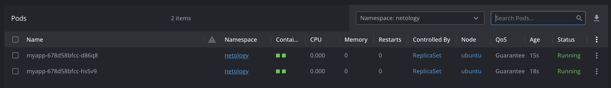
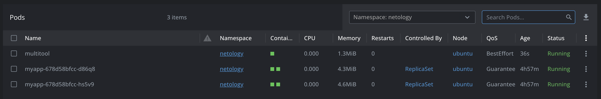

# Домашнее задание к занятию «Запуск приложений в K8S»

### Цель задания

В тестовой среде для работы с Kubernetes, установленной в предыдущем ДЗ, необходимо развернуть Deployment с приложением, состоящим из нескольких контейнеров, и масштабировать его.

------

### Чеклист готовности к домашнему заданию

1. Установленное k8s-решение (например, MicroK8S).
2. Установленный локальный kubectl.
3. Редактор YAML-файлов с подключённым git-репозиторием.

------

### Инструменты и дополнительные материалы, которые пригодятся для выполнения задания

1. [Описание](https://kubernetes.io/docs/concepts/workloads/controllers/deployment/) Deployment и примеры манифестов.
2. [Описание](https://kubernetes.io/docs/concepts/workloads/pods/init-containers/) Init-контейнеров.
3. [Описание](https://github.com/wbitt/Network-MultiTool) Multitool.

------

### Задание 1. Создать Deployment и обеспечить доступ к репликам приложения из другого Pod

1. Создать Deployment приложения, состоящего из двух контейнеров — nginx и multitool. Решить возникшую ошибку.
2. После запуска увеличить количество реплик работающего приложения до 2.
3. Продемонстрировать количество подов до и после масштабирования.
4. Создать Service, который обеспечит доступ до реплик приложений из п.1.
5. Создать отдельный Pod с приложением multitool и убедиться с помощью `curl`, что из пода есть доступ до приложений из п.1.

### Решение

[service.yaml](./src/service.yaml)
[deployment.yaml](./src/deployment.yaml)

```shell
kubectl -n netology apply -f kuber-hw-03/src/deployment.yaml
kubectl -n netology apply -f kuber-hw-03/src/service.yaml
kubectl -n netology get pods
kubectl -n netology get service
kubectl -n netology get replicasets
kubectl -n netology get deployments
```

Ошибки, которые возникли, это использование 80 порта и в nginx и в network-multitool.
Для исправления, можно указать в переменных окружения network-multitool значение http_port

```
env:
  - name: HTTP_PORT
    value: "8080"
```


Увеличиваем кол-во реплик

```
spec:
  replicas: 2
```

```shell
kubectl -n netology apply -f kuber-hw-03/src/deployment.yaml
kubectl -n netology get pods
kubectl -n netology get service
kubectl -n netology get replicasets
kubectl -n netology get deployments
```





```shell
kubectl run multitool --image=praqma/network-multitool -n netology
kubectl -n netology get pods
```




------

### Задание 2. Создать Deployment и обеспечить старт основного контейнера при выполнении условий

1. Создать Deployment приложения nginx и обеспечить старт контейнера только после того, как будет запущен сервис этого приложения.
2. Убедиться, что nginx не стартует. В качестве Init-контейнера взять busybox.
3. Создать и запустить Service. Убедиться, что Init запустился.
4. Продемонстрировать состояние пода до и после запуска сервиса.

[service.yaml](./src/service.yaml)
[deployment2.yaml](./src/deployment2.yaml)

```shell
kubectl -n netology apply -f kuber-hw-03/src/deployment2.yaml
kubectl -n netology get pods
kubectl -n netology get service
kubectl -n netology get replicasets
kubectl -n netology get deployments
```


------

### Правила приема работы

1. Домашняя работа оформляется в своем Git-репозитории в файле README.md. Выполненное домашнее задание пришлите ссылкой на .md-файл в вашем репозитории.
2. Файл README.md должен содержать скриншоты вывода необходимых команд `kubectl` и скриншоты результатов.
3. Репозиторий должен содержать файлы манифестов и ссылки на них в файле README.md.

------
