# Домашнее задание к занятию «Сетевое взаимодействие в K8S. Часть 1»

### Цель задания

В тестовой среде Kubernetes необходимо обеспечить доступ к приложению, установленному в предыдущем ДЗ и состоящему из двух контейнеров, по разным портам в разные контейнеры как внутри кластера, так и снаружи.

------

### Чеклист готовности к домашнему заданию

1. Установленное k8s-решение (например, MicroK8S).
2. Установленный локальный kubectl.
3. Редактор YAML-файлов с подключённым Git-репозиторием.

------

### Инструменты и дополнительные материалы, которые пригодятся для выполнения задания

1. [Описание](https://kubernetes.io/docs/concepts/workloads/controllers/deployment/) Deployment и примеры манифестов.
2. [Описание](https://kubernetes.io/docs/concepts/services-networking/service/) Описание Service.
3. [Описание](https://github.com/wbitt/Network-MultiTool) Multitool.

------

### Задание 1. Создать Deployment и обеспечить доступ к контейнерам приложения по разным портам из другого Pod внутри кластера

1. Создать Deployment приложения, состоящего из двух контейнеров (nginx и multitool), с количеством реплик 3 шт.
2. Создать Service, который обеспечит доступ внутри кластера до контейнеров приложения из п.1 по порту 9001 — nginx 80, по 9002 — multitool 8080.
3. Создать отдельный Pod с приложением multitool и убедиться с помощью `curl`, что из пода есть доступ до приложения из п.1 по разным портам в разные контейнеры.
4. Продемонстрировать доступ с помощью `curl` по доменному имени сервиса.
5. Предоставить манифесты Deployment и Service в решении, а также скриншоты или вывод команды п.4.

### Решение

* [deployment1.yaml](./src/deployment1.yaml)
* [service1.yaml](./src/service1.yaml)

```shell
kubectl apply -n netology -f deployment1.yaml
kubectl get pods -n netology
kubectl apply -n netology -f service1.yaml
kubectl get services -n netology
kubectl get endpoints -n netology
kubectl get pods -o wide -n netology

kubectl run mycurlpod --image=praqma/network-multitool -i --tty --rm -- sh
curl 10.1.243.225:80
curl 10.1.243.225:8080
curl 10.1.243.226:80
curl 10.1.243.226:8080
curl 10.1.243.228:80
curl 10.1.243.228:8080

curl nginx # -> no_port error
curl nginx:9001
curl nginx:9002
```

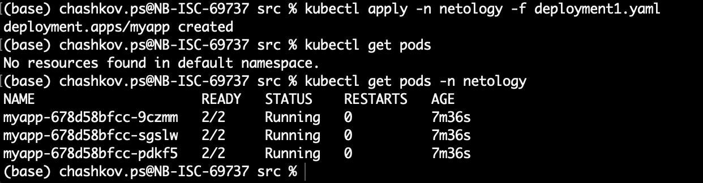

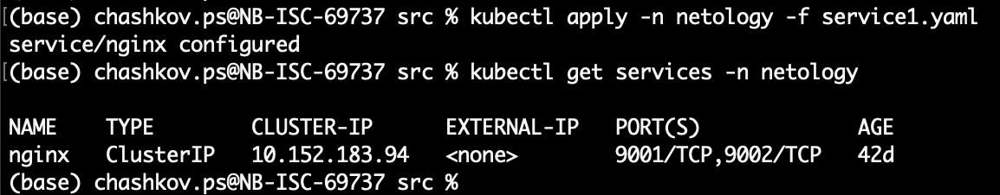

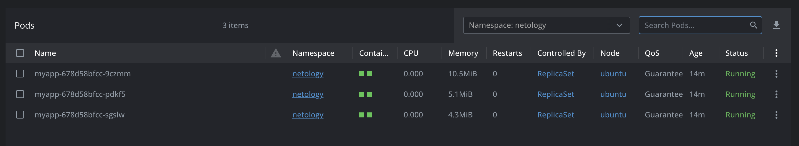

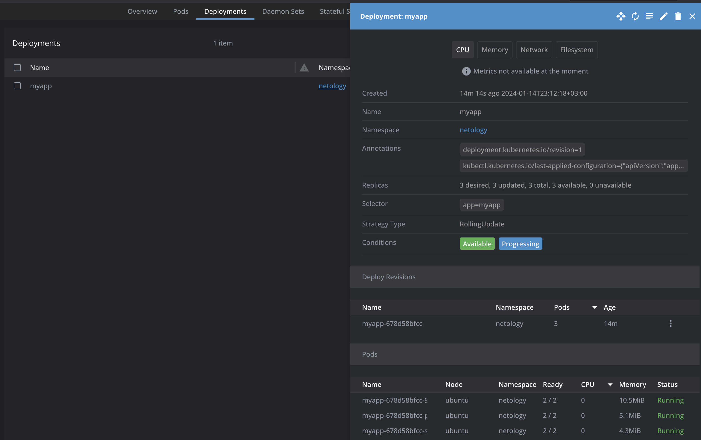

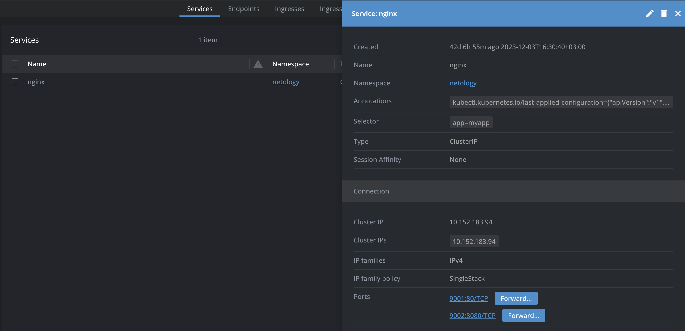

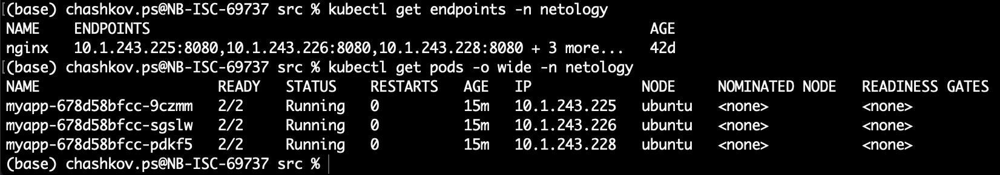


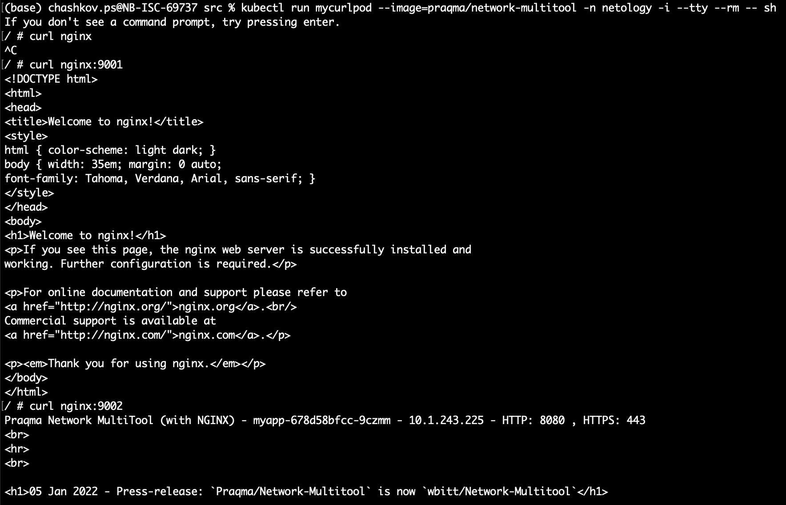

------

### Задание 2. Создать Service и обеспечить доступ к приложениям снаружи кластера

1. Создать отдельный Service приложения из Задания 1 с возможностью доступа снаружи кластера к nginx, используя тип NodePort.
2. Продемонстрировать доступ с помощью браузера или `curl` с локального компьютера.
3. Предоставить манифест и Service в решении, а также скриншоты или вывод команды п.2.

### Решение

* [service2.yaml](./src/service2.yaml)

```shell
kubectl apply -n netology -f service2.yaml
kubectl get services -n netology
curl ubuntu.local:30898 # from PC
curl ubuntu.local:32424 # from PC
curl localhost:30898 # from VM
curl localhost:32424 # from VM
```

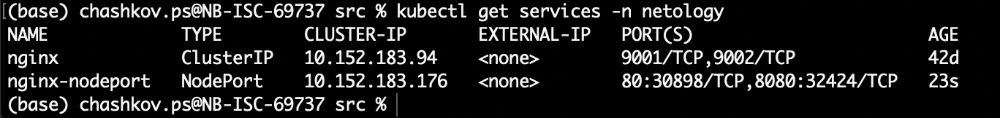

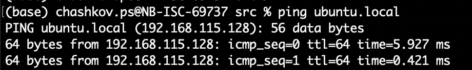

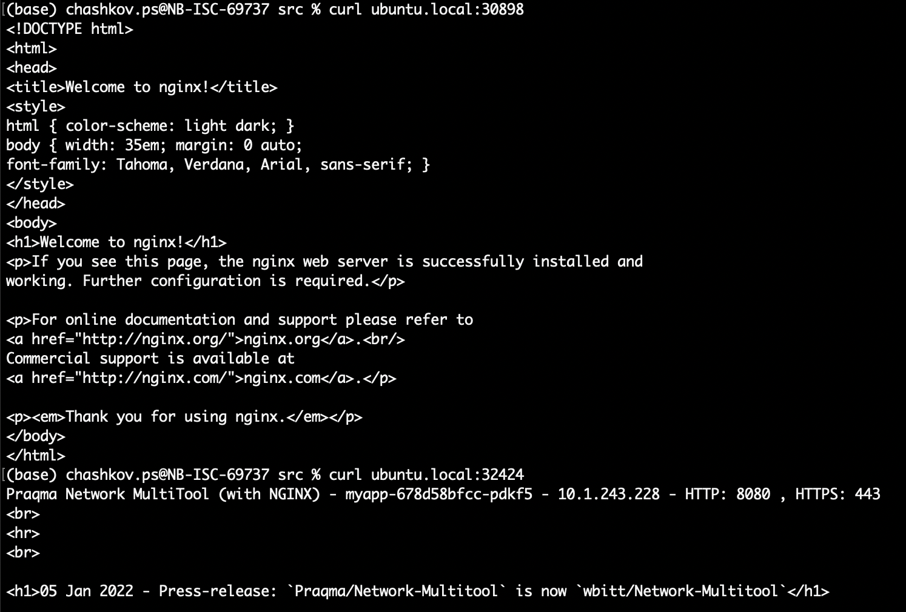

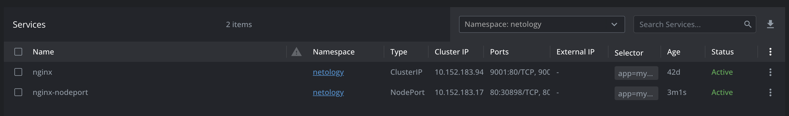

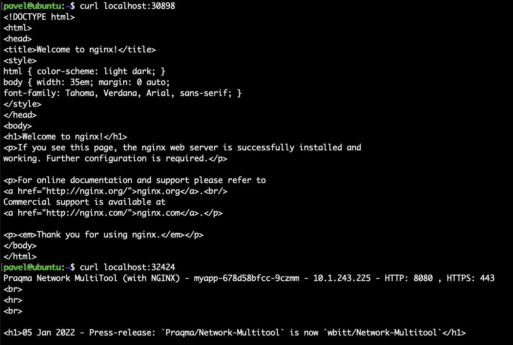

------

### Правила приёма работы

1. Домашняя работа оформляется в своем Git-репозитории в файле README.md. Выполненное домашнее задание пришлите ссылкой на .md-файл в вашем репозитории.
2. Файл README.md должен содержать скриншоты вывода необходимых команд `kubectl` и скриншоты результатов.
3. Репозиторий должен содержать тексты манифестов или ссылки на них в файле README.md.

