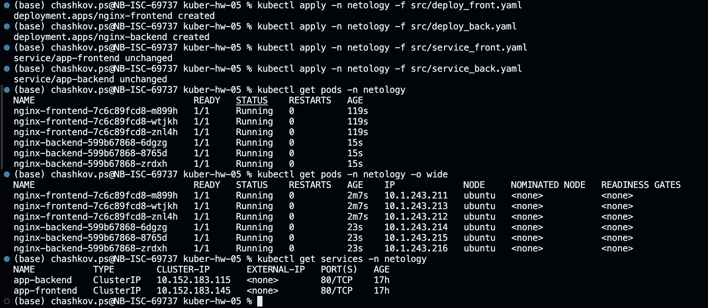

# Домашнее задание к занятию «Сетевое взаимодействие в K8S. Часть 2»

### Цель задания

В тестовой среде Kubernetes необходимо обеспечить доступ к двум приложениям снаружи кластера по разным путям.

------

### Чеклист готовности к домашнему заданию

1. Установленное k8s-решение (например, MicroK8S).
2. Установленный локальный kubectl.
3. Редактор YAML-файлов с подключённым Git-репозиторием.

------

### Инструменты и дополнительные материалы, которые пригодятся для выполнения задания

1. [Инструкция](https://microk8s.io/docs/getting-started) по установке MicroK8S.
2. [Описание](https://kubernetes.io/docs/concepts/services-networking/service/) Service.
3. [Описание](https://kubernetes.io/docs/concepts/services-networking/ingress/) Ingress.
4. [Описание](https://github.com/wbitt/Network-MultiTool) Multitool.

------

### Задание 1. Создать Deployment приложений backend и frontend

1. Создать Deployment приложения _frontend_ из образа nginx с количеством реплик 3 шт.
2. Создать Deployment приложения _backend_ из образа multitool. 
3. Добавить Service, которые обеспечат доступ к обоим приложениям внутри кластера. 
4. Продемонстрировать, что приложения видят друг друга с помощью Service.
5. Предоставить манифесты Deployment и Service в решении, а также скриншоты или вывод команды п.4.

### Решение

* [deploy_front.yaml](./src/deploy_front.yaml)
* [deploy_back.yaml](./src/deploy_back.yaml)
* [service_front.yaml](./src/service_front.yaml)
* [service_back.yaml](./src/service_back.yaml)

```shell
kubectl apply -n netology -f src/deploy_front.yaml
kubectl apply -n netology -f src/deploy_back.yaml
kubectl apply -n netology -f src/service_front.yaml
kubectl apply -n netology -f src/service_back.yaml

kuber-hw-05 % kubectl get pods -n netology -o wide
kuber-hw-05 % kubectl get services -n netology

kuber-hw-05 % kubectl run -n netology mycurlpod --image=praqma/network-multitool -i --tty --rm -- sh
curl app-frontend
curl app-backend
```




------

### Задание 2. Создать Ingress и обеспечить доступ к приложениям снаружи кластера

1. Включить Ingress-controller в MicroK8S.
2. Создать Ingress, обеспечивающий доступ снаружи по IP-адресу кластера MicroK8S так, чтобы при запросе только по адресу открывался _frontend_ а при добавлении /api - _backend_.
3. Продемонстрировать доступ с помощью браузера или `curl` с локального компьютера.
4. Предоставить манифесты и скриншоты или вывод команды п.2.

### Решение

* [ingress.yaml](./src/ingress.yaml)

```shell
kubectl create namespace ingress-nginx
kubectl get ns
brew install helm
helm repo add ingress-nginx https://kubernetes.github.io/ingress-nginx
helm -n ingress-nginx install ingress-nginx ingress-nginx/ingress-nginx
kubectl get pods -n ingress-nginx
kubectl get services -n ingress-nginx

kubectl apply -n netology -f src/ingress.yaml
curl ubuntu.local
curl ubuntu.local/api
```


------

### Правила приема работы

1. Домашняя работа оформляется в своем Git-репозитории в файле README.md. Выполненное домашнее задание пришлите ссылкой на .md-файл в вашем репозитории.
2. Файл README.md должен содержать скриншоты вывода необходимых команд `kubectl` и скриншоты результатов.
3. Репозиторий должен содержать тексты манифестов или ссылки на них в файле README.md.

------
