# Домашнее задание к занятию «Хранение в K8s. Часть 2»

### Цель задания

В тестовой среде Kubernetes нужно создать PV и продемострировать запись и хранение файлов.

------

### Чеклист готовности к домашнему заданию

1. Установленное K8s-решение (например, MicroK8S).
2. Установленный локальный kubectl.
3. Редактор YAML-файлов с подключенным GitHub-репозиторием.

------

### Дополнительные материалы для выполнения задания

1. [Инструкция по установке NFS в MicroK8S](https://microk8s.io/docs/nfs). 
2. [Описание Persistent Volumes](https://kubernetes.io/docs/concepts/storage/persistent-volumes/). 
3. [Описание динамического провижининга](https://kubernetes.io/docs/concepts/storage/dynamic-provisioning/). 
4. [Описание Multitool](https://github.com/wbitt/Network-MultiTool).

------

### Задание 1

**Что нужно сделать**

Создать Deployment приложения, использующего локальный PV, созданный вручную.

1. Создать Deployment приложения, состоящего из контейнеров busybox и multitool.
2. Создать PV и PVC для подключения папки на локальной ноде, которая будет использована в поде.
3. Продемонстрировать, что multitool может читать файл, в который busybox пишет каждые пять секунд в общей директории. 
4. Удалить Deployment и PVC. Продемонстрировать, что после этого произошло с PV. Пояснить, почему.
5. Продемонстрировать, что файл сохранился на локальном диске ноды. Удалить PV.  Продемонстрировать что произошло с файлом после удаления PV. Пояснить, почему.
5. Предоставить манифесты, а также скриншоты или вывод необходимых команд.

### Решение

* [1_pv.yaml](./src/1_pv.yaml)
* [1_pvc.yaml](./src/1_pvc.yaml)
* [1_deployment.yaml](./src/1_deployment.yaml)

```shell
sudo mkdir /mnt/data
ls -la /mnt/data/
kubectl apply -f src/1_pv.yaml
kubectl get pv pv-volume
kubectl apply -f src/1_pvc.yaml
kubectl get pvc pv-claim
kubectl apply -f src/1_deployment.yaml
kubectl get pods
kubectl logs myapp-85cc44b9c6-9c6c8 -c busybox
kubectl logs myapp-85cc44b9c6-9c6c8 -c multitool
ls -la /mnt/data/
cat /mnt/data/logs/myapp.txt

kubectl delete -f src/1_deployment.yaml
kubectl delete -f src/1_pvc.yaml
kubectl get pods
kubectl get pvc
ls -la /mnt/data/logs/
cat /mnt/data/logs/myapp.txt

kubectl delete -f src/1_pvc.yaml
kubectl get pv
ls -la /mnt/data/logs/
cat /mnt/data/logs/myapp.txt
```

Данные остались на хостовой ВМ, т.к. дефолтное значение persistentVolumeReclaimPolicy: Retain (для pv)
(после удаления PV ресурсы из внешних провайдеров автоматически не удаляются)

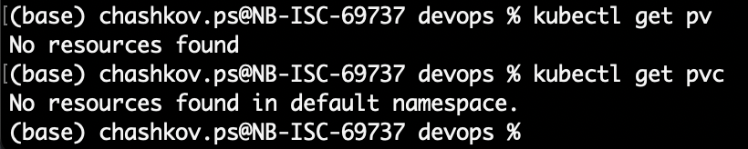

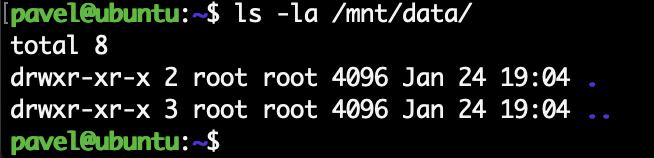

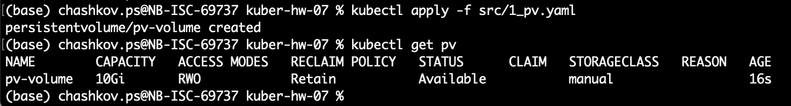

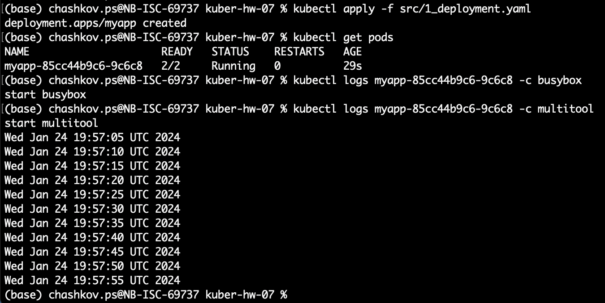

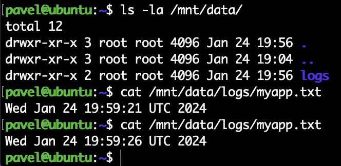

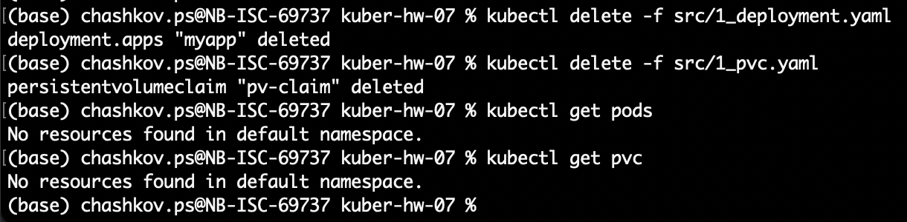

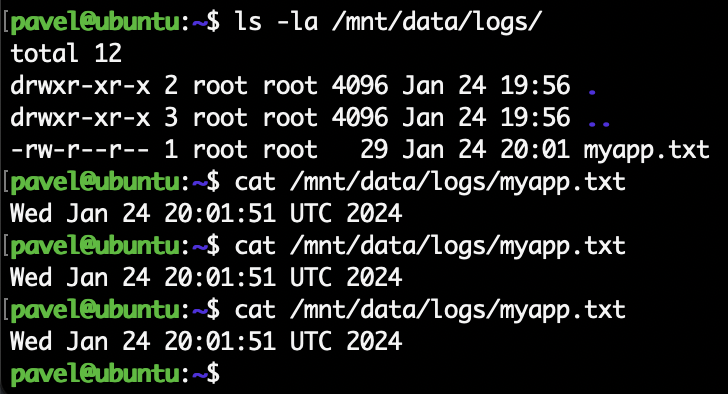

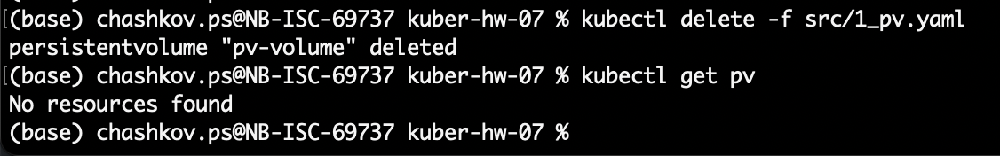

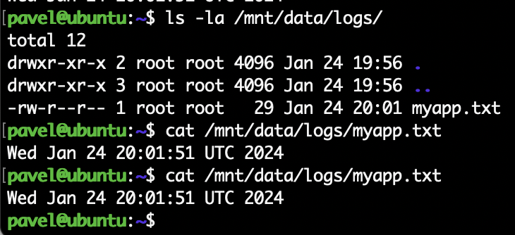

------

### Задание 2

**Что нужно сделать**

Создать Deployment приложения, которое может хранить файлы на NFS с динамическим созданием PV.

1. Включить и настроить NFS-сервер на MicroK8S.
2. Создать Deployment приложения состоящего из multitool, и подключить к нему PV, созданный автоматически на сервере NFS.
3. Продемонстрировать возможность чтения и записи файла изнутри пода. 
4. Предоставить манифесты, а также скриншоты или вывод необходимых команд.

### Решение

Запустить NFS-сервер на MicroK8S через nfs-server stable/nfs-server-provisioner не удалось, возникает ошибка
exec /nfs-provisioner: exec format error (архитектура ARM64 MacBook M1)

На сайте MikroK8S есть туториал по запуску NFS сервера
https://microk8s.io/docs/addon-nfs

* [2_sc.yaml](./src/2_sc.yaml)
* [2_pvc.yaml](./src/2_pvc.yaml)
* [2_deployment.yaml](./src/2_deployment.yaml)

```shell
sudo apt-get install nfs-kernel-server

sudo mkdir -p /srv/nfs
sudo chown nobody:nogroup /srv/nfs
sudo chmod 0777 /srv/nfs

sudo mv /etc/exports /etc/exports.bak
echo '/srv/nfs 192.168.115.128/24(rw,sync,no_subtree_check)' | sudo tee /etc/exports

sudo systemctl restart nfs-kernel-server

microk8s enable helm3
microk8s helm3 repo add csi-driver-nfs https://raw.githubusercontent.com/kubernetes-csi/csi-driver-nfs/master/charts
microk8s helm3 repo update

microk8s helm3 install csi-driver-nfs csi-driver-nfs/csi-driver-nfs \
    --namespace kube-system \
    --set kubeletDir=/var/snap/microk8s/common/var/lib/kubelet

microk8s kubectl wait pod --selector app.kubernetes.io/name=csi-driver-nfs --for condition=ready --namespace kube-system

microk8s kubectl get csidrivers

microk8s kubectl get pod -n kube-system

kubectl apply -f src/2_sc.yaml
kubectl get sc
kubectl apply -f src/2_pvc.yaml
kubectl get pvc
kubectl get pv

kubectl apply -f src/2_deployment.yaml

kubectl exec -it myapp-588f74544c-pkcf2 -- sh
date > /static/test.txt

cat /srv/nfs/pvc-fae45915-e8fe-42de-a4a2-9e89b5346b55/test.txt
```

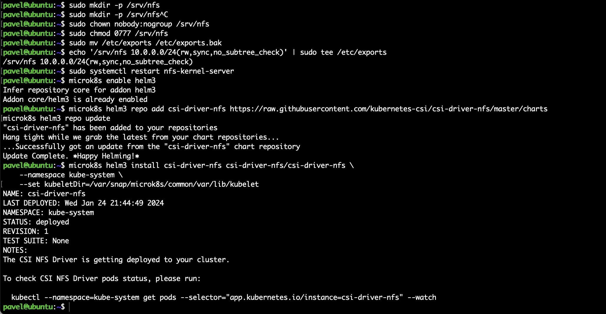

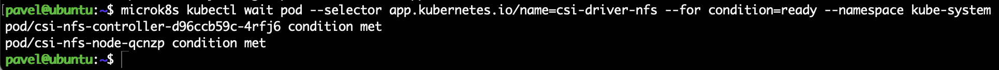

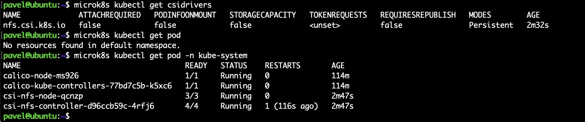

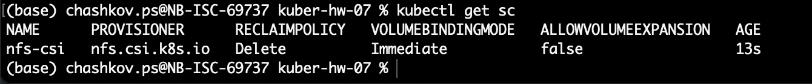

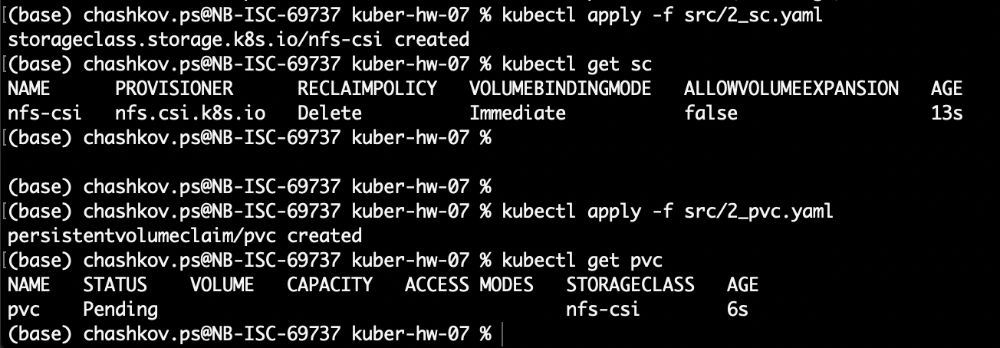

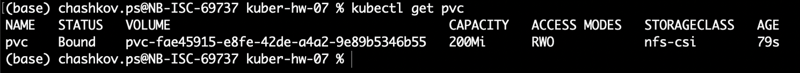

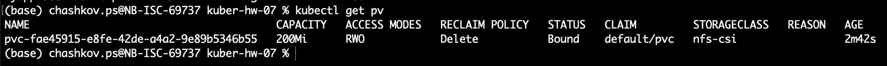

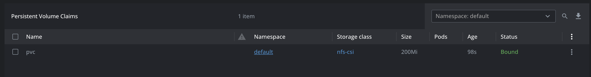

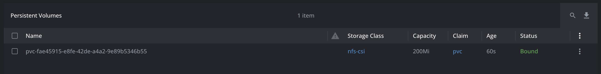

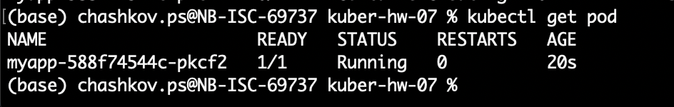

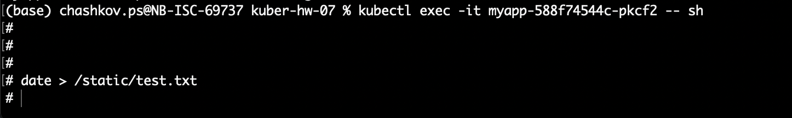

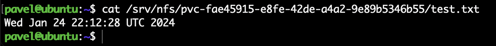

------

### Правила приёма работы

1. Домашняя работа оформляется в своём Git-репозитории в файле README.md. Выполненное задание пришлите ссылкой на .md-файл в вашем репозитории.
2. Файл README.md должен содержать скриншоты вывода необходимых команд `kubectl`, а также скриншоты результатов.
3. Репозиторий должен содержать тексты манифестов или ссылки на них в файле README.md.
