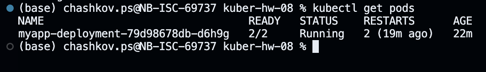
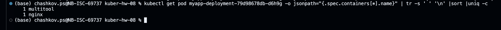
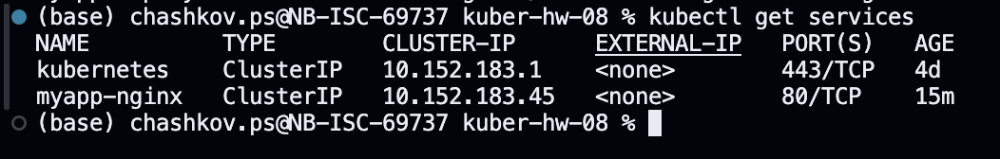
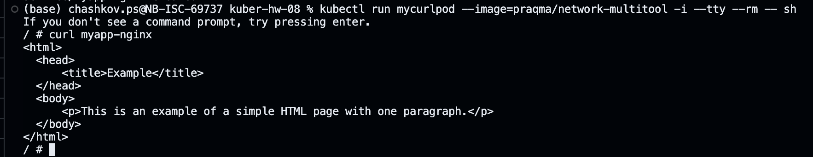
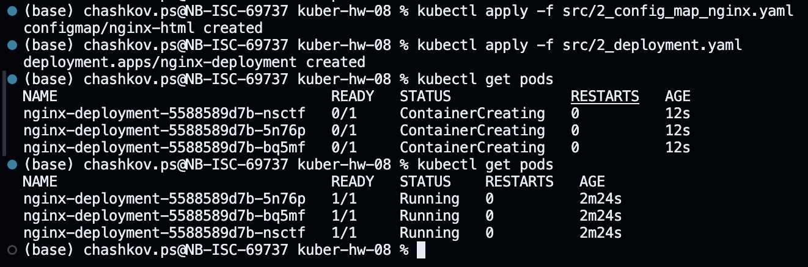
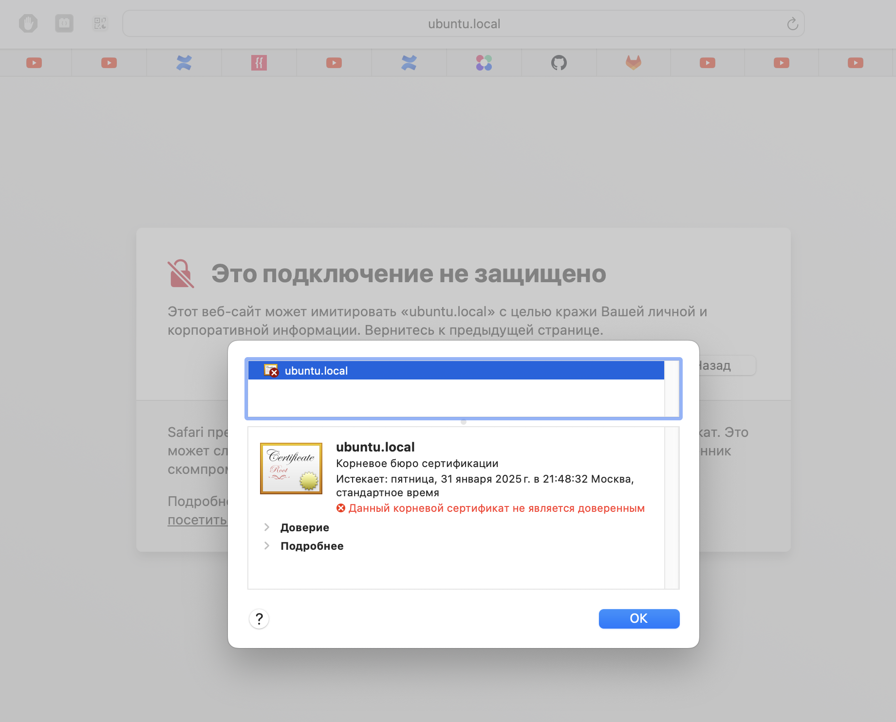
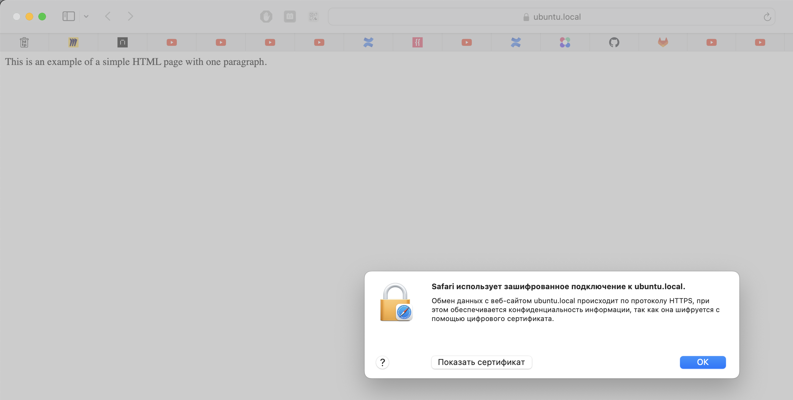

# Домашнее задание к занятию «Конфигурация приложений»

### Цель задания

В тестовой среде Kubernetes необходимо создать конфигурацию и продемонстрировать работу приложения.

------

### Чеклист готовности к домашнему заданию

1. Установленное K8s-решение (например, MicroK8s).
2. Установленный локальный kubectl.
3. Редактор YAML-файлов с подключённым GitHub-репозиторием.

------

### Инструменты и дополнительные материалы, которые пригодятся для выполнения задания

1. [Описание](https://kubernetes.io/docs/concepts/configuration/secret/) Secret.
2. [Описание](https://kubernetes.io/docs/concepts/configuration/configmap/) ConfigMap.
3. [Описание](https://github.com/wbitt/Network-MultiTool) Multitool.

------

### Задание 1. Создать Deployment приложения и решить возникшую проблему с помощью ConfigMap. Добавить веб-страницу

1. Создать Deployment приложения, состоящего из контейнеров nginx и multitool.
2. Решить возникшую проблему с помощью ConfigMap.
3. Продемонстрировать, что pod стартовал и оба конейнера работают.
4. Сделать простую веб-страницу и подключить её к Nginx с помощью ConfigMap. Подключить Service и показать вывод curl или в браузере.
5. Предоставить манифесты, а также скриншоты или вывод необходимых команд.

### Решение

* [1_config_map_multitool.yaml](./src/1_config_map_multitool.yaml)
* [1_config_map_nginx.yaml](./src/1_config_map_nginx.yaml)
* [1_deployment.yaml](./src/1_deployment.yaml)
* [1_service.yaml](./src/1_service.yaml)

```shell
kubectl apply -f src/1_config_map_multitool.yaml
kubectl apply -f src/1_config_map_nginx.yaml
kubectl apply -f src/1_deployment.yaml
kubectl get pods
kubectl describe pod myapp-deployment-79d98678db-d6h9g
kubectl get pod myapp-deployment-79d98678db-d6h9g -o jsonpath="{.spec.containers[*].name}" | tr -s ' ' '\n' |sort |uniq -c
kubectl apply -f src/1_service.yaml
kubectl get services
kubectl run mycurlpod --image=praqma/network-multitool -i --tty --rm -- sh
/# curl myapp-nginx
```









------

### Задание 2. Создать приложение с вашей веб-страницей, доступной по HTTPS 

1. Создать Deployment приложения, состоящего из Nginx.
2. Создать собственную веб-страницу и подключить её как ConfigMap к приложению.
3. Выпустить самоподписной сертификат SSL. Создать Secret для использования сертификата.
4. Создать Ingress и необходимый Service, подключить к нему SSL в вид. Продемонстировать доступ к приложению по HTTPS. 
4. Предоставить манифесты, а также скриншоты или вывод необходимых команд.

### Решение

* [2_config_map_nginx.yaml](./src/2_config_map_nginx.yaml)
* [2_deployment.yaml](./src/2_deployment.yaml)
* [2_metalb.yaml](./src/2_metalb.yaml)
* [2_secret.yaml](./src/2_secret.yaml)
* [2_service.yaml](./src/2_service.yaml)
* [2_ingress.yaml](./src/2_ingress.yaml)

```shell
kubectl apply -f src/2_config_map_nginx.yaml
kubectl apply -f src/2_deployment.yaml
kubectl get pods

openssl req -x509 -nodes -days 365 -newkey rsa:2048 -keyout tls.key -out tls.crt -subj "/CN=ubuntu.local"
cat tls.crt | base64
cat tls.key | base64
kubectl apply -f src/2_secret.yaml

kubectl create namespace metallb-system 
kubectl apply -f https://raw.githubusercontent.com/metallb/metallb/v0.14.3/config/manifests/metallb-native.yaml
kubectl apply -f src/2_metalb.yaml 

kubectl apply -f src/2_service.yaml

kubectl run -n netology mycurlpod --image=praqma/network-multitool -i --tty --rm -- sh
/# curl nginx-service

kubectl apply -f src/2_ingress.yaml
```








------

### Правила приёма работы

1. Домашняя работа оформляется в своём GitHub-репозитории в файле README.md. Выполненное домашнее задание пришлите ссылкой на .md-файл в вашем репозитории.
2. Файл README.md должен содержать скриншоты вывода необходимых команд `kubectl`, а также скриншоты результатов.
3. Репозиторий должен содержать тексты манифестов или ссылки на них в файле README.md.

------
