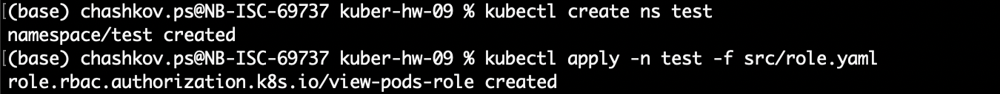

# Домашнее задание к занятию «Управление доступом»

### Цель задания

В тестовой среде Kubernetes нужно предоставить ограниченный доступ пользователю.

------

### Чеклист готовности к домашнему заданию

1. Установлено k8s-решение, например MicroK8S.
2. Установленный локальный kubectl.
3. Редактор YAML-файлов с подключённым github-репозиторием.

------

### Инструменты / дополнительные материалы, которые пригодятся для выполнения задания

1. [Описание](https://kubernetes.io/docs/reference/access-authn-authz/rbac/) RBAC.
2. [Пользователи и авторизация RBAC в Kubernetes](https://habr.com/ru/company/flant/blog/470503/).
3. [RBAC with Kubernetes in Minikube](https://medium.com/@HoussemDellai/rbac-with-kubernetes-in-minikube-4deed658ea7b).

------

### Задание 1. Создайте конфигурацию для подключения пользователя

1. Создайте и подпишите SSL-сертификат для подключения к кластеру.
2. Настройте конфигурационный файл kubectl для подключения.
3. Создайте роли и все необходимые настройки для пользователя.
4. Предусмотрите права пользователя. Пользователь может просматривать логи подов и их конфигурацию (`kubectl logs pod <pod_id>`, `kubectl describe pod <pod_id>`).
5. Предоставьте манифесты и скриншоты и/или вывод необходимых команд.

### Решение

* [role.yaml](./src/role.yaml)
* [role_binding.yaml](./src/role_binding.yaml)

```shell
mkdir k8s
openssl genrsa -out k8s/test.key 204
openssl req -new -key k8s/test.key -out k8s/test.csr -subj="/CN=test/O=ops"
openssl x509 -req -in k8s/test.csr -CA /var/snap/microk8s/current/certs/ca.crt -CAkey /var/snap/microk8s/current/certs/ca.key -CAcreateserial -out k8s/test.crt -days 5000

kubectl config set-credentials test --client-certificate=k8s/test.crt --client-key=k8s/test.key --embed-certs=true

kubectl create ns test
kubectl apply -n test -f src/role.yaml
kubectl -n test get role
kubectl -n test get role -o yaml

kubectl apply -n test -f src/role_binding.yaml

kubectl config use-context microk8s-test
kubectl get pods
```


```yaml
users:
- name: my-user
  user:
    client-certificate-data: <base64-encoded-client-cert>
    client-key-data: <base64-encoded-client-key>

contexts:
- context:
    cluster: microk8s-cluster
    user: my-user
  name: microk8s_my-user
```




------

### Правила приёма работы

1. Домашняя работа оформляется в своём Git-репозитории в файле README.md. Выполненное домашнее задание пришлите ссылкой на .md-файл в вашем репозитории.
2. Файл README.md должен содержать скриншоты вывода необходимых команд `kubectl`, скриншоты результатов.
3. Репозиторий должен содержать тексты манифестов или ссылки на них в файле README.md.

------

