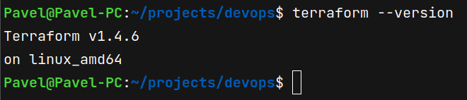
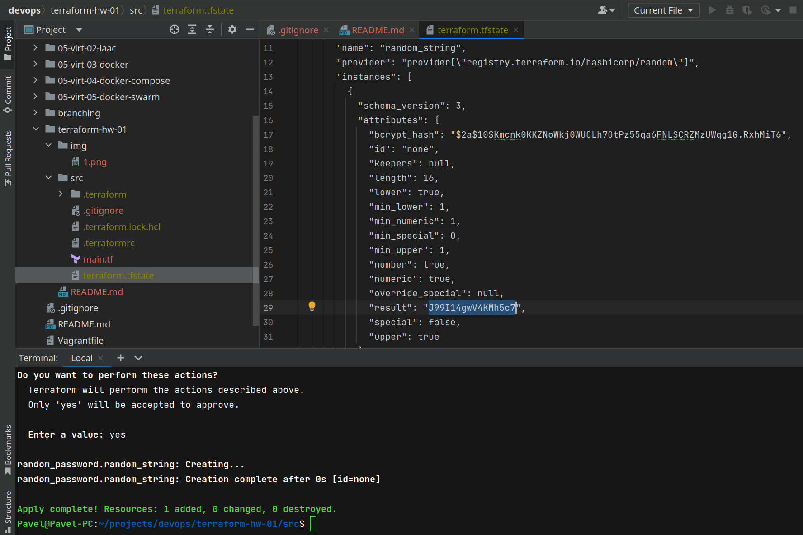
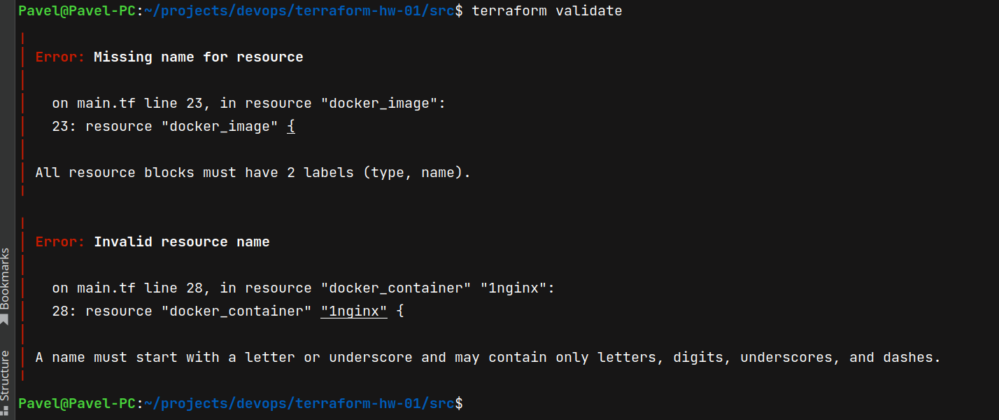
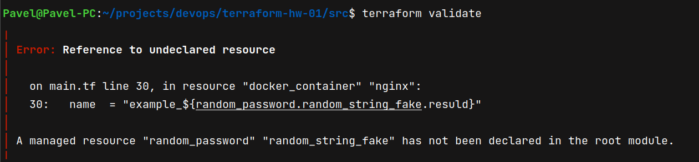
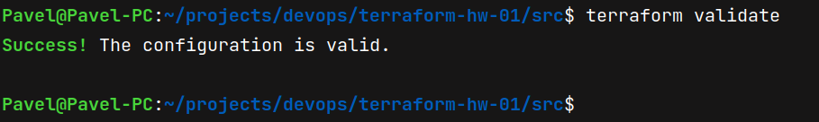
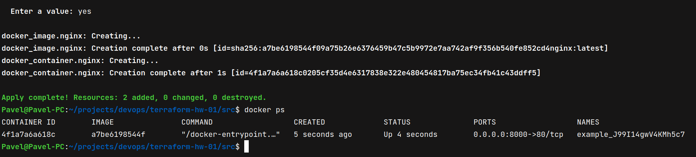
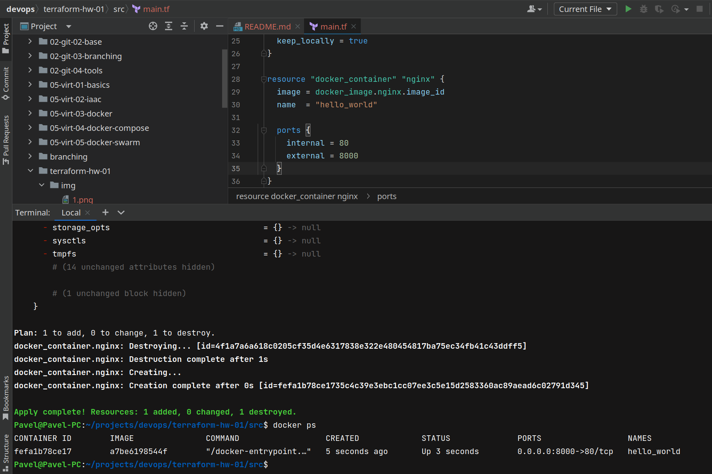
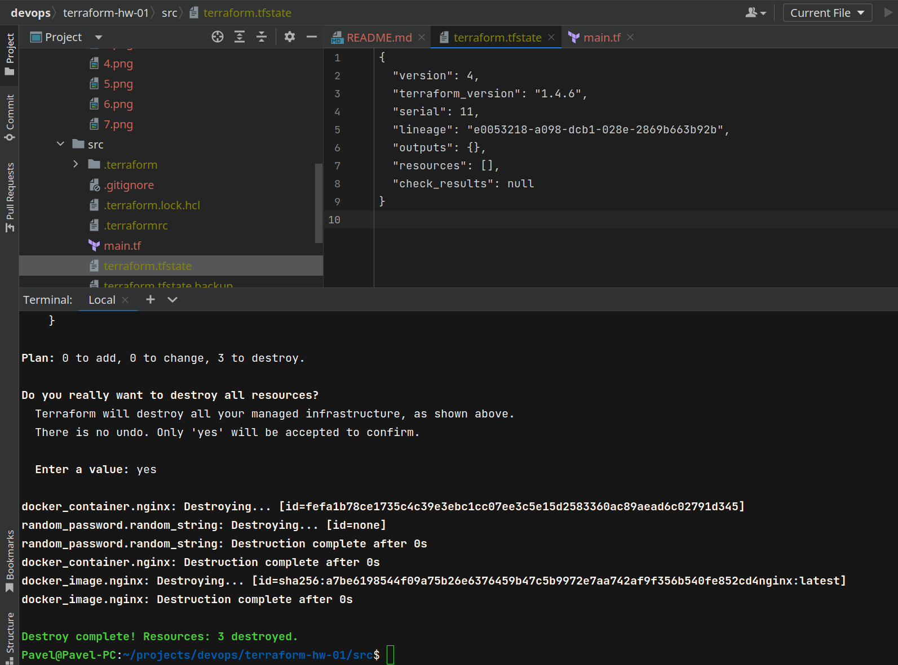

# Домашнее задание к занятию «Введение в Terraform»

### Цель задания

1. Установить и настроить Terrafrom.
2. Научиться использовать готовый код.

------

### Чеклист готовности к домашнему заданию

1. Скачайте и установите актуальную версию **terraform** >=1.4.X . Приложите скриншот вывода команды ```terraform --version```.

<p>
    
</p>

2. Скачайте на свой ПК данный git репозиторий. Исходный код для выполнения задания расположен в директории **01/src**.
3. Убедитесь, что в вашей ОС установлен docker.

------

### Инструменты и дополнительные материалы, которые пригодятся для выполнения задания

1. Установка и настройка Terraform  [ссылка](https://cloud.yandex.ru/docs/tutorials/infrastructure-management/terraform-quickstart#from-yc-mirror)
2. Зеркало документации Terraform  [ссылка](https://registry.tfpla.net/browse/providers) 
3. Установка docker [ссылка](https://docs.docker.com/engine/install/ubuntu/) 
------

### Задание 1

1. Перейдите в каталог [**src**](https://github.com/netology-code/ter-homeworks/tree/main/01/src). Скачайте все необходимые зависимости, использованные в проекте. 
2. Изучите файл **.gitignore**. В каком terraform файле согласно этому .gitignore допустимо сохранить личную, секретную информацию?

### Решение

```
# own secret vars store.
personal.auto.tfvars
```

3. Выполните код проекта. Найдите  в State-файле секретное содержимое созданного ресурса **random_password**, пришлите в качестве ответа конкретный ключ и его значение.

### Решение

<p>
    
</p>

4. Раскомментируйте блок кода, примерно расположенный на строчках 29-42 файла **main.tf**.
Выполните команду ```terraform validate```. Объясните в чем заключаются намеренно допущенные ошибки? Исправьте их.

### Решение

<p>
    
</p>

```terraform
resource "docker_image" {
  ...
}
```

- Error: Missing name for resource  
All resource blocks must have 2 labels (type, name).  
Все ресурсы должны иметь 2 метки: type и name

```terraform
resource "docker_container" "1nginx" {
  ...
}
```

- Error: Invalid resource name  
A name must start with a letter or underscore and may contain only letters, digits, underscores, and dashes.  
Имя не должно начинаться с цифры

<p>
    
</p>

- Error: Reference to undeclared resource  
A managed resource "random_password" "random_string_fake" has not been declared in the root module.  
random_string_fake не объявлен в главном модуле (опечатка в названии - random_string.result)

<p>
    
</p>

5. Выполните код. В качестве ответа приложите вывод команды ```docker ps```

### Решение

<p>
    
</p>

6. Замените имя docker-контейнера в блоке кода на ```hello_world```, выполните команду ```terraform apply -auto-approve```.
Объясните своими словами, в чем может быть опасность применения ключа  ```-auto-approve``` ? В качестве ответа дополнительно приложите вывод команды ```docker ps```

### Решение

<p>
    
</p>

Опасность заключается в том, создание или изменение ресурсов происходит без подтверждения. Нет возможности проверить план изменений.

8. Уничтожьте созданные ресурсы с помощью **terraform**. Убедитесь, что все ресурсы удалены. Приложите содержимое файла **terraform.tfstate**.

### Решение

<p>
    
</p>

9. Объясните, почему при этом не был удален docker образ **nginx:latest** ? Ответ подкрепите выдержкой из документации провайдера.

### Решение

```terraform
resource "docker_image" "nginx" {
  name         = "nginx:latest"
  keep_locally = true
}
```
keep_locally (Boolean) If true, then the Docker image won't be deleted on destroy operation  
При создании инфраструктуры был выставлен параметр keep_locally в true 