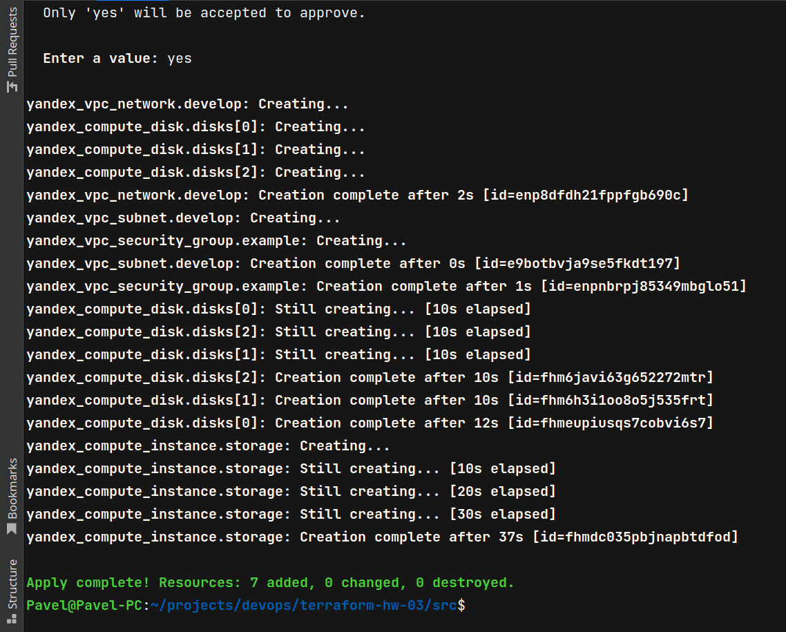

# Домашнее задание к занятию "Управляющие конструкции в коде Terraform"

### Цель задания

1. Отработать основные принципы и методы работы с управляющими конструкциями Terraform
2. Освоить работу с шаблонизатором Terraform(Interpolation Syntax)

------

### Чеклист готовности к домашнему заданию

1. Зарегистрирован аккаунт в Yandex Cloud. Использован промокод на грант.
2. Установлен инструмент yandex cli.
3. Доступен исходный код для выполнения задания в директории [**03/src**](https://github.com/netology-code/ter-homeworks/tree/main/03/src).
4. Любые ВМ, использованные при выполнении задания должны быть прерываемыми, для экономии средств.

------

### Инструменты/ дополнительные материалы, которые пригодятся для выполнения задания

1. [Консоль управления Yandex Cloud](https://console.cloud.yandex.ru/folders/<cloud_id>/vpc/security-groups).
2. [Группы безопасности](https://cloud.yandex.ru/docs/vpc/concepts/security-groups?from=int-console-help-center-or-nav).
3. [Datasource compute disk](https://terraform-eap.website.yandexcloud.net/docs/providers/yandex/d/datasource_compute_disk.html).


### Задание 1

1. Изучите проект.
2. Заполните файл personal.auto.tfvars
3. Инициализируйте проект, выполните код (он выполнится даже если доступа к preview нет).

Примечание: Если у вас не активирован preview доступ к функционалу "Группы безопасности" в Yandex Cloud - запросите доступ у поддержки облачного провайдера. Обычно его выдают в течении 24-х часов.

Приложите скриншот входящих правил "Группы безопасности" в ЛК Yandex Cloud  или скриншот отказа в предоставлении доступа к preview версии.

### Решение


------

### Задание 2

1. Создайте файл count-vm.tf. Опишите в нем создание двух **одинаковых** ВМ  web-1 и web-2(не web-0 и web-1!), с минимальными параметрами, используя мета-аргумент **count loop**. Назначьте ВМ созданную в 1-м задании группу безопасности.
2. Создайте файл for_each-vm.tf. Опишите в нем создание 2 ВМ с именами "main" и "replica" **разных** по cpu/ram/disk , используя мета-аргумент **for_each loop**. Используйте переменную типа list(object({ vm_name=string, cpu=number, ram=number, disk=number  })). При желании внесите в переменную все возможные параметры.
3. ВМ из пункта 2.2 должны создаваться после создания ВМ из пункта 2.1.
4. Используйте функцию file в local переменной для считывания ключа ~/.ssh/id_rsa.pub и его последующего использования в блоке metadata, взятому из ДЗ №2.
5. Инициализируйте проект, выполните код.

### Решение

```terraform
resource "yandex_compute_instance" "web" {
  count = 2
  name = "web-${count.index+1}"
  platform_id = "standard-v1"

  resources {
    cores  = 2
    memory = 1
    core_fraction = 20
  }

  boot_disk {
    initialize_params {
      image_id = data.yandex_compute_image.base_ubuntu.image_id
      type = "network-hdd"
      size = 5
    }
  }

  metadata = {
    ssh-keys = "ubuntu:${file(var.ssh_pub_key_file)}"
  }

  scheduling_policy { preemptible = true }

  network_interface {
    subnet_id = yandex_vpc_subnet.develop.id
    nat       = true
    security_group_ids = [yandex_vpc_security_group.example.id]
  }
  allow_stopping_for_update = true
}
```

```terraform
variable "ssh_pub_key_file" {
  type = string
  default = "~/.ssh/id_rsa.pub"
}
```


```terraform
locals {
  vms = [
    {
      id = 1,
      name = "main",
      cpu = 4,
      core_fraction = 20,
      ram = 8,
      disk = 10,
    },
    {
      id = 2,
      name = "replica",
      cpu = 2,
      core_fraction = 5,
      ram = 4,
      disk = 5
    }
  ]
}

resource "yandex_compute_instance" "cluster" {
  for_each = {
    for vm in local.vms :
    vm.id => vm
  }

  depends_on = [yandex_compute_instance.web]

  name = each.value.name
  platform_id = "standard-v1"

  resources {
    cores  = each.value.cpu
    memory = each.value.ram
    core_fraction = each.value.core_fraction
  }

  boot_disk {
    initialize_params {
      image_id = data.yandex_compute_image.base_ubuntu.image_id
      type = "network-hdd"
      size = each.value.disk
    }
  }

  metadata = {
    ssh-keys = "ubuntu:${file(var.ssh_pub_key_file)}"
  }

  scheduling_policy { preemptible = true }

  network_interface {
    subnet_id = yandex_vpc_subnet.develop.id
    nat       = true
    security_group_ids = [yandex_vpc_security_group.example.id]
  }
  allow_stopping_for_update = true
}
```

либо можно не использовать local, а параметры ресурсов описать в var

```terraform
variable "cluster_vms" {
  type = list(object({
    id = number
    name = string
    cpu = number
    core_fraction = number
    ram = number
    disk = number
  }))
  default = [
    {
      id = 1,
      name = "main",
      cpu = 4,
      core_fraction = 20,
      ram = 8,
      disk = 10,
    },
    {
      id = 2,
      name = "replica",
      cpu = 2,
      core_fraction = 5,
      ram = 4,
      disk = 5
    }
  ]
}

resource "yandex_compute_instance" "cluster" {
  for_each = {
    for vm in var.cluster_vms :
    vm.id => vm
  }
  ...
}
```

Скрины по работе depends_on


------

### Задание 3

1. Создайте 3 одинаковых виртуальных диска, размером 1 Гб с помощью ресурса yandex_compute_disk и мета-аргумента count в файле **disk_vm.tf** .
2. Создайте в том же файле одну ВМ c именем "storage" . Используйте блок **dynamic secondary_disk{..}** и мета-аргумент for_each для подключения созданных вами дополнительных дисков.

### Решение




------

### Задание 4

1. В файле ansible.tf создайте inventory-файл для ansible.
Используйте функцию tepmplatefile и файл-шаблон для создания ansible inventory-файла из лекции.
Готовый код возьмите из демонстрации к лекции [**demonstration2**](https://github.com/netology-code/ter-homeworks/tree/main/demonstration2).
Передайте в него в качестве переменных группы виртуальных машин из задания 2.1, 2.2 и 3.2.(т.е. 5 ВМ)
2. Инвентарь должен содержать 3 группы [webservers], [databases], [storage] и быть динамическим, т.е. обработать как группу из 2-х ВМ так и 999 ВМ.
3. Выполните код. Приложите скриншот получившегося файла. 

Для общего зачета создайте в вашем GitHub репозитории новую ветку terraform-03. Закомитьте в эту ветку свой финальный код проекта, пришлите ссылку на коммит.   
**Удалите все созданные ресурсы**.

### Решение

```terraform
resource "local_file" "hosts_cfg" {
  depends_on = [yandex_compute_instance.web, yandex_compute_instance.database, yandex_compute_instance.storage]
  content = templatefile(
    "${path.module}/hosts.tftpl",
    {
      webservers = yandex_compute_instance.web,
      databases  = yandex_compute_instance.database,
      storage    = yandex_compute_instance.storage
    }
  )
  filename = "${abspath(path.module)}/hosts.cfg"
}
```

```terraform
[webservers]
%{~ for i in webservers ~}

${i["name"]}   ansible_host=${i["network_interface"][0]["nat_ip_address"]}
%{~ endfor ~}


[databases]
%{~ for i in databases ~}

${i["name"]}   ansible_host=${i["network_interface"][0]["nat_ip_address"]}
%{~ endfor ~}


[storage]
%{~ for i in storage ~}

${i["name"]}   ansible_host=${i["network_interface"][0]["nat_ip_address"]}
%{~ endfor ~}
```


------

## Дополнительные задания (со звездочкой*)

**Настоятельно рекомендуем выполнять все задания под звёздочкой.**   Их выполнение поможет глубже разобраться в материале.   
Задания под звёздочкой дополнительные (необязательные к выполнению) и никак не повлияют на получение вами зачета по этому домашнему заданию. 

### Задание 5*(необязательное)
1. Напишите output, который отобразит все 5 созданных ВМ в виде списка словарей:
``` 
[
 {
  "name" = 'имя ВМ1'
  "id"   = 'идентификатор ВМ1'
  "fqdn" = 'Внутренний FQDN ВМ1'
 },
 {
  "name" = 'имя ВМ2'
  "id"   = 'идентификатор ВМ2'
  "fqdn" = 'Внутренний FQDN ВМ2'
 },
 ....
]
```
Приложите скриншот вывода команды ```terrafrom output```

### Решение

```terraform
locals {
  all_mv_groups = [yandex_compute_instance.storage, yandex_compute_instance.web, yandex_compute_instance.database]
}

output "all_vms" {
  value = flatten([
    for gr in local.all_mv_groups: [
      for vm in gr: {
        name = vm.name,
        id = vm.id,
        fqdn = vm.fqdn
      }
    ]
  ])
}
```


------

### Задание 6*(необязательное)

1. Используя null_resource и local-exec примените ansible-playbook к ВМ из ansible inventory файла.
Готовый код возьмите из демонстрации к лекции [**demonstration2**](https://github.com/netology-code/ter-homeworks/tree/main/demonstration2).
3. Дополните файл шаблон hosts.tftpl. 
Формат готового файла:
```netology-develop-platform-web-0   ansible_host="<внешний IP-address или внутренний IP-address если у ВМ отсутвует внешний адрес>"```

Для проверки работы уберите у ВМ внешние адреса. Этот вариант используется при работе через bastion сервер.
Для зачета предоставьте код вместе с основной частью задания.

### Правила приема работы

В своём git-репозитории создайте новую ветку terraform-03, закомитьте в эту ветку свой финальный код проекта. Ответы на задания и необходимые скриншоты оформите в md-файле в ветке terraform-03.

В качестве результата прикрепите ссылку на ветку terraform-03 в вашем репозитории.

ВАЖНО!Удалите все созданные ресурсы.

### Критерии оценки

Зачёт:

* выполнены все задания;
* ответы даны в развёрнутой форме;
* приложены соответствующие скриншоты и файлы проекта;
* в выполненных заданиях нет противоречий и нарушения логики.

На доработку:

* задание выполнено частично или не выполнено вообще;
* в логике выполнения заданий есть противоречия и существенные недостатки. 

